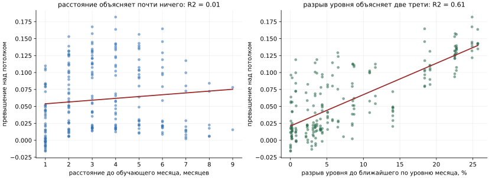
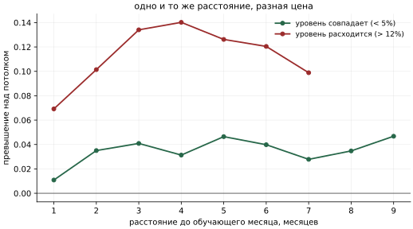
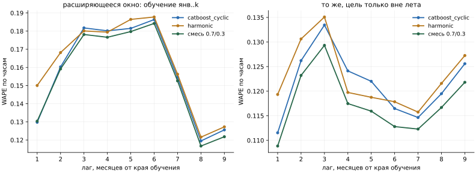
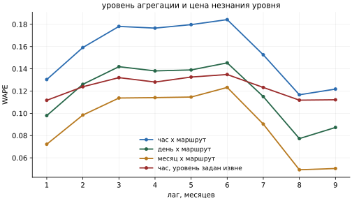
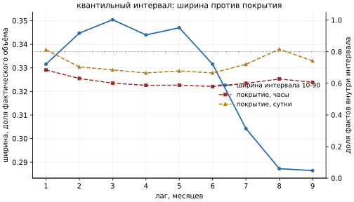
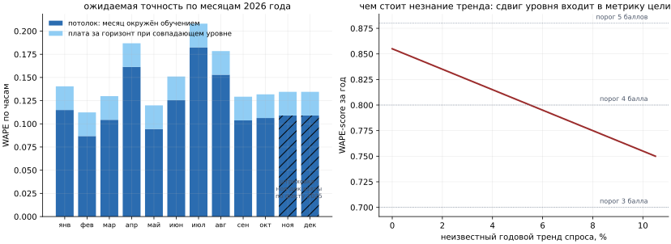

# Горизонт прогноза: что происходит с точностью, когда данных не хватает

Исследование от 27.09.2026. Все числа получены прогонами в этом репозитории и
воспроизводятся командами из последнего раздела.

## Вопрос

MODEL.md фиксирует границу применимости честно: «Горизонт: до двух месяцев с сохранением
заявленной точности. Три месяца и больше - без замеров, потому что проверить не на чем».
Задача хакатона требует горизонта «год» хотя бы качественно, а веб-сервис обещает его в
интерфейсе. Нужно знать, чего стоит это обещание.

Проверить прогноз на 2026 год напрямую нельзя: данных за него нет и не будет. Но можно
обеднять обучающую выборку на известной истории и смотреть, как ошибка реагирует на нехватку
информации. Из этого выводится закон деградации, а из закона - оценка для года.

## Дизайн эксперимента

Данные: январь-октябрь 2025, плотная сетка маршрут x дата x час, 72 960 строк. Маршрут 5
остаётся в обучающей сетке, как в проде, но из замера исключён: по нему ноль успешных
валидаций за всю историю, и в проде он заполняется отдельной процедурой - иначе мы мерили бы
постобработку, а не модель.

Четыре схемы разбиения, 56 конфигураций:

| Схема | Конфигураций | Что развязывает |
|---|---|---|
| `expanding` | 9 | обучение янв..k, прогноз k+1..окт: горизонт растёт вместе с объёмом обучения, как в жизни |
| `sliding1/2/3` | 27 | окно фиксированной ширины 1, 2 или 3 месяца, прогноз всех остальных месяцев, включая более ранние |
| `lomo` | 10 | обучение на девяти месяцах, прогноз пропущенного: потолок интерполяции |
| `lomo_flat` | 10 | то же с равными весами наблюдений |

Скользящие окна нужны потому, что в расширяющемся окне горизонт и целевой месяц связаны
жёстко: лаг 9 встречается ровно один раз, у октября по январю. В скользящих окнах один и тот
же месяц прогнозируется с разных расстояний, и свойства месяца отделяются от расстояния.

`lomo_flat` отличается от `lomo` отключённым затуханием весов. Производственное затухание с
периодом полураспада 60 дней отсчитывается от края обучения, а в схеме `lomo` край всегда
октябрь, и январь получил бы вес 0.03 - потолок интерполяции мерился бы на почти пустых
данных. Разница между схемами оказалась мала: в среднем 0.003 по модулю, максимум 0.011, без
систематического знака. Все выводы ниже строятся на `lomo_flat`.

Три конфигурации модели, все без калибровки и постобработки, чтобы мерить модель, а не
обвязку:

- `catboost_cyclic` - основная модель прода,
- `harmonic` - гармоническая регрессия, единственная, кто экстраполирует аналитически,
- `mix_cb70_mlp30` - продовая смесь 0.7 catboost_cyclic + 0.3 mlp.

Метрика - та же глобальная WAPE, что на лидерборде, посчитанная для каждого целевого месяца
отдельно на трёх уровнях агрегации: почасовая сетка, суточные итоги по маршруту, месячный
итог по маршруту. Дополнительно считается WAPE прогноза, перемасштабированного на истинный
месячный объём: это ошибка формы, очищенная от ошибки уровня.

### Якорь: харнесс воспроизводит известные числа

Конфигурация `expanding` с краем обучения 31 августа - это фолд 3 из `backtest.py`, а с краем
30 сентября - фолд 4.

| Замер | Здесь | MODEL.md |
|---|---|---|
| сен-окт по янв-авг, смесь | 0.1112 | 0.1108 (пул фолдов 3 и 4, с калибровкой) |
| октябрь по янв-сен, смесь | 0.0989 | 0.0968 без поправки, 0.0993 с поправкой |

Расхождения в пределах различий в обвязке (у нас нет калибровки и нет маршрута 5). Харнесс
меряет то же, что продовый бэктест.

## Главный результат

**Ошибка не растёт с горизонтом. Она растёт с разрывом сезонного уровня между обучением и
целью.**

Это не оговорка и не тонкость интерпретации. Одномерная регрессия превышения над потолком
интерполяции по скользящим окнам:

| Объясняющая переменная | R2 (catboost) | R2 (harmonic) | R2 (смесь) |
|---|---:|---:|---:|
| расстояние до обучающего месяца | 0.013 | 0.011 | **0.012** |
| разрыв уровня до ближайшего по уровню месяца | 0.557 | 0.401 | 0.606 |
| разрыв уровня до среднего по обучению | 0.637 | 0.420 | **0.663** |



Механизм прозрачен, как только на него посмотреть. У модели нет лаговых признаков: ни
авторегрессии, ни скользящих средних, ни состояния, которое «стареет». Признаки - час, день
недели, тип дня, сезон, расстояние до праздничного блока. Такая модель не помнит прошлое и не
забывает его: она интерполирует календарь. Ей безразлично, на сколько месяцев вперёд её
спрашивают; ей важно, встречался ли в обучении день с похожим уровнем спроса.

Три следствия, каждое замерено.

**Прогноз назад стоит ровно столько же, сколько вперёд.** Средняя почасовая WAPE по всем
конфигурациям с окном в один месяц:

| Модель | вперёд | назад |
|---|---:|---:|
| `catboost_cyclic` | 0.1890 | 0.1918 |
| `harmonic` | 0.1845 | 0.1831 |
| `mix_cb70_mlp30` | 0.1845 | 0.1877 |

Обучение на феврале с прогнозом января ничем не лучше обучения на феврале с прогнозом марта.
Для модели со стрелой времени это было бы невозможно.

**При совпадающем уровне расстояние не важно.** Превышение над потолком интерполяции для
конфигураций, где в обучении есть месяц с уровнем рабочего дня в пределах 5% от целевого:

| Расстояние, мес | 1 | 2 | 3 | 4 | 5 | 6 | 7 | 8 | 9 |
|---|---:|---:|---:|---:|---:|---:|---:|---:|---:|
| смесь | 0.011 | 0.035 | 0.041 | 0.031 | 0.047 | 0.040 | 0.028 | 0.035 | 0.047 |
| `harmonic` | -0.011 | 0.018 | 0.026 | 0.022 | 0.029 | 0.017 | 0.008 | 0.018 | 0.021 |

Кривая выходит на полку 0.03-0.05 уже на втором месяце и дальше не растёт. Девять месяцев
разрыва стоят столько же, сколько два.

**При расходящемся уровне то же расстояние стоит втрое дороже.** Те же конфигурации, но с
разрывом уровня больше 12%:

| Расстояние, мес | 1 | 2 | 3 | 4 | 5 | 6 | 7 |
|---|---:|---:|---:|---:|---:|---:|---:|
| смесь | 0.069 | 0.101 | 0.134 | 0.140 | 0.126 | 0.120 | 0.099 |



Именно поэтому наивная кривая «ошибка по лагу» в расширяющемся окне ведёт себя странно: растёт
до лага 6 и падает на лагах 7-9. Лаг 9 в наших данных - это пара «январь -> октябрь», у
которых рабочий день различается на 4%, а лаг 4 часто означает «апрель -> июль» с разрывом 22%.
Кривая описывает состав пар, а не горизонт.



## Потолок: чего стоит сама задача

`lomo_flat` даёт нижнюю границу: месяц выброшен из обучения, но окружён им с обеих сторон,
уровень известен модели точно. Это чистая невязка - дневной шум, который не предсказывается
календарём вообще.

| Модель | час x маршрут | сутки x маршрут | месяц x маршрут |
|---|---:|---:|---:|
| `catboost_cyclic` | 0.1245 | 0.0882 | 0.0561 |
| `harmonic` | 0.1479 | 0.1170 | 0.0878 |
| `mix_cb70_mlp30` | 0.1233 | 0.0903 | 0.0602 |

По месяцам потолок различается вдвое: февраль 0.087, май 0.094, сентябрь и октябрь 0.104-0.106,
январь 0.115, июнь 0.126, август 0.153, апрель 0.161, июль 0.183. Летние месяцы и апрель
предсказуемы хуже не из-за модели, а из-за самих данных: отпуска, дачи и погода делают спрос
менее регулярным, и календарь их не описывает.

Независимая проверка того же порядка величины: если взять истинный месячный объём и
распределить его по профилю часа недели, снятому на сентябре-октябре, почасовая WAPE для
сентября и октября выходит 0.115-0.121. Тот же потолок, полученный вообще без модели.

**Вывод для планирования: при календарных входах почасовой прогноз в среднем по году не
может быть точнее 0.12 WAPE ни при каком объёме данных и ни при какой архитектуре.** В самых
регулярных месяцах потолок 0.087, в июле 0.183. Остаток - шум конкретного дня, информации о
котором в календаре нет.

## Уровень против формы

Ошибку можно разложить: часть приходится на неверный общий уровень, часть - на форму
(распределение по часам, дням недели, маршрутам). Первая снимается извне: если диспетчер или
сценарий задаёт ожидаемый объём, прогноз перемасштабируется. Вторая не снимается ничем.

Скользящие окна, смесь, почасовая WAPE:

| Разрыв уровня | сырой прогноз | уровень города задан | уровень маршрутов задан |
|---|---:|---:|---:|
| < 3% | 0.142 | 0.138 | 0.135 |
| 3-6% | 0.150 | 0.137 | 0.131 |
| 6-12% | 0.184 | 0.147 | 0.138 |
| 12-20% | 0.233 | 0.178 | 0.162 |
| > 20% | 0.278 | 0.190 | 0.163 |

Форма деградирует тоже, но в разы медленнее: превышение по форме растёт с 0.027 до 0.043, то
есть на 0.016, тогда как полное превышение - с 0.026 до 0.134, на 0.108. То есть **при полном
незнании режима около двух третей превышения - это ошибка уровня**, и она устраняется одним
числом на месяц.

Это прямое обоснование корректирующих коэффициентов в интерфейсе (`docs/SPEC-correction-layer.md`):
на дальнем горизонте ползунок уровня даёт больше, чем любое улучшение модели.



## Агрегация: где прогноз на год уже пригоден

Метрика сильно зависит от того, на каком уровне её считать. Расширяющееся окно, смесь:

| Лаг, мес | час x маршрут | сутки x маршрут | месяц x маршрут | смещение |
|---|---:|---:|---:|---:|
| 1 | 0.130 | 0.098 | 0.072 | +2.7% |
| 2 | 0.159 | 0.126 | 0.098 | +5.0% |
| 3 | 0.178 | 0.142 | 0.114 | +7.0% |
| 6 | 0.184 | 0.145 | 0.123 | +11.1% |
| 9 | 0.122 | 0.087 | 0.050 | -2.9% |

Суточный итог считается на 25-30% точнее почасового, месячный - на 50-60%; на замерах потолка
отношения равны 0.72 и 0.46. Почасовой шум сокращается при суммировании, и это не фокус: для
задач планирования подвижного состава на месяц вперёд нужен именно суточный и месячный
уровень, а не час.

## Интервалы: квантильная модель не годится

MODEL.md предлагал получить интервалы почти бесплатно - двумя дополнительными CatBoost на
alpha 0.1 и 0.9. Замер показывает, что так делать нельзя.

| Лаг, мес | ширина интервала 10-90 | покрытие, часы | покрытие, сутки |
|---|---:|---:|---:|
| 1 | 0.332 | 0.684 | 0.812 |
| 3 | 0.350 | 0.601 | 0.685 |
| 6 | 0.332 | 0.580 | 0.666 |
| 9 | 0.286 | 0.606 | 0.742 |



Ширина интервала на горизонт **не реагирует вообще**, а на дальних лагах даже сужается.
Покрытие вместо заявленных 80% составляет 58-68% и падает с горизонтом. Причина в том, что
квантильный лосс описывает условный разброс цели при данных признаках - шум конкретного часа.
Он ничего не знает о том, что сами параметры модели перенесены в незнакомый режим. Интервал,
построенный так, обещает точность, которой нет, и это хуже, чем отсутствие интервала.

**Рабочая замена - эмпирические интервалы по этому эксперименту.** Квантили отношения
прогноз/факт для суточного итога маршрута, скользящие окна:

| Разрыв уровня | 10% | медиана | 90% |
|---|---:|---:|---:|
| < 3% | 0.85 | 0.99 | 1.21 |
| 3-6% | 0.81 | 0.99 | 1.21 |
| 6-12% | 0.74 | 0.95 | 1.27 |
| > 12% | 0.72 | 1.11 | 1.49 |

Для потолка интерполяции разброс уже: 0.85-1.05 в октябре, 0.93-1.14 в сентябре, но
0.93-1.31 в июле и августе. То есть даже в идеальных условиях суточный итог маршрута надо
объявлять с коридором около плюс-минус 15%, летом - плюс-минус 30%, а в незнакомом режиме -
плюс-минус 30% со смещением.

## Прогноз на весь 2026 год

### Может ли модель это сделать

Механически - да, без переделок. В пайплайне нет ни одного признака, который требовал бы
фактических данных прогнозного периода: всё считается из календаря. Прогноз на любую дату
2026 года строится ровно тем же вызовом, что и на ноябрь 2025.

Нужны две вещи:

1. **Производственный календарь на 2026 год.** Файл `input/calendar/2026.xml` в том же формате
   (xmlcalendar.ru). Загрузчик `input/calendar/transform.py` сейчас жёстко зашит на 2025
   (`_parse_day_overrides(..., year=2025)`) - нужна правка в несколько строк, чтобы год брался
   из имени файла или аргумента.
2. **Решение по калибровке.** Групповая поправка `route x weekday` снимается на последнем
   месяце с фактами и, по замеру MODEL.md, работает только внутри одного режима. Для января
   2026 она осмысленна, для июля - нет. На дальних месяцах её надо отключать, иначе она
   переносит осенние соотношения на лето.

Погодный блок (`--weather all`, дающий лучший результат 0.88466) на годовом горизонте
недоступен: фактической погоды нет, а сезонный прогноз на 12 месяцев несёт немногим больше
климатической нормы. Для 2026 года модель работает в конфигурации без погоды.

### С какой точностью

Оценка собирается из двух измеренных слагаемых: потолок интерполяции для месяца плюс плата за
горизонт при совпадающем уровне (0.026 по часам, 0.025 по суткам, 0.018 по месяцу).

Ключевое обстоятельство: **каждый месяц 2026 года имеет в истории 2025 прямой аналог - тот же
календарный месяц годом раньше**. Модель, правда, опознаёт его не по номеру месяца, которого в
признаках нет, а по сезону и календарю - об ограничении этого способа ниже отдельный раздел. Разрыв уровня даже до ближайшего постороннего месяца не
превышает 5% (январь 0.7%, февраль 0.2%, март 0.8%, апрель 0.8%, май 0.1%, июнь 4.4%, июль и
август 0.0%, сентябрь 0.7%, октябрь 0.1%), то есть 2026 год целиком попадает в корзину
«уровень совпадает», где плата за расстояние минимальна и от расстояния не зависит.

Такая сборка оценки сознательно пессимистична. Потолок `lomo` снят в условиях, когда целевого
месяца в обучении нет вовсе, а при прогнозе 2026 года тот же месяц в обучении есть - пусть и
из другого года. Сверху на этот потолок добавлена ещё и плата за горизонт. Обе поправки
смещают оценку в сторону худшего, поэтому числа ниже следует читать как нижнюю границу
качества, а не как ожидание.

| Месяц | потолок | прогноз на 2026 | источник потолка |
|---|---:|---:|---|
| январь | 0.115 | 0.140 | замер `lomo` |
| февраль | 0.087 | 0.112 | замер `lomo` |
| март | 0.104 | 0.130 | замер `lomo` |
| апрель | 0.161 | 0.187 | замер `lomo` |
| май | 0.094 | 0.120 | замер `lomo` |
| июнь | 0.126 | 0.151 | замер `lomo` |
| июль | 0.183 | 0.208 | замер `lomo` |
| август | 0.153 | 0.178 | замер `lomo` |
| сентябрь | 0.104 | 0.129 | замер `lomo` |
| октябрь | 0.106 | 0.132 | замер `lomo` |
| ноябрь | 0.111 | 0.136 | факт лидерборда ноя-дек 2025 |
| декабрь | 0.111 | 0.136 | факт лидерборда ноя-дек 2025 |



Для ноября и декабря замера `lomo` быть не может - этих месяцев нет в истории. Вместо него
взят прямой факт: сабмит за ноябрь-декабрь 2025 в конфигурации без погоды дал WAPE-score
0.88268, то есть WAPE 0.1173, из которых 0.0065 - цена нулей по маршруту 5. По девяти
оцениваемым маршрутам это 0.111, ровно на уровне осеннего потолка. Взята именно конфигурация
без погоды, потому что на годовом горизонте погодного блока не будет; вариант с погодой дал
0.88466. Это самое сильное свидетельство в пользу всего вывода:
**два месяца, которых модель не видела никогда, были предсказаны с точностью окружённого
данными месяца.**

Взвешенная по объёму оценка на год целиком:

| Уровень агрегации | WAPE | WAPE-score |
|---|---:|---:|
| час x маршрут | 0.146 | **0.854** |
| сутки x маршрут | 0.112 | **0.888** |
| месяц x маршрут | 0.076 | **0.924** |

Для сравнения: фактический результат на горизонте два месяца - 0.883 на лидерборде. Оценки
сопоставимы не полностью, потому что лидерборд включает маршрут 5, а наш замер нет; с учётом
его цены годовая оценка была бы около 0.848. Потеря при переходе от двух месяцев к двенадцати
составляет 3-4 пункта почасовой метрики, а не кратное падение.

### Как растёт неопределённость с горизонтом

Правильный ответ: **не растёт монотонно с горизонтом, а ступенчато зависит от того, знаком ли
режим.** Практическая форма для сервиса - три класса горизонта:

| Класс | Условие | Почасовая WAPE | Коридор суточного итога |
|---|---|---:|---|
| Оперативный | до 2 месяцев, режим не меняется, доступна калибровка на свежих фактах | 0.11-0.13 | плюс-минус 15% |
| Плановый | до 12 месяцев, режим целевого месяца представлен в истории | 0.13-0.16 | плюс-минус 20% |
| Незнакомый режим | месяц без аналога по уровню, новый режим сети | 0.18-0.26 | плюс-минус 30%, со смещением |

Четвёртого класса - «дальше горизонт, больше ошибка» - в данных нет.

### Структурный дефект, который видно только на годовом горизонте

В признаках модели нет месяца. Сезон задан четырьмя значениями, и внутри сезона все месяцы для
модели неразличимы. На горизонте двух месяцев это ничего не стоило, а на годовом стоит, и
величину можно измерить.

Уровень рабочего дня внутри лета распределён неравномерно: июнь 0.967 от среднего по году,
июль и август - 0.840. Разрыв июня с его соседями по сезону 15%. Модель, у которой нет способа
отличить июнь от июля, обязана промахнуться, и промахивается ровно так:

| Месяц | смещение `catboost_cyclic` | смещение смеси | разрыв с соседями по сезону |
|---|---:|---:|---:|
| июнь | -11.4% | -6.3% | +15.1% |
| июль | +5.2% | +9.9% | -7.0% |
| август | +4.6% | +8.9% | -7.0% |
| март | -3.3% | -5.0% | +2.0% |
| май | +1.0% | -0.1% | -2.7% |

Знак смещения в точности следует за разрывом: июнь недобирает, июль и август перебирают, а
весенние месяцы, чьи уровни близки, смещены слабо. Это не шум подгонки, а прямое следствие
гранулярности признака `season`.

Отсюда следует конкретная ревизия одного из решений MODEL.md. Месяц и день года были отклонены
как признаки, потому что «ноя-дек вне обученного диапазона»: для цели ноябрь-декабрь 2025 они
попадали в невиданную область. **Для прогноза на 2026 год по истории полного 2025 года это
возражение отпадает** - каждый месяц цели имеет прямой аналог в обучении. Проверить это на
наших данных нельзя (второго года нет, а в схеме `lomo` целевой месяц отсутствует в обучении,
и категория месяца была бы невиданной), но как только появится история за полный год, месяц
как категориальный признак нужно перезамерить в первую очередь. Ожидаемый выигрыш - снятие
именно этого смещения уровня, достигающего 10% на летних месяцах. При обучении на полном годе
часть его уйдёт сама (июнь попадёт в обучение вместе с июлем и августом), но не вся: сезон
всё равно останется четырёхзначным, и все три летних месяца получат один уровень.

До тех пор летние месяцы 2026 года следует отдавать с явной пометкой о систематическом сдвиге
уровня и с включённым ползунком поправки.

### Чего эксперимент не измеряет

Это главное ограничение отчёта, и его нельзя обойти замерами на имеющихся данных.

**Годовой тренд.** История покрывает один неполный год. Сезонный цикл наблюдён ровно один раз,
поэтому отделить сезонность от тренда невозможно в принципе: любое изменение уровня между 2025
и 2026 годом попадёт в прогноз целиком, потому что модель тренда не содержит (линейный тренд
проверялся и отклонён, 0.218 против 0.173). Сдвиг уровня входит в WAPE почти один к одному:

| Годовой тренд спроса | WAPE за год | WAPE-score |
|---|---:|---:|
| 0% | 0.146 | 0.854 |
| 2% | 0.166 | 0.834 |
| 5% | 0.196 | 0.804 |
| 10% | 0.246 | 0.754 |

Иначе говоря, **неизвестный годовой тренд - более крупный источник ошибки, чем весь горизонт**.
Пять процентов роста пассажиропотока стоят дороже, чем переход от двух месяцев прогноза к
двенадцати. Это аргумент не за более сложную модель, а за внешний ввод уровня: годовой прогноз
имеет смысл отдавать вместе с полем «ожидаемый рост к прошлому году», по умолчанию 0%.

**Изменения сети.** Продления линий, закрытия на ремонт, перенумерация маршрутов, открытие
станций метро рядом с трамвайной линией. Замерить нечем, и MODEL.md уже показал на признаке
`route_change`, что данные о перекрытиях с несимметричным покрытием вредят сильнее, чем
помогают. Правильное место таких событий - сценарный ползунок, а не признак.

**Устойчивость формы через год.** Мы проверили перенос профиля между месяцами внутри года.
Переносится ли профиль часа недели через границу года - непроверяемо: второго года нет.
Косвенный довод в пользу устойчивости: дрейф профиля не упорядочен по времени. Расстояние L1
между профилями часа недели соседних сентября и октября - 0.197, а между январём и октябрём,
разнесёнными на девять месяцев, - 0.094. Профиль колеблется, но не уходит монотонно, поэтому
нет оснований ждать накопления сдвига за год.

**Смена тарифов и правил оплаты.** Цель - валидации, а не поездки. Изменение тарифного меню
или правил пересадок меняет число валидаций при неизменном пассажиропотоке.

## Что из этого следует для решения

1. **Горизонт «год» можно заявлять**, с оценкой 0.854 по часам и 0.924 по месячным итогам, и с
   явной оговоркой про тренд. Это не экстраполяция кривой, а сумма двух замеренных слагаемых.
2. **Интервалы строить эмпирически**, по таблице разброса из этого эксперимента, а не
   квантильными моделями: замер показал, что квантильный интервал не реагирует на горизонт и
   недопокрывает факт.
3. **Поле «ожидаемый годовой тренд» в интерфейсе важнее любого улучшения модели** на этом
   горизонте: оно закрывает крупнейший неизмеримый источник ошибки.
4. **Менять модель под дальний горизонт не нужно.** Гармоника деградирует меньше (превышение
   0.084 против 0.134 в худшей корзине), но и потолок у неё хуже, и на сырой метрике разницы
   нет: 0.261 против 0.259 по часам при разрыве уровня больше 12%. Продовая смесь остаётся
   лучшим выбором на всех горизонтах.
5. **Калибровку на дальних месяцах отключать.** Она оценивается на последнем месяце с фактами
   и переносит его режим на цель.
6. **Перезамерить месяц как категориальный признак, как только появится история за полный
   год.** Причина его отклонения (невиданный диапазон) для годового прогноза не действует, а
   цена его отсутствия измерена: до 10% систематического сдвига уровня на летних месяцах.

## Воспроизведение

```bash
PYTHONPATH=. python3 experiments/holdout_months.py          # 56 конфигураций, около 38 минут
PYTHONPATH=. python3 experiments/analyze_holdout.py         # таблицы по горизонту и объёму
PYTHONPATH=. python3 experiments/analyze_horizon_drivers.py # разрыв уровня, интервалы
PYTHONPATH=. python3 experiments/horizon_figures.py         # графики в docs/img
```

Результаты прогона лежат в `artifacts/experiments/`: помесячные метрики, разбивка по маршрутам,
квантильные замеры и полный дамп прогнозов (15 МБ) - последний позволяет задавать новые вопросы
к эксперименту без повторного обучения моделей.
