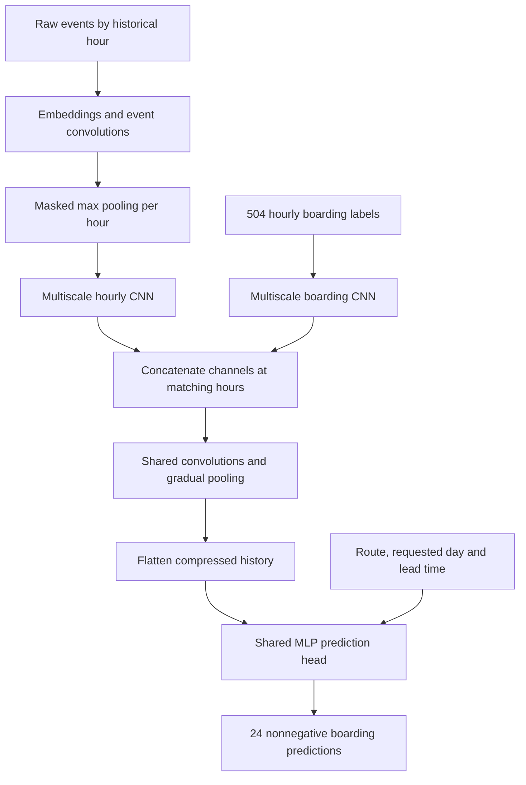

# Tram Ridership Forecasting — Architecture Manifest

Version: 1.0 • Date: 2026-09-25 • Status: historical design, now implemented.

Implementation clarification (2026-09-25): **every convolutional stage uses parallel paths with different kernel lengths and dilations**, including the event encoder and shared post-fusion compression stages. See [architecture_implementation_plan.md](architecture_implementation_plan.md) for the concrete v1.1 implementation specification, tensor contracts, defaults, updated parameter accounting, and acceptance gates. Its explicit settings resolve the open implementation choices below; the older PDF parameter formula does not apply to the clarified network.

Current training protocol (2026-09-26): group requested days under one route/cutoff
context, default to leads 1–7, and reuse the context representation within each
forward pass. See the v1.2 implementation specification for current batch,
evaluation and export contracts. The original 61-day design below remains the
eventual competition horizon.

## Objective and model budget

Predict the 24 hourly boarding counts of a specified future day for one route, using the preceding three weeks of observed history. Predict each requested day directly; do not generate intermediate days or feed predictions back into history.

**Target: 100,000–400,000 trainable parameters in total, including all embeddings.** This supersedes the earlier 500k–900k proposal. Size the model within this range after vocabulary construction; report the exact parameter count by component. Do not enlarge layers merely to consume the budget.

## Sample contract

A sample is `(route, observation_cutoff, requested_day)`.

- The cutoff is midnight immediately following the last observed day.
- Both histories cover `[cutoff − 504 hours, cutoff)` for the same route.
- Boarding history contains exactly 504 chronological hourly positions.
- Raw history contains a variable number of transactions, grouped by historical date and hour and ordered by event timestamp within each hour.
- The requested day has 24 output positions corresponding to hours 0–23.
- Training lead times span 1–61 days. Lead 1 requests the day starting at the cutoff; lead h starts h−1 days after the cutoff.
- The target is available only for training/evaluation and never enters the history encoder.

## Architecture

### Raw-event branch

Encode selected categorical fields with learned embeddings. Process event sequences with a narrow convolutional encoder shared across all hours and routes. Use masked max pooling to produce one fixed-width vector per historical hour. Empty hours receive a defined zero vector.

Apply parallel temporal convolutions with different kernel sizes and dilations across the resulting 504 hourly vectors. Include an undilated path. Concatenate parallel outputs by channel. Exact widths, kernels, and dilations remain configurable.

No handcrafted fare mixes, unique-card counts, or other aggregate features are part of this version. Pooling operates on learned event representations. Max pooling can lose event multiplicity; the boarding branch supplies successful-boarding volume, but does not recover every raw-event frequency statistic.

### Boarding branch and fusion

Process the 504 historical counts with separate multiscale convolutions. Preserve hourly length and alignment through both temporal branches until fusion. Concatenate on the channel axis: `[B, C_raw, 504] + [B, C_target, 504] → [B, C_raw + C_target, 504]`.

After fusion, shared convolutions learn interactions across the branches. Gradually reduce temporal length using max pooling and control channel width with convolutions. Flatten only the compressed representation, then concatenate request conditioning and apply a small MLP.

This is time-aligned fusion. Later fusion remains a possible future comparison, not the initial implementation.

### Illustrative compression shapes — not fixed hyperparameters

| Stage | Shape excluding batch |
|---|---|
| Each temporal branch | 32 × 504 |
| Channel fusion | 64 × 504 |
| Shared convolution + pool 2 | 64 × 252 |
| Shared convolution + pool 2 | 32 × 126 |
| Shared convolution + pool 3 | 16 × 42 |
| Flatten | 672 |
| Add request conditioning | 672 + conditioning width |
| MLP | 128 → 24 |

This illustrates how to keep the dense input compact. The complete architecture, including event encoder and vocabularies, must be counted before claiming it meets the 100k–400k target. Channels listed per branch are the combined output of its parallel kernels.

## Field handling

The following is the proposed initial field policy; full vocabulary sizes remain unknown.

| Field | Treatment |
|---|---|
| tran_date_time | Sorting and date/hour alignment; derive calendar inputs |
| ngpt_route / route | Normalize identity; select history and supply route embedding |
| validation_result | Categorical embedding; code 1 denotes successful boarding |
| tran_type_id | Categorical embedding |
| good_type | Categorical embedding |
| place_id | Categorical embedding |
| pass_route | Categorical embedding with explicit missing token |
| device_no, bus_exit_no, garage_number | Defer pending practical vocabulary/coverage checks |
| crd_hashcode, tran_no | Exclude from model inputs |
| begin_date_time, input_date_time | Exclude from initial model inputs |

Use hour-of-day, weekday, and day-of-month as the initial calendar components. Supply requested-day weekday/day-of-month and numeric lead time to the head. Output position already identifies forecast hour. Exact calendar encoding is configurable. Day-of-month does not represent annual seasonality.

Retain full dates for alignment and split construction even though the model receives selected calendar components. Fit categorical mappings and numeric scaling on training data only. Keep separate unknown and missing categorical tokens.

## Data preparation and loading

- Fill absent hourly label rows with zero under the supplied label convention. Keep enough metadata to detect malformed inputs and serious coverage inconsistencies.
- Sort events explicitly; sample file order is not reliably chronological. Define deterministic handling of equal timestamps without claiming tied events have a known true order.
- Normalize raw route strings to label route IDs.
- Build compact disk-backed event storage and route-hour offsets; do not materialize overlapping windows or load the complete raw dataset into RAM.
- Index sample identities compactly and shuffle them without replacement each epoch. Only sample order is random; history order stays chronological. Overlapping histories are expected.
- Pad variable-length hourly event sequences and track masks/lengths. Exclude padded positions from max pooling and prevent invalid activations propagating through convolution layers.
- Process hourly sequences in manageable chunks if needed. Chunking the event encoder alone does not guarantee bounded backward-pass memory; measure retained activations and use an appropriate training-memory strategy if necessary.
- Do not silently truncate busy hours or subsample events.

Full profiling was stopped because it took too long. Do not restart it as a prerequisite. Perform essential parsing, vocabulary, indexing, and resource checks during required preprocessing. No complete profiling report exists.

## Training and evaluation

Use one shared network for all supported routes and leads. Compute a regression error for each of the 24 outputs and reduce across hours and samples. Exact loss, scaling, optimizer, activation, batch size, and regularization remain configurable. Ensure final predictions are nonnegative.

| Run | History policy | Requested targets |
|---|---|---|
| Training | Rolling midnight cutoffs; all history and targets before September 1, 2025 | Eligible days at leads 1–61 |
| Validation | Fixed history August 11–31, cutoff September 1, 2025 | September–October, 61 days |
| Final forecast | Fixed history October 11–31, cutoff November 1, 2025 | November–December, 61 days |

After model selection, final fitting may use January–October observed data. For each evaluation run, preprocessing and model fitting must use only the allowed training period. Never use validation-period raw events in the fixed validation history.

Evaluate global WAPE as total absolute error divided by total actual boardings, with explicit zero-denominator handling. Also report per-route and lead-time performance. Compare a weekly-profile baseline, a boarding-only CNN, and the full model when running experiments; baselines do not alter the architecture.

Exclude route 5 from neural training/inference under the current no-label-history assumption. Required submission rows still need a separate fallback; zero was discussed as the simple option and is not validated against hidden labels.

## Package responsibilities and acceptance checks

Organize the eventual package into configuration/schema, preprocessing/storage, dataset/sampler/collation, model encoders/fusion/head, training, evaluation, and inference modules. Persist vocabularies, scaling configuration, model configuration, and checkpoints together for reproducibility.

Before a full training run, verify:

1. Both branches refer to identical route-hour positions at fusion.
2. Every sample obeys its history/target boundaries and lead convention.
3. Padding and empty-hour handling produce finite outputs and correct masking.
4. Outputs have shape `[B, 24]`; gradients reach both branches.
5. Sample identities do not repeat within an epoch.
6. Exact trainable parameter count is within the agreed target.
7. A representative batch fits memory, including backward computation.

## Evidence limits and open configuration

The inspected excerpts contained only 18 raw events and 55 hourly labels for one day. They established parsing details, missing categorical values, unsorted events, and anomalous begin timestamps; they cannot establish full-data coverage or memory requirements. Raw excerpt counts do not reconstruct the label totals.

Still to configure: embedding dimensions and rare-category policy, selected deferred fields, convolution widths/kernels/dilations, loss and scaling, nonnegative output transform, optimizer, batch/chunk sizes, and training schedule. These are implementation choices within the agreed design, not reasons to resume exhaustive profiling.
