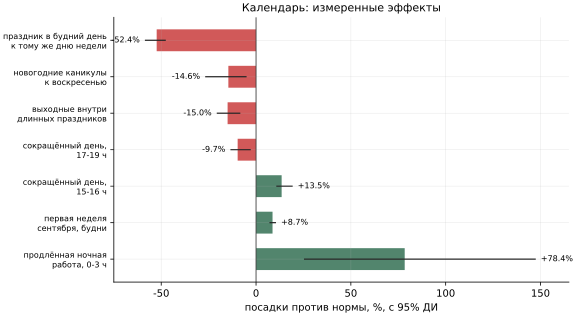
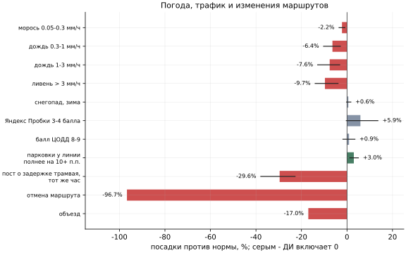
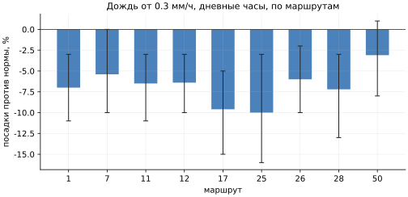
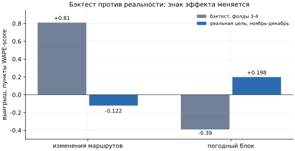
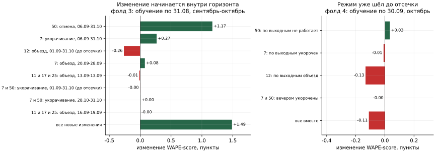

# Данные: исходный датасет и внешние источники

Что собрано, откуда, с каким покрытием, какой эффект на посадки измерен и как каждый источник
используется в моделях. Для каждого источника дана рабочая ссылка на первоисточник.

Внешним данным уделено много работы: восемь групп источников, для большинства - несколько
независимых поставщиков, для каждого - замер эффекта на посадки с доверительным интервалом.
Результат двоякий. Календарь, погода и заранее известные события вошли в модели. Остальные
источники оказались слишком шумными или неполными, чтобы подавать их на вход модели в
прототипе, но их измеренные эффекты не пропали: **из них выведены корректирующие
коэффициенты сервиса** - дождь, температура, задержка трамвая, отмена и изменение маршрута.
Каждый коэффициент несёт паспорт: источник, эффект, интервал, объём выборки, допустимые
горизонты.

## Как мы решали, брать ли источник

Сам факт загрузки источника пользой не считается. Для каждого проверялись:

1. рабочая ссылка и воспроизводимый способ получения;
2. покрытие обучения и прогноза сопоставимо;
3. данные доступны в момент, когда строится прогноз;
4. эффект на посадки измерен и значим;
5. признак не дублирует уже учтённый фактор.

Прошедший все пять пунктов становится **признаком модели**. Источник с измеренным эффектом, но
несимметричным покрытием или недоступный заранее, становится **сценарным коэффициентом**:
диспетчер применяет его сам. Остальное остаётся исследовательским. Этим объясняется, почему
собрано больше, чем вошло в модель.

**Как считался эффект.** Норма - медиана посадок того же маршрута в тот же час того же дня
недели за соседние ±1-3 недели, без праздников и аномальных часов. Сравнение с нормой убирает
сезон, тренд и недельный цикл, остаётся краткосрочное влияние фактора. Эффект = (сумма посадок
/ сумма нормы в часы с фактором) / (то же в часы без фактора) - 1, 95%-й интервал - бутстрепом
по дням. Данные январь-октябрь 2025 года, маршрут 5 не входит.

## Сводка

| Группа | Источники | Покрытие | Как используется |
|---|---|---|---|
| Календарь | производственный календарь РФ 2025-2026 | день | признак в обеих моделях |
| События | Дептранс, площадки, РПЛ, афиши | событие, час | признак CNN; коэффициент «событие» в сервисе |
| Погода | Open-Meteo, ECMWF, DWD ICON, NOAA GFS, ERA5, Meteostat, NASA POWER, rp5 | 2024-2026, час | признак ансамбля в метрическом режиме; коэффициент «погода» в сервисе |
| Изменения маршрутов | посты Дептранса | событие, час | сценарный коэффициент; как признак отклонён |
| Трафик | Яндекс Пробки через Wayback Machine, ЦОДД, ЦБДД МО, data.mos.ru | час - месяц | исследовательский; кроме задержек трамваев |
| Парковки | городской сервис, архив на Hugging Face | час, с апреля 2025 | исследовательский |
| ДТП | ГИБДД | событие | исследовательский |
| География | OpenStreetMap | линия, остановка | карта, исследование новой линии |
| Пассажиропоток | data.mos.ru | месяц | ориентир для уровня и годового тренда |

## Исходный датасет

Сырые валидации за январь-август (обучение) и сентябрь-октябрь (проверка) 2025 года с полями:
время валидации, результат, тип билета, маршрут, выход, бортовой номер, код площадки, цепочка
пересадок. Посадка - валидация с успешным результатом.

Что из датасета взять нельзя и почему:

- **Остановки и направления.** Номер остановки практически не обновляется в течение суток для
  пары «маршрут + борт», код площадки - это депо, а не остановка. Справочник координат остановок
  покрывает маршруты 1, 5, 7, 11, 12 - пять из десяти. Направление движения по данным
  не определяется, это подтвердили организаторы.
- **Наполнение салона.** Посадка не говорит, сколько пассажир едет. Листы расписания и наряда
  в справочнике содержат по 15 строк - это образец формата, а не план выпуска.
- **Маршрут 5.** Ни одной успешной валидации за всю историю. По посту Дептранса маршрут в
  нынешнем виде открылся 16 декабря 2025 года ([пост](https://t.me/DtOperativno/24135)).
- **Время загрузки записи** местами битое, для агрегации используется только время валидации.

## Календарь

Самый сильный и самый надёжный внешний фактор: он известен заранее на любой горизонт и
полностью покрывает прогнозный период.

**Источники.** [Производственный календарь 2025](https://www.consultant.ru/law/ref/calendar/proizvodstvennye/2025/)
(постановление Правительства № 1335 от 04.10.2024, [текст](https://government.ru/docs/52895/)) и
[производственный календарь 2026](https://www.consultant.ru/law/ref/calendar/proizvodstvennye/2026/)
(постановление № 1466 от 24.09.2025). Машиночитаемая форма - XML в формате
[xmlcalendar.ru](https://xmlcalendar.ru/) с явными переносами, рабочими субботами и сокращёнными
днями. Дополнительно собраны школьные каникулы Москвы
([график школы № 2116](https://sch2116.mskobr.ru/edu-news/3523),
[сводка 2024-2026](https://otvet.userecho.ru/knowledge-bases/2/articles/36-raspisanie-kanikul-2024-2026-v-moskovskih-shkolah-tochnyie-datyi-i-grafiki)),
церковные праздники, дни посещения кладбищ и День города.

Из календаря построены: тип дня, флаги праздника, выходного и сокращённого дня, длина блока
выходных и позиция в нём, дней до длинных выходных и после них, новогодние каникулы, майские
праздники, каникулы, первая неделя сентября. В 2025 и 2026 годах по 118 выходных дней.

| Условие | Дней | Посадки против нормы |
|---|---:|---|
| праздник или перенос в будний день, к тому же дню недели | 6 | -52.4% [-58.3; -47.9] |
| то же, к обычному воскресенью | 6 | -4.9% [-13.7; +3.0] |
| новогодние каникулы, к воскресенью | 8 | -14.6% [-26.5; -5.3] |
| суббота и воскресенье внутри длинных праздников | 6 | -15.0% [-20.4; -8.6] |
| сокращённый день, 15-16 ч | 3 | +13.5% [+11.0; +19.0] |
| сокращённый день, 17-19 ч | 3 | -9.7% [-13.2; -3.1] |
| ночи с продлённой работой транспорта, 0-3 ч | 4 | +78.4% [+25.6; +147.2] |
| первая неделя сентября, будни | 5 | +8.7% [+7.4; +10.2] |
| День города, 10-23 ч | 2 | +3.2% [+1.0; +9.9] |
| школьные каникулы, будни | 5 | от -1.8% до +0.6%, ДИ включает 0 |

Выводы: **праздник в будний день ведёт себя как воскресенье**; длинные праздники тише обычного
воскресенья; сокращённый день сдвигает вечерний пик на час раньше, не меняя суточного итога;
школьные каникулы по будням эффекта не дают.

**Использование.** Флаги типа дня и праздничные блоки - в ансамбле (праздничные блоки вместе
с новогодними множителями дали +0.034 пункта на цели, сами множители - +0.135). В CNN переход с эвристики на официальный календарь дал +0.25 пункта
(0.88158 -> 0.88409).

## События

**Источники.** Каталог собран вручную, у каждого события - ссылка:

- городские праздники, события на ВДНХ и в Сокольниках, ночи с продлённой работой транспорта,
  изменения маршрутов - Telegram-канал Дептранса [@DtOperativno](https://t.me/s/DtOperativno),
  а также [vdnh.ru](https://vdnh.ru/news/4507/);
- матчи РПЛ - [football-data.co.uk](https://www.football-data.co.uk/new/RUS.csv), 88 домашних
  матчей четырёх московских клубов, время переведено в московское;
- концерты и матчи в Лужниках - [luzhniki.ru](https://www.luzhniki.ru/afisha/), Спорт-Экспресс,
  Первый канал;
- День города - [KP](https://www.kp.ru/afisha/msk/prazdniki/glavnye-sobytiya-stoliczy-2025/),
  [KudaGo](https://kudago.com/msk/event/prazdnik-den-goroda-v-moskve/).

Для каждой площадки посчитано расстояние до ближайшего участка каждой линии по геометрии
OpenStreetMap. Окно события - от 2 часов до начала до 2 часов после окончания, у футбола конец
= начало + 110 минут. В 1.5 км от линий попадают только ВДНХ (маршруты 11, 17, 25),
Сокольники (25, 7) и РЖД Арена (7).

| Условие | Дней | Посадки против нормы |
|---|---:|---|
| фестиваль на ВДНХ, маршруты 11, 17, 25, 2 ч до начала | 5 | +8.2% [+2.5; +17.2] |
| фестиваль на ВДНХ, во время | 5 | +6.2% [-2.6; +13.6] |
| матч РПЛ на РЖД Арене, маршрут 7, после | 16 | +5.1% [-0.7; +12.2] |
| концерт в Лужниках, маршрут 26, до / после | 5-6 | +4.6% / -0.9% |
| финал Кубка России, маршрут 26, после матча | 1 | +55% |

Стадионные события на эти маршруты почти не влияют: арены далеко от линий, болельщики едут на
метро. **Использование.** В CNN - три заранее известных флага: продлённая ночная работа,
событие в 1.5 км от линии, общегородское событие; они дали +0.09 пункта (0.88409 -> 0.88499).
В ансамбле событийные признаки отклонены: перемешанные колонки давали прирост больше
настоящих. Каталог не полная афиша Москвы, а события с проверенной датой и площадкой.

## Погода

**Источники** (все через бесплатные API, проверены вживую):

| Источник | Что даёт | Ссылка |
|---|---|---|
| Open-Meteo Historical Forecast API | основной почасовой ряд 2024 - сегодня + 15 суток, 2-9 км, без лага и пропусков | [open-meteo.com](https://open-meteo.com/en/docs/historical-forecast-api) |
| ERA5 через Open-Meteo Archive | реанализ, независимый эталон и климатология | [open-meteo.com](https://open-meteo.com/en/docs/historical-weather-api) |
| ECMWF IFS, DWD ICON, NOAA GFS через Previous Runs API | прогнозы, выпущенные за сутки до срока | [open-meteo.com](https://open-meteo.com/en/docs/previous-runs-api) |
| Open-Meteo Forecast и Seasonal API | прогноз на 16 суток почасово и около 190 суток посуточно, 50 членов ансамбля | [open-meteo.com](https://open-meteo.com/en/docs/seasonal-forecast-api) |
| Meteostat | наблюдения аэропортов и ВДНХ | [meteostat.net](https://meteostat.net/) |
| NASA POWER | реанализ MERRA-2 | [power.larc.nasa.gov](https://power.larc.nasa.gov/) |
| rp5.ru | сводки SYNOP станций Росгидромета, высота снега, явления | [rp5.ru](https://rp5.ru/) |

Точки: 16 точек по Москве; каждому маршруту сопоставлена ближайшая - Балчуг или ВДНХ.
Почему основной ряд Historical Forecast, а не ERA5: сверка с фактом станции ВДНХ за 2025 год
даёт MAE температуры 0.79 °C против 0.91 °C и почти без систематического холодного сдвига.

**Чем закрывать неизвестную погоду.** Проверено на ноябре-декабре 2025 года, точка ВДНХ:

| Замена неизвестной погоды | MAE температуры | Корреляция | Совпадение часов с дождём |
|---|---:|---:|---:|
| прошлый год, сдвиг на 364 дня | 4.34 °C | 0.18 | 0% |
| прогноз ECMWF за сутки | 0.68 °C | 0.98 | 66% |

Копия прошлого года конкретные часы не угадывает вовсе и годится только как уровень сезона.
Для по-настоящему будущих дат: 16 суток почасового прогноза, затем сезонный ансамбль, затем
климатическая норма.

| Условие, дневные часы 6-22 | Маршруто-часов | Посадки против нормы |
|---|---:|---|
| морось 0.05-0.3 мм/ч | 7 333 | -2.2% [-3.5; -0.9] |
| дождь 0.3-1 мм/ч | 1 953 | -6.4% [-10.3; -2.9] |
| дождь 1-3 мм/ч | 666 | -7.6% [-12.9; -3.2] |
| ливень больше 3 мм/ч | 125 | -9.7% [-14.0; -3.9] |
| то же по прогнозу ECMWF за сутки, 0.3-1 / 1-3 мм/ч | 2 274 / 713 | -4.4% / -8.6% |
| весной холоднее обычного на 4-8 градусов | 1 422 | -9.5% [-17.3; -2.7] |
| весной теплее обычного на 8+ градусов | 1 346 | +6.4% [+0.5; +14.1] |
| снегопад больше 0.3 мм/ч, зима | 41 | +0.6% [-0.2; +1.7] |

В дождь на трамвае ездят меньше: люди отказываются от необязательных поездок. Эффект сильнее
весной и летом по выходным; прогноз за сутки даёт тот же эффект, что и факт, поэтому поправку
можно применять к будущим датам. Снегопады на посадки не влияют.

**Использование.** Погодный блок из восьми показателей в ансамбле дал +0.198 пункта на цели
(0.88268 -> 0.88466), хотя на бэктесте стоил 0.39 пункта. Организаторы разрешили внешние данные,
опубликованные после 31 октября 2025 года. В сервисе погода - сценарный коэффициент: одна и
та же погода не может быть и признаком, и множителем, иначе эффект считается дважды.

## Изменения маршрутов

**Источник.** Посты [@DtOperativno](https://t.me/s/DtOperativno) об отменах, укорачиваниях и
объездах маршрутов, 26 записей с датами и часами.

| Вид | Дней | Посадки против нормы |
|---|---:|---:|
| отмена маршрута | 9 | -96.7% |
| укорачивание | 78 | -15.2% |
| объезд | 42 | -17.0% |

Второй по силе фактор после праздников. Самые длинные изменения: маршрут 50 не ходил по
выходным с 6 сентября по 9 ноября, 7 и 50 вечером не доезжали до Белорусского вокзала с 15
августа по 24 ноября, 12 по выходным шёл в объезд с 7 июня по 16 ноября.

**Как признак модели источник отклонён**, хотя механизм прямой: бэктест +0.81 пункта, реальная
цель -0.12. Сбор постов закончился на краю обучающих данных, в декабре записей нет вовсе, и
модель вернула маршрутам 7 и 50 полный уровень, которого у них не было с июля. Признак, чьё
покрытие в обучении богаче, чем в прогнозе, бэктест переоценивает.

**Как датированное правило источник работает.** Тот же пост об изменении несёт то, чего нет в
признаке: даты начала и окончания, маршрут, дни недели и часы. Если применить его к прогнозу
как правило - умножить затронутые ячейки на измеренный эффект вида изменения (отмена -96.7%,
укорачивание -15.2%, объезд -17.0%), - асимметрия покрытия исчезает: правило действует ровно в
объявленном окне и не распространяется ни на что другое.

Замер на календарной модели, фолд 3: обучение по 31 августа, проверка на сентябре-октябре. В
это окно попадают изменения, начавшиеся уже после отсечки, - ровно ситуация прогноза.

| Изменение | Ячеек | WAPE ячеек: модель -> правило | Вклад в WAPE-score, пункты |
|---|---:|---|---:|
| 50: по выходным не работает, с 06.09 | 304 | 16.94 -> 1.12 | **+1.17** |
| 7: по выходным укорочен, с 06.09 | 304 | 0.61 -> 0.38 | +0.27 |
| 7: по выходным объезд, 20.09-28.09 | 76 | 0.76 -> 0.47 | +0.08 |
| 7 и 50: после 22:00 укорочены, с 28.10 | 8 | 0.47 -> 0.28 | +0.00 |
| 11, 17, 25: разовые ночные и дневные объезды | 120 | 0.13-0.25 -> 0.17-0.29 | -0.01 |
| **все изменения, начавшиеся после отсечки** | | | **+1.49** (0.8875 -> 0.9024) |
| 12: по выходным объезд, идёт с 07.06 | 304 | 0.09 -> 0.20 | -0.26 |
| 7 и 50: вечером укорочены, идёт с 15.08 | 122 | 0.30 -> 0.32 | -0.00 |

Два вывода.

1. **Правило ценно, когда режим меняется внутри горизонта.** Отмена выходных маршрута 50 за два
   месяца стоит больше, чем любой погодный или событийный признак.
2. **Правило вредит, если режим модель уже видела.** Объезд маршрута 12 идёт с июня, и модель его
   выучила; множитель поверх считает эффект второй раз. Поэтому правило применяется только к
   изменениям, начавшимся после последних обучающих данных. Тот же вывод даёт фолд 4 (обучение
   по 30 сентября): режимы, начавшиеся в сентябре, модель уже знает, и замена прогноза профилем
   режима ничего не добавляет (-0.11 пункта суммарно).

Это и есть корректная форма использования источника: не признак модели, а датированное
структурное условие. В сервисе оно так и устроено: условия «отмена» и «изменение маршрута» с
областью по маршрутам, датам, дням недели и часам, а их эффекты взяты из этой таблицы.

## Трафик, парковки и ДТП

Почасового архива пробок за 2025 год в открытом доступе нет ни у Яндекса, ни у TomTom, ни у
городских служб. Поэтому трафик собран из нескольких неполных, но проверяемых источников:

| Источник | Что это | Шаг | Ссылка |
|---|---|---|---|
| Яндекс Пробки | балл по Москве из копий фида в Wayback Machine, 227 замеров за 126 дней | случайные моменты | [web.archive.org](https://web.archive.org/web/2025*/core-jams-info.maps.yandex.net*) |
| ЦОДД Москвы | баллы, средняя скорость из постов, 331 пост | неравномерно | [@DtOperativno](https://t.me/s/DtOperativno) |
| ЦБДД Московской области | утренний и вечерний балл, число машин на дорогах МО | рабочие дни | [@cbdd50](https://t.me/s/cbdd50) |
| data.mos.ru | среднемесячный балл загруженности 2020-2026 | месяц | [набор 62525](https://data.mos.ru/opendata/62525) |
| парковки | загрузка 171 городской парковки | час, с 01.04.2025 | [Hugging Face](https://huggingface.co/datasets/matrosovdani/moscow-parking-occupancy) |
| ДТП | ДТП с пострадавшими, координаты, участие трамвая, 11 922 записи | событие | [stat.gibdd.ru](http://stat.gibdd.ru/) |
| ремонт дорог | плановые и фактические даты, геометрия участка | событие | [набор 62101](https://data.mos.ru/opendata/62101) |
| пассажиропоток | месячный пассажиропоток Москвы по видам транспорта, включая трамвай | месяц | [набор 62521](https://data.mos.ru/opendata/62521) |

| Показатель | Корреляция с отклонением посадок, Пирсон / Спирмен |
|---|---:|
| балл Яндекс Пробок по часам | +0.19 / +0.14 |
| ДТП за день | +0.13 / +0.17 |
| машины на дорогах МО утром | +0.10 / +0.12 |
| максимальный балл ЦОДД за день | +0.08 / +0.08 |
| загрузка парковок | -0.00 / +0.02 |

| Условие | Посадки против нормы |
|---|---|
| Яндекс Пробки 3-4 балла против 0-2 | +5.9% [-0.3; +13.6] |
| балл ЦОДД 8-9 против 0-5 | +0.9% [-1.8; +3.5] |
| парковки в 1 км от линии полнее обычного на 10+ п.п. | +3.0% [+1.2; +5.0] |
| пост «задерживаются трамваи №» с маршрутом, тот же час | -29.6% [-37.9; -22.8] |
| то же через 1 и 2 часа | -25.9% и -14.2% |

Загруженность дорог связана с посадками слабо и положительно: в дни с пробками и авариями на
трамвае ездят чуть больше, оба числа следуют за общей активностью города. **Сильнейший
оперативный сигнал - задержка самого трамвая**: маршрут теряет около 30% пассажиров на два
часа и к пятому часу восстанавливается.

**Использование.** В модели трафик отклонён (WAPE на фолдах 0.1312 против 0.1071): прокси
загруженности на месяц вперёд сам предсказывается из календаря и не несёт новой информации.
Посты о задержках - оперативный коэффициент на ближайшие часы. Совместная регрессия
подтверждает, что эффекты осадков, температуры, задержек и парковок сохраняются при
одновременном учёте всех факторов, поэтому коэффициенты можно перемножать.

**Пассажиропоток data.mos.ru** - внешний ориентир уровня: наши десять маршрутов стабильно дают
32-35% месячного пассажиропотока трамвая Москвы, и в наборе уже есть ноябрь и декабрь 2025 года
(19.34 и 21.26 млн). Это естественный источник для поля «ожидаемый годовой тренд» в годовом
прогнозе (см. [research-horizon.md](research-horizon.md)).

**Что не вошло:** TomTom Traffic Index убрал Москву из рейтинга, INRIX, HERE, Citymapper и
Moovit Москву в 2025 году не покрывают, архив Яндекс Погоды платный.

## География

**Источник.** [OpenStreetMap](https://www.openstreetmap.org/) через
[Overpass API](https://overpass-api.de/api/interpreter), данные под ODbL. Скачаны линии всех
десяти маршрутов в обоих направлениях: справочник заказчика покрывает только пять. Сырые ответы
сохранены, потому что OSM живой, и без снимка числа перестали бы воспроизводиться.

**Использование.** Геометрия линий - для карты сервиса и для расстояний от событий до линий. 22
признака маршрута (длина, остановки, пересадки на метро, застройка, общий путь с другими
трамваями) - для исследования новой линии (см. [research-geo.md](research-geo.md)). Остановки
на карте - только геометрия: посадок в разрезе остановок в данных нет.

## Итог по критерию внешних источников

| Источник | Эффект подтверждён | Где работает |
|---|---|---|
| календарь | да, до -52% в праздник | признак обеих моделей, +0.25 пункта у CNN |
| погода | да, -2...-10% в дождь | признак ансамбля (+0.198 пункта на цели), коэффициенты «дождь» и «температура» в сервисе |
| события и изменения маршрутов | да, до +78% ночью и -97% при отмене | признак CNN (+0.09 пункта), коэффициенты «отмена» и «изменение маршрута» в сервисе |
| трафик | слабый по пробкам; задержки трамваев -31.7% [-41.2; -23.6] | коэффициент «задержка трамвая» в сервисе |

Два источника из проверенных отклонены как признаки, и отклонены с замерами. Это сильнее
списка ссылок: показывает понимание, при каких условиях источник помогает, а при каких вредит.
