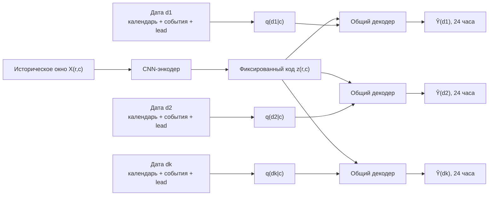
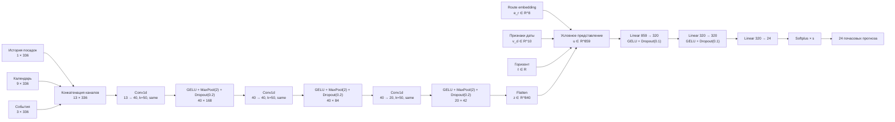
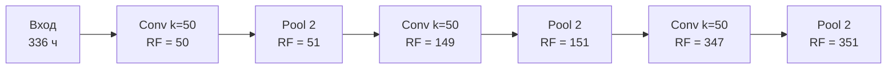
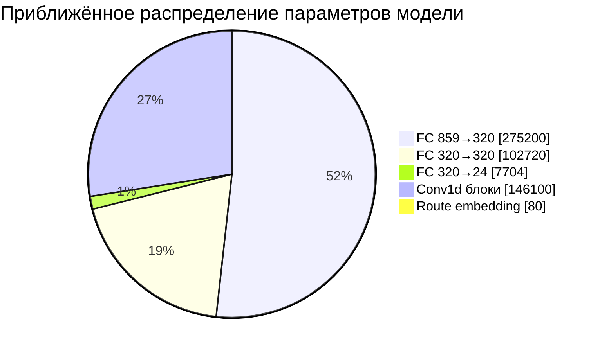
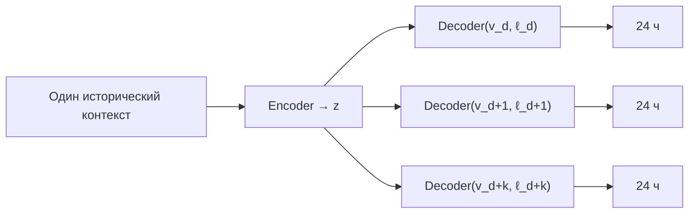
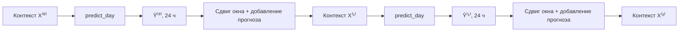
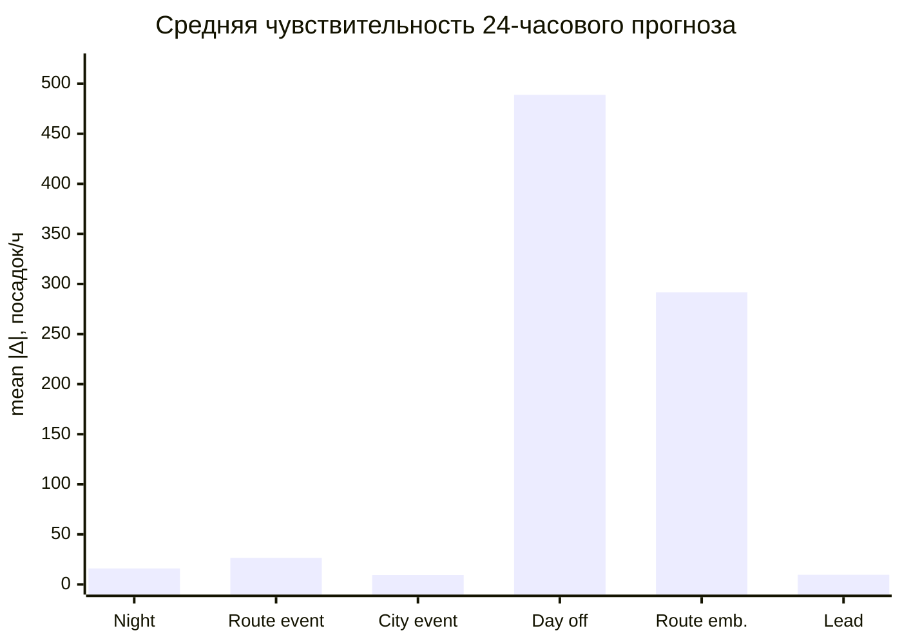
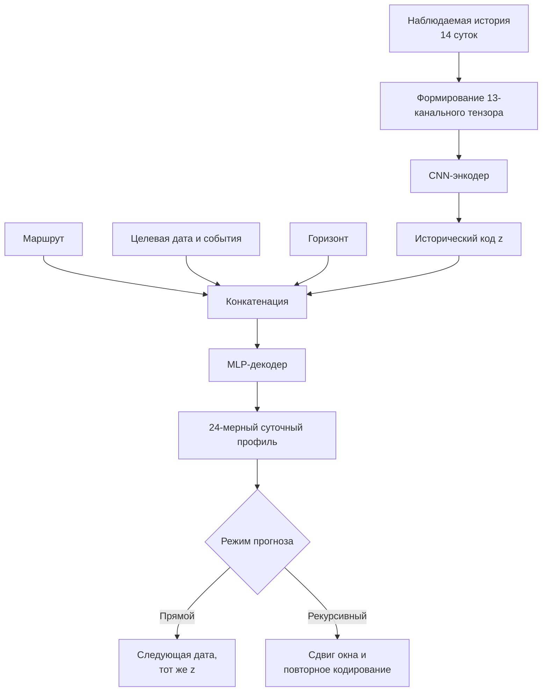

# Условная свёрточная модель для почасового прогнозирования пассажиропотока на произвольном горизонте

## Аннотация

Рассматривается условная одномерная свёрточная нейронная сеть для прогнозирования почасового пассажиропотока на городском маршруте. Архитектура разделяет вычисление прогноза на две стадии. На первой стадии фиксированное историческое окно продолжительностью 14 суток анализируется свёрточным энкодером и преобразуется в латентное представление истории, не зависящее от конкретной запрашиваемой будущей даты. На второй стадии **целевая дата выбирается уже после кодирования последовательности**: к неизменному историческому представлению добавляются embedding маршрута, календарно-событийные характеристики выбранной даты и относительный горизонт прогноза. Поэтому при одном и том же проанализированном историческом окне изменение даты запроса приводит к изменению прогнозируемого 24-часового профиля без повторного анализа исходной последовательности. В отличие от покомпонентной авторегрессии по часам, модель формирует полный суточный вектор за один прямой проход декодера. Для многодневного прогнозирования поддерживаются два режима: прямой, в котором один исторический код переиспользуется для произвольного набора будущих дат, и рекурсивный, в котором предсказанный суточный профиль включается в последующее окно истории и контекст кодируется заново.

**Ключевые слова:** временные ряды, Conv1d, пассажиропоток, условное прогнозирование, экзогенные признаки, многогоризонтный прогноз, авторегрессия.

---

## 1. Формальная постановка задачи

Пусть:

- $r$ - идентификатор маршрута;
- $c$ - cutoff, первая дата после наблюдаемого исторического интервала;
- $d \ge c$ - целевая дата;
- $h \in \{0,\ldots,23\}$ - номер часа внутри целевых суток;
- $T=336$ - длина исторического окна, соответствующая 14 суткам.

Историческое окно задаётся как

$$
\mathcal{H}_{r,c}
=
\left\{
y_{r,t},
\mathbf{c}_t,
\mathbf{e}_t
\right\}_{t=c-T}^{c-1},
$$

где $y_{r,t}$ - число посадок за час, $\mathbf{c}_t$ - календарные признаки, $\mathbf{e}_t$ - событийные признаки.

Модель аппроксимирует отображение

$$
f_\theta:
\left(
\mathcal{H}_{r,c},
r,
\mathbf{v}_{r,d},
\ell(d,c)
\right)
\mapsto
\widehat{\mathbf{Y}}_{r,d},
$$

где

$$
\widehat{\mathbf{Y}}_{r,d}
=
\left[
\hat y_{r,d,0},
\hat y_{r,d,1},
\ldots,
\hat y_{r,d,23}
\right]^\top
\in \mathbb{R}_{\ge 0}^{24}.
$$

Таким образом, один запрос соответствует не одному часовому значению, а полному суточному вектору.

---

## 2. Представление входных данных

### 2.1. Исторический тензор

Число посадок нормируется глобальным коэффициентом

$$
s = \max\left(1,\; \mathbb{E}_{\text{train}}[y]\right),
\qquad
x^{(y)}_t = \frac{y_t}{s}.
$$

Исторический тензор формируется конкатенацией по каналам:

$$
\mathbf{X}
=
\operatorname{concat}
\left(
\mathbf{x}^{(y)},\,
\mathbf{C},\,
\mathbf{E}
\right)
\in \mathbb{R}^{13\times 336},
$$

где:

- $1$ канал - нормированное число посадок;
- $9$ каналов - календарные признаки;
- $3$ канала - событийные признаки.

Календарные переменные содержат циклические кодировки часа, дня недели и дня месяца, а также бинарные индикаторы `is_holiday`, `is_day_off`, `is_short_working_day`.

Для периодической величины $q$ с периодом $P$ используется стандартное вложение на единичную окружность:

$$
\phi(q;P)
=
\left(
\sin \frac{2\pi q}{P},
\cos \frac{2\pi q}{P}
\right).
$$

### 2.2. Условные признаки целевой даты

Целевая дата описывается вектором

$$
\mathbf{v}_{r,d}\in\mathbb{R}^{10},
$$

содержащим четыре циклических календарных координаты, три бинарных рабочих флага и три суточных событийных индикатора.

Маршрут кодируется обучаемым embedding:

$$
\mathbf{e}_r
=
\operatorname{Embedding}(r)
\in \mathbb{R}^{8}.
$$

Дополнительно используется нормированная относительная удалённость даты от cutoff:

$$
\ell(d,c)=\frac{(d-c)_{\text{days}}}{60}.
$$

---

## 2.3. Разделение анализа истории и выбора даты прогноза

Принципиальной особенностью архитектуры является разделение исторического анализа и формирования запроса на будущую дату. Сначала энкодер вычисляет

$$
\mathbf{z}_{r,c}
=
E_{\theta}
\left(
\mathbf{X}_{r,c}
\right),
$$

где $\mathbf{X}_{r,c}$ полностью определяется наблюдаемым окном до момента cutoff $c$. На этом этапе целевая дата $d$ в вычисления не входит.

После получения $\mathbf{z}_{r,c}$ дата запроса может быть выбрана независимо. Для каждой даты $d$ формируется отдельный условный вектор

$$
\mathbf{q}_{r,d\mid c}
=
\left[
\mathbf{e}_r;
\mathbf{v}_{r,d};
\ell(d,c)
\right],
$$

и прогноз вычисляется декодером

$$
\widehat{\mathbf{Y}}_{r,d}
=
D_{\theta}
\left(
\mathbf{z}_{r,c},
\mathbf{q}_{r,d\mid c}
\right).
$$

Следовательно, для двух различных будущих дат $d_1$ и $d_2$ при одном и том же историческом контексте

$$
\mathbf{z}_{r,c}^{(d_1)}
=
\mathbf{z}_{r,c}^{(d_2)}
=
\mathbf{z}_{r,c},
$$

но, вообще говоря,

$$
\mathbf{q}_{r,d_1\mid c}
\neq
\mathbf{q}_{r,d_2\mid c}
\quad\Longrightarrow\quad
\widehat{\mathbf{Y}}_{r,d_1}
\neq
\widehat{\mathbf{Y}}_{r,d_2}.
$$

Иными словами, свёрточная часть отвечает за извлечение информации из наблюдаемой последовательности, тогда как выбор конкретной даты осуществляется на уровне условного декодирования. Это позволяет один раз закодировать историческое окно и затем получать различные прогнозы для нескольких будущих дат без повторного прохождения исходной последовательности через CNN.

**Рисунок 1.** Разделение исторического кодирования и условного выбора даты. Код истории вычисляется один раз; изменение даты изменяет условный запрос к декодеру, но не требует повторного анализа исходного временного ряда.

---

## 3. Архитектура модели

**Рисунок 2.** Полная вычислительная схема модели. Свёрточная ветвь извлекает представление исторического окна, после чего декодер условится на маршруте, характеристиках целевой даты и горизонте прогноза.

---

## 4. Свёрточный энкодер

Для $j$-го свёрточного блока предактивация канала $o$ в момент $t$ определяется выражением

$$
A^{(j)}_{o,t}
=
b^{(j)}_o
+
\sum_i
\sum_{q=0}^{49}
W^{(j)}_{o,i,q}
H^{(j-1)}_{i,t+q-p_j},
$$

где $p_j$ - величина дополнения, соответствующая режиму `padding="same"`.

После нелинейности и max-pooling:

$$
H^{(j)}_{o,t}
=
\max_{u\in\{0,1\}}
\operatorname{GELU}
\left(
A^{(j)}_{o,2t+u}
\right),
\qquad
j=1,2,3.
$$

Функция активации задаётся как

$$
\operatorname{GELU}(x)
=
x\,\Phi(x),
$$

где $\Phi(x)$ - функция распределения стандартного нормального закона.

Изменение размерностей имеет вид

$$
13\times336
\rightarrow
40\times168
\rightarrow
40\times84
\rightarrow
20\times42.
$$

После развёртки:

$$
\mathbf{z}
=
\operatorname{vec}\left(H^{(3)}\right)
\in
\mathbb{R}^{840}.
$$

### Эффективное рецептивное поле

Для каскада из трёх свёрток с ядром $k=50$ и трёх pooling-операций со stride $2$ теоретическое рецептивное поле последнего временного элемента равно 351 исходному часу.

**Рисунок 3.** Рост теоретического рецептивного поля по глубине энкодера. Значение 351 превышает фактическую длину окна 336 из-за нулевого дополнения по границам.

---

## 5. Условный декодер

После кодирования истории формируется объединённое представление

$$
\mathbf{u}
=
\left[
\mathbf{z};
\mathbf{e}_r;
\mathbf{v}_{r,d};
\ell
\right]
\in
\mathbb{R}^{859}.
$$

Далее применяются два полносвязных слоя:

$$
\mathbf{a}_1
=
\operatorname{GELU}
\left(
W_1\mathbf{u}+\mathbf{b}_1
\right),
\qquad
W_1\in\mathbb{R}^{320\times859},
$$

$$
\mathbf{a}_2
=
\operatorname{GELU}
\left(
W_2\mathbf{a}_1+\mathbf{b}_2
\right),
\qquad
W_2\in\mathbb{R}^{320\times320}.
$$

Итоговый часовой прогноз:

$$
\hat y_h
=
s\cdot
\operatorname{Softplus}
\left(
\mathbf{w}_h^\top\mathbf{a}_2+b_h
\right),
\qquad
h=0,\ldots,23.
$$

Softplus обеспечивает неотрицательность выходов:

$$
\operatorname{Softplus}(x)=\log(1+e^x).
$$

Существенно, что 24 выхода не являются независимыми моделями. Все часы разделяют единое скрытое представление $\mathbf{a}_2$, вследствие чего сеть аппроксимирует **совместный суточный профиль**.

---

## 6. Параметризация

Полное число обучаемых параметров модели составляет

$$
N_\theta = 531\,804.
$$

Основная параметрическая ёмкость сосредоточена в первом полносвязном слое, который отображает 859-мерное условное представление в скрытое пространство размерности 320.

**Рисунок 4.** Структура параметрической ёмкости. Диаграмма предназначена для иллюстрации доминирующей роли полносвязного декодера; суммарное число параметров соответствует 531 804.

---

## 7. Многодневное прогнозирование

### 7.1. Прямой режим

Для последовательности целевых дат

$$
[a,b)
=
\{d_1,\ldots,d_D\},
\qquad
D=(b-a)_{\text{days}},
$$

исторический код $\mathbf{z}$ вычисляется один раз, после чего изменяются только условные признаки даты.

$$
\widehat{\mathbf{Y}}_{r,[a,b)\mid c}
=
\operatorname{stack}_{d=a}^{b-1}
f_\theta
\left(
\mathbf{X}_{r,c},
r,
\mathbf{v}_{r,d},
\ell(d,c)
\right)
\in
\mathbb{R}_{\ge0}^{D\times24}.
$$

### 7.2. Рекурсивный режим

В рекурсивном варианте прогноз за сутки $k$ включается в следующий исторический контекст:

$$
\widehat{\mathbf{Y}}^{(k)}
=
f_\theta
\left(
\mathbf{X}^{(k)},
r,
\mathbf{v}_{r,c_k},
0
\right),
$$

$$
\mathbf{F}^{(k+1)}
=
\left[
\mathbf{F}^{(k)}_{24:336};
\widehat{\mathbf{Y}}^{(k)}
\right].
$$

После 14 последовательных обновлений исходные фактические наблюдения полностью покидают 14-дневное окно.

---

## 8. Чувствительность условного прогноза

Диагностический эксперимент из исходного описания показывает, что различные условные входы неодинаково изменяют суточный профиль. Для каждого модифицированного признака рассчитывалось

$$
\overline{|\Delta|}
=
\frac{1}{24}
\sum_{h=0}^{23}
\left|
\hat y_h^{\text{modified}}
-
\hat y_h^{\text{base}}
\right|.
$$

Зафиксированные значения:

| Изменяемый вход | Среднее $|\Delta|$, посадок/ч |
|---|---:|
| Ночное обслуживание: $0\to1$ | 16.0 |
| Событие у маршрута: $0\to1$ | 26.5 |
| Городское событие: $0\to1$ | 9.3 |
| Выходной день: $0\to1$ | 488.9 |
| Embedding маршрута: $7\to11$ | 291.6 |
| Lead: $1\to61$ | 9.6 |

**Рисунок 5.** Среднее абсолютное изменение 24 выходов при контролируемом изменении одного условного входа. Это характеристика чувствительности обученной функции, а не оценка причинного эффекта.

---

## 9. Обучение и критерии качества

В текущей реализации модель обучается минимизацией MAE:

$$
\mathcal{L}_{\mathrm{MAE}}
=
\frac{1}{24R}
\sum_{i=1}^{R}
\sum_{h=0}^{23}
\left|
\hat y_{i,h}-y_{i,h}
\right|,
$$

где $R$ - число суточных примеров.

Дополнительно вычисляется WAPE:

$$
\operatorname{WAPE}
=
\frac{
\sum_{i,h}
\left|
\hat y_{i,h}-y_{i,h}
\right|
}{
\sum_{i,h}
y_{i,h}
}.
$$

Оптимизация производится AdamW с ограничением нормы градиента. Выбор checkpoint выполняется по значению validation MAE.

---

## 10. Экспериментальные результаты многодневного прогноза

В исходном проекте были зафиксированы два 61-дневных backtest-периода.

### CNN отдельно

| Период | Прямой CNN | Рекурсивный CNN |
|---|---:|---:|
| Июль-август | 0.7955 | 0.7672 |
| Сентябрь-октябрь | 0.8175 | 0.8553 |

```mermaid
xychart-beta
    title "CNN: прямой и рекурсивный режим"
    x-axis ["Июль-август", "Сентябрь-октябрь"]
    y-axis "Score" 0.74 --> 0.88
    bar "Прямой" [0.7955, 0.8175]
    bar "Рекурсивный" [0.7672, 0.8553]
```

### Смесь Transformer / CNN

| Период | Прямая смесь | Смесь с рекурсивной CNN |
|---|---:|---:|
| Июль-август | 0.8373 | 0.8297 |
| Сентябрь-октябрь | 0.8366 | 0.8543 |

```mermaid
xychart-beta
    title "Смесь Transformer / CNN"
    x-axis ["Июль-август", "Сентябрь-октябрь"]
    y-axis "Score" 0.80 --> 0.87
    bar "Прямая смесь" [0.8373, 0.8366]
    bar "С рекурсивной CNN" [0.8297, 0.8543]
```

Совокупный score смеси изменился с

$$
0.8369 \rightarrow 0.8432,
\qquad
\Delta = +0.0063.
$$

Наблюдаемый результат не следует интерпретировать как универсальное превосходство рекурсивного режима: на одном периоде рекурсия улучшает качество, на другом - ухудшает.

---

## 11. Статистическая и архитектурная интерпретация

Предложенная модель может рассматриваться как параметризация условного математического ожидания

$$
\widehat{\mathbf{Y}}_{r,d}
\approx
\mathbb{E}
\left[
\mathbf{Y}_{r,d}
\mid
\mathcal{H}_{r,c},
r,
\mathbf{v}_{r,d},
\ell(d,c)
\right].
$$

Свёрточный энкодер выполняет локально-инвариантное преобразование временного контекста, постепенно увеличивая рецептивное поле и уменьшая временное разрешение. Полносвязный декодер, напротив, является глобальным по отношению к последнему скрытому представлению и может формировать различные выходные профили при одинаковой истории, если изменяются маршрут, дата, событийные признаки или горизонт.

Архитектура не вводит явных стохастических выходов, поэтому прогноз является точечным. Квантильные интервалы, дисперсия условного распределения и калиброванные доверительные интервалы в текущей реализации отсутствуют.

---

## 12. Ограничения

1. **Отсутствие вероятностного выхода.**  
   Модель предсказывает только условную точечную оценку.

2. **Экстраполяция признака горизонта.**  
   API допускает произвольную будущую дату, однако качество вне обучавшегося диапазона не гарантируется.

3. **Накопление ошибок при рекурсии.**  
   В рекурсивном режиме ошибка одного суточного прогноза изменяет вход последующих шагов.

4. **Полная потеря исходного контекста после 14 обновлений.**  
   После 14 рекурсивных суточных шагов историческое окно состоит только из ранее сгенерированных значений.

5. **Событийные признаки целевой даты агрегированы по суткам.**  
   Модель знает факт события в пределах суток, но не его точное часовое расписание.

6. **Нулевое заполнение пропусков требует интерпретационной осторожности.**  
   В частности, отсутствие записи о посадках и истинное нулевое значение могут быть неразличимы на уровне подготовленного входа.

---

## 13. Итоговая спецификация

$$
\boxed{
\mathbf{X}\in\mathbb{R}^{13\times336}
\;\xrightarrow{\text{3×Conv1d + Pool}}\;
\mathbf{z}\in\mathbb{R}^{840}
}
$$

$$
\boxed{
[\mathbf{z};\mathbf{e}_r;\mathbf{v}_{r,d};\ell]
\in\mathbb{R}^{859}
\;\xrightarrow{\text{MLP}}\;
\widehat{\mathbf{Y}}_{r,d}
\in\mathbb{R}_{\ge0}^{24}
}
$$

Основные характеристики реализации:

| Компонент | Значение |
|---|---|
| Историческое окно | 14 суток = 336 часов |
| Число входных каналов | 13 |
| Conv1d | $13\to40\to40\to20$ |
| Размер ядра | 50 |
| Pooling | MaxPool1d(2) после каждой свёртки |
| Код истории | 840 |
| Embedding маршрута | 8 |
| Признаки целевой даты | 10 |
| Условный вектор | 859 |
| MLP | $859\to320\to320\to24$ |
| Выход | 24 почасовых значения |
| Выходная активация | Softplus |
| Число параметров | 531 804 |
| Обучающий loss | MAE |
| Дополнительная метрика | WAPE |

---

## 14. Схема вычислительного процесса

**Рисунок 6.** Логическая схема применения модели на инференсе.

---

## Заключение

Архитектура представляет собой условную CNN-модель многомерного суточного прогнозирования, в которой пространством предсказания является не отдельный следующий временной шаг, а полный 24-компонентный профиль целевой даты. Свёрточная часть концентрирует локальную и среднесрочную структуру 14-дневной истории, тогда как полносвязный декодер связывает историческое представление с известными будущими факторами.

Такое разделение исторического энкодера и условного декодера позволяет переиспользовать один и тот же контекст при прямом прогнозировании нескольких дат и одновременно поддерживает рекурсивный режим, в котором прогнозы динамически обновляют входное окно. Практические backtest-результаты показывают, что рекурсивное обновление может изменять качество существенно и неоднозначно; поэтому его следует рассматривать как альтернативный механизм многогоризонтного инференса, а не как безусловно предпочтительную конфигурацию.
