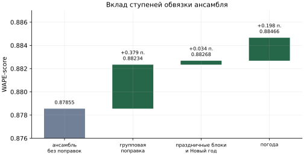
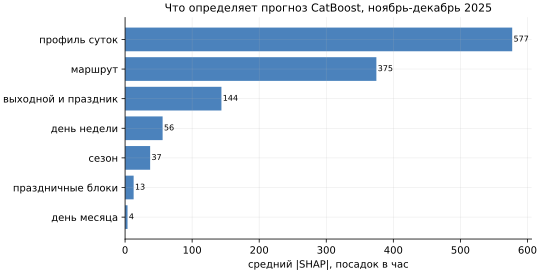
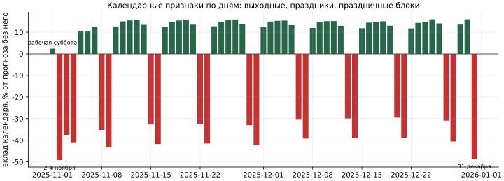
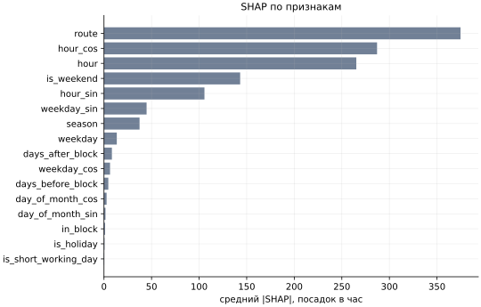

# Classical ML: CatBoost, гармоническая регрессия, MLP и ансамбль

Модель долгосрочного контура решения и основа исследовательской части. Документ описывает, как она
устроена, почему устроена именно так, как проверялась и где кончается её применимость.

## Роль в решении

В решении две идеи применения моделей. **Оперативный контур** опирается на недавнюю
историю, события и прогноз погоды; его основа - CNN (см. [model-ai.md](model-ai.md)).
**Долгосрочный контур** не использует ни лагов, ни прогнозов внешних факторов и строит
регулярную составляющую спроса только по календарю. Эта модель - его реализация, и именно она
строит в прототипе прогноз на дальние месяцы; основная модель по умолчанию - CNN.

1. **Долгосрочный прогноз.** Модель не использует лаги, поэтому одинаково применима на месяц
   и на год вперёд и не накапливает ошибку с горизонтом. Качество на ноябре-декабре близко к
   CNN: 0.88466 против 0.88646, при том что CNN видит свежую историю, а эта модель - нет.
2. **Независимость от свежих данных.** Не нужны ни поток валидаций, ни прогноз погоды:
   пайплайн строится одним запуском от сырых CSV до файла прогноза. Внешние факторы приходят
   поверх прогноза корректирующими коэффициентами.
3. **База исследований.** На ней проведены оба исследования применимости: деградация с
   горизонтом ([research-horizon.md](research-horizon.md)) и прогноз новой линии без
   истории ([research-geo.md](research-geo.md)). Модель быстро обучается и прозрачна, что
   позволило прогнать десятки конфигураций.

## Задача глазами модели

Прогнозируется число посадок на плотной сетке `маршрут x дата x час`: 10 маршрутов, 61 день
ноября-декабря 2025 года, 24 часа - 14 640 значений. Обучение на январе-октябре 2025 года,
304 дня.

Метрика WAPE-score = `max(0, 1 - sum|y - prediction| / sum(y))` глобальная: числитель и
знаменатель суммируются по всей сетке. Маршрут 17 с долей 24% объёма весит в метрике в 6.6
раза больше маршрута 25 с долей 3.6%. Оптимизировать нужно суммарную абсолютную ошибку, а
не средний процент по маршрутам.

Из формы метрики следует функция потерь. Под L1-критерием оптимальный поточечный прогноз -
условная **медиана**, а не среднее. Отсюда квантильная функция потерь `alpha = 0.49` у
бустинга и L1 у нейросети. Следствие, которое стоит помнить: сумма медиан по правоскошенным
почасовым счётчикам заведомо ниже суммы фактов. Это не дефект, а то, чего требует метрика.

## Результат

| Конфигурация | WAPE-score |
|---|---:|
| Ансамбль с погодным блоком | **0.88466** |
| Ансамбль без погоды | 0.88268 |

Как складывался результат, по отправленным на платформу решениям:

| WAPE-score | Что добавлено |
|---:|---|
| 0.86711 | одна модель: гармоническая регрессия |
| 0.87087 | одна модель: CatBoost |
| 0.87163 | одна модель: MLP с эмбеддингами |
| 0.87411 | смесь CatBoost и гармоник |
| 0.87855 | ансамбль 0.7 CatBoost + 0.3 MLP |
| 0.88234 | + групповая поправка `маршрут x день недели` |
| 0.88268 | + признаки праздничных блоков и новогодние множители |
| **0.88466** | + погодный блок, 8 показателей |

Отклонённые варианты с их сабмитами перечислены ниже, в разделе «Что проверено и
отклонено».

## Архитектура

Четыре модели-кандидата. Веса смеси подбираются на прогнозах вне обучения, затем каждая
модель переобучается на всей истории и прогнозирует ноябрь-декабрь.

    плотная почасовая сетка
      -> календарные, циклические признаки и признаки праздничных блоков [+ погода]
        -> 4 модели: catboost_cyclic, catboost_base, harmonic, mlp
          -> прогнозы вне обучения на двух последних фолдах
            -> подбор весов на симплексе по WAPE
              -> переобучение на январе-октябре, прогноз ноября-декабря
                -> групповая поправка маршрут x день недели
                  -> постобработка: маршрут 5, новогодний блок
                    -> файл прогноза

Весь путь от сырых данных до файла прогноза проходится одним запуском.

### Модель 1: catboost_cyclic - основная

Градиентный бустинг на деревьях с квантильной функцией потерь `alpha = 0.49`: 625
итераций, глубина 8, learning rate 0.052, L2-регуляризация 0.617, минимум 2 наблюдения в
листе, Bayesian bootstrap. Гиперпараметры подобраны Optuna по фолдам бэктеста.

| Группа признаков | Состав | Роль |
|---|---|---|
| базовые | час, маршрут, день недели, сезон, праздник, выходной, сокращённый день | суточный и недельный профиль, тип дня |
| циклические | sin/cos от часа, дня недели, дня месяца | границы циклов перестают быть разрывами |
| праздничные блоки | дней до блока выходных, дней после, внутри блока | форма спроса вокруг многодневных выходных |
| погода, опционально | температура, осадки, ветер, облачность, влажность, прогноз ECMWF на сутки по температуре и осадкам, аномалия температуры | фактические условия прогнозных дней |

**Затухающий вес наблюдений** с периодом полураспада 60 дней: `w = 0.5 ** (возраст / 60)`.
Это ключевая настройка. Она приглушает лето, режим которого отличается от учебного года, но
не выбрасывает его. Явная фильтрация (обучение только на январе-мае и сентябре-октябре)
измеримо хуже: WAPE 0.1108 против 0.1062 на пуле фолдов. Летние данные несут суточный и
внутринедельный профиль, от режима не зависящий.

### Модель 2: mlp - нейросеть с эмбеддингами

Таблицу признаков заменяют обучаемые векторы: маршрут (16 измерений), час недели 0-167 (16),
тип дня (4). Дальше один скрытый слой на 256 нейронов, dropout 0.037, функция потерь L1 на
сырых посадках. Прогноз каждого маршрута масштабируется собственным множителем, чтобы
крупные маршруты не подавили мелкие в общем градиенте. Результат усредняется по пяти
случайным инициализациям, обучение занимает около минуты.

Эмбеддинг часа недели - принципиально другой способ описать профиль: не «час» и «день
недели» по отдельности со взаимодействием, которое дерево собирает сплитами, а сразу 168
состояний. Поэтому MLP получает 0.3 веса при худшем одиночном результате: она ошибается не
там, где CatBoost.

### Модель 3: harmonic - гармоническая регрессия

Ряды Фурье: 12 гармоник суточного цикла, 8 недельного, взаимодействие с типом дня,
пуассоновская связь, регуляризация 1.9e-4. В отличие от деревьев экстраполирует
аналитически. Вес в финальной смеси 0: модель оставлена как диагностический эталон и как
кандидат для дальних горизонтов.

### Модель 4: catboost_base

Тот же бустинг на исходном наборе признаков, без циклических и праздничных блоков. Вес 0,
оставлена как контроль: показывает вклад добавленных признаков при тех же гиперпараметрах.

## Ансамбль

Веса подбираются перебором по симплексу с шагом 0.1. Критерий - WAPE на объединённой
валидации фолдов 3 и 4, а не на цели. Лучшая комбинация:

    catboost_cyclic 0.7   mlp 0.3   catboost_base 0.0   harmonic 0.0

Нулевой вес не означает бесполезность модели: он означает, что модель коррелирована с
лидером и в смеси не добавляет информации. Гармоники держали вес, пока CatBoost был слабым;
после добавления циклических признаков и праздничных блоков их вклад ушёл в ноль, а попытка
оставить их принудительно ухудшает пул с 0.1108 до 0.1130.

Оптимум - плоское плато, а не острый пик: восемь лучших комбинаций укладываются в
0.1108-0.1114, и все состоят из той же пары. Смесь устойчива, а не подогнана.

## Групповая поправка

После прогноза применяется мультипликативный коэффициент по ячейкам `маршрут x день недели`:

    k = 1 + (k_raw - 1) * n / (n + 5),   k_raw = sum(y) / sum(prediction) по ячейке,
    k ограничен диапазоном [0.85, 1.20]

Усадка к единице по числу наблюдений нужна потому, что ячеек 70, наблюдений в каждой мало, и
сырые отношения шумные. Коэффициенты снимаются на октябре моделью, обученной до 30 сентября,
то есть вне обучения. Вклад на реальной цели: 0.87855 без поправки, 0.88234 с ней, +0.38
пункта.

Два измеренных ограничения, оба важны для переноса решения:

1. **Окно оценки поправки должно лежать в том же режиме, что цель.** Поправка, снятая через
   границу «лето - учебный год», ухудшает метрику с 0.1096 до 0.13-0.18. Внутри режима
   улучшает: 0.1051 -> 0.0997.
2. **Сетка `маршрут x день недели` - оптимум.** Проверено девять вариантов; единственный,
   обогнавший отсутствие поправки на фолде, проверен сабмитом и проиграл: сетка
   `маршрут x день недели x час` с усадкой 20 дала 0.88226 против 0.88268.

## Постобработка

**Маршрут 5.** В истории по нему ноль успешных валидаций, но в эталоне он присутствует, и
нули по нему стоят около 0.0065 метрики. Маршрут заполняется городским профилем,
отмасштабированным на эту долю.

**Новогодний блок.** 31 декабря 2025 года - официальный выходной, и модели учитывают это
сами. Ручные множители на 29, 30 и 31 декабря - 0.95, 0.92 и 0.92 с дополнительным
ослаблением вечера 31-го - выведены по симметрии с январским выходом из каникул. Проверено
сабмитом: без них 0.88133, с ними 0.88268. Это единственное место, где ручной коэффициент
оправдан: предпраздничный спад модель выучить не может, потому что таких дней в обучении
три-четыре.

**Зануление ночного окна** 01:00-05:30 оставлено параметром и выключено: модели на плотной
сетке сами кладут в часы 1-4 те же 0.04% объёма, что и в истории, эффект на фолдах 0.00.

## Бэктест

Расширяющееся окно, горизонт до двух календарных месяцев, четыре фолда:

| Фолд | Край обучения | Валидация | Роль |
|---|---|---|---|
| 1 | 30 апреля | май-июнь | единственный, где проверяемы праздничные блоки |
| 2 | 30 июня | июль-август | летний режим |
| 3 | 31 августа | сентябрь-октябрь | горизонт 61 день, как в задаче |
| 4 | 30 сентября | октябрь | непрерывный режим без летнего разрыва |

Отбор ведётся по пулу фолдов 3 и 4, а не по среднему из четырёх: осень предсказывается по
осени, как в задаче, а усреднение по фолдам с разными режимами вводит в заблуждение.
Калибровка считается внутри фолда, на периоде перед валидацией, иначе фолды системно
занижают модели, чувствительные к сдвигу уровня.

### Чего бэктест не видит

Это главный практический вывод всей работы с внешними признаками. Четыре пары «бэктест
против реального прогноза» дают два правила, и оба - про соотношение покрытия признака в
обучении и в прогнозе, а не про силу его эффекта.

**Правило 1. Признак, чьё покрытие в обучении богаче, чем в прогнозе, бэктест переоценивает.**
Признак изменений маршрутов (отмены, укорачивания, объезды по постам Дептранса) улучшил
фолды на 0.81 пункта (WAPE 0.0986 против 0.1067) и ухудшил цель на 0.12 пункта (0.88146
против 0.88268). Механизм прямой: отменённый маршрут никого не
везёт. Но сбор постов закончился на краю обучения. Маршруты 7 и 50 стояли под ограничениями
почти каждый день с середины августа, записи доходят до 24 ноября, в декабре их нет вовсе.
Модель списала их просадку на ремонт и вернула полный уровень, которого не было с июля.

**Правило 2. Признак, несущий информацию именно о прогнозных днях, бэктест недооценивает.**
Погодный блок стоил 0.39 пункта на бэктесте и дал +0.198 на цели. На фолдах валидация лежит
в сезоне, представленном в обучении, и восемь коррелированных погодных колонок там - лишняя
сложность. Гипотеза, что работает не погода, а подсказка о невиданном сезоне, проверена и
опровергнута: длина светового дня отдельно дала 0.88273 против 0.88268, а вместе с погодой
ухудшила результат до 0.88362. Выигрыш несёт фактическая погода прогнозных дней, которую
организаторы разрешили использовать.

Отсюда практика: внешние признаки отбираются не по силе эффекта на фолдах, а по тому, как
соотносятся их покрытия в обучении и в прогнозе.

Тот же источник об изменениях маршрутов, применённый не признаком, а датированным правилом -
множителем эффекта в объявленном окне, - на фолде 3 даёт **+1.49 пункта** (0.8875 -> 0.9024) по
изменениям, начавшимся после отсечки. Разбор по каждому изменению - в [data.md](data.md).

## Что проверено и отклонено

| Гипотеза | Замер | Вердикт |
|---|---|---|
| годовые циклические признаки: день года, месяц | ноябрь-декабрь вне обученного диапазона | отклонено |
| линейный тренд | WAPE 0.218 против 0.173 | отклонено |
| двухступенчатая модель «дневной итог x доли суток» | хуже прямого прогноза | отклонено |
| обучение только на учебном режиме, без лета | 0.1108 против 0.1062 | отклонено |
| усреднение CatBoost по 3 и 5 инициализациям | 0.1072 и 0.1071 против 0.1062 | отклонено |
| события: футбол, фестивали, концерты | перемешанные колонки дают прирост больше настоящих | отклонено |
| трафик: баллы пробок, парковки, ДТП, машины в области | 0.1312 против 0.1071 | отклонено в модели |
| изменения маршрутов | +0.81 на фолдах, -0.12 на цели | отклонено, правило 1 |
| флаг школьных каникул | портит фолд 4 на 0.43 пункта | отклонено |
| длина светового дня | 0.88273 против 0.88268, с погодой 0.88362 | отклонено |
| сетка поправки `маршрут x час` и `маршрут x день недели x час` | лучшая 0.88226 против 0.88268 | отклонено |
| зануление ночного окна | 0.00 пункта | отклонено |
| квантильные интервалы 10-90% | покрытие 58-68% вместо 80% | отклонено, см. research-horizon |

**Оракульный резерв.** Подстановка истины на разных уровнях агрегации на фолде 4 показывает:
точный уровень маршрута стоит 0.94 пункта, точный дневной итог города 0.66, точный профиль
`маршрут x час` 1.99, точная форма суток 3.65. Это недостижимый потолок, а не резерв: ни один
из девяти способов оценить тот же профиль по предыдущему окну не переносится. Отклонение
профиля от нормы почти целиком - шум конкретного периода, а не устойчивое смещение.

Это же закрывает вопрос о «более сильной» архитектуре на том же входе. TFT, N-BEATS, DeepAR
сильны лаговыми входами и вниманием по истории; на горизонте 61 день без фактических
предшествующих суток они вырождаются в ту же календарную регрессию. Выигрыш даёт не другая
архитектура поверх календаря, а другая информация на входе, и именно это делает основная
модель: она видит последние две недели ряда.

## Что определяет прогноз: SHAP

Вклады признаков сервисной модели CatBoost на сетке ноября-декабря 2025 года, девять маршрутов с
историей. Модель обучена на сырых посадках с квантильной функцией потерь, поэтому SHAP-вклады - в
посадках в час, а их сумма с базовым значением (822 посадки в час) точно равна прогнозу.

| Группа | Средний \|SHAP\|, посадок в час |
|---|---:|
| профиль суток: час и его sin/cos | 577 |
| маршрут | 375 |
| выходной, праздник, сокращённый день | 144 |
| день недели | 56 |
| сезон | 37 |
| праздничные блоки | 13 |
| день месяца | 4 |

Картина соответствует природе спроса: форма суток и масштаб маршрута объясняют основную часть
прогноза, тип дня - следующий по силе фактор. Праздничные блоки в среднем дают мало, но
сосредоточены в немногих днях, где без них прогноз ошибается сильно.

По дням календарные признаки делают ровно то, что измерено на истории. Обычные будни они
поднимают на 10-16% относительно нейтрального дня, выходные опускают на 30-43%. Праздничный блок
2-4 ноября опускает прогноз на 37-49%, а рабочая суббота 1 ноября, наоборот, почти не отличается
от будня (+2%). 31 декабря - среда, но официальный выходной и начало новогоднего блока, и модель
опускает его на 48%, глубже обычного воскресенья.

## Сервисная версия

В сервисе используется одна модель catboost_cyclic без MLP; в Go-сервисе это резервная модель
долгосрочного контура на всей области дат, основная и выбранная по умолчанию - CNN. Причина отказа от MLP - цена:
MLP стоит около 5 мкс на строку против 0.7 мкс у CatBoost, то есть в семь раз дороже, а в
качестве на фолдах даёт 0.001:

| Модель | WAPE-score на фолдах 3 и 4 |
|---|---:|
| 0.7 CatBoost cyclic + 0.3 MLP | 0.8892 |
| CatBoost cyclic | 0.8882 |
| MLP | 0.8833 |
| CatBoost base | 0.8811 |

CatBoost в Go вызывается через официальную C-библиотеку `libcatboostmodel` (cgo) с
предварительно захэшированными категориями. Сервисный бандл собирает `export_bundle.py` тем же
кодом, что и файл прогноза, но без погоды в признаках: в сервисе погода - сценарное условие,
иначе её эффект считался бы дважды. Разница на целевой метрике - 0.198 пункта: 0.88466 с погодой против 0.88268 без неё. К выходу
модели сервис применяет калибровку `маршрут x день недели`, городскую долю маршрута 5 и
новогодние множители. При каждом старте сервер пересчитывает всю сетку ноября-декабря и
сверяет с Python: совпадение бит в бит. Подробности - в [system.md](system.md) и
[perfomance.md](perfomance.md).

## Область определения

- **Маршруты:** десять заданных, каждый целиком. Маршрут входит в модель категорией и
  эмбеддингом, поэтому новый маршрут без истории модель в текущем виде не прогнозирует.
- **Детализация:** маршрут, дата, час. Остановки и направления недоступны: номер остановки в
  валидациях практически не обновляется в течение суток, справочник координат покрывает
  пять маршрутов.
- **Горизонт:** до двух месяцев с заявленной точностью в знакомом режиме. Дальше точность
  зависит не от расстояния, а от того, представлен ли уровень целевого месяца в обучении.
- **Режим:** учебный год. Летний режим отличается, поправки через границу режимов вредят.
- **Внешние факторы:** глобальные для Москвы. Погода берётся в ближайшей к маршруту точке
  (Балчуг или ВДНХ), трафик - общегородской.

## Ограничения и область адаптации

**Что нужно для переноса.**

- На новые даты того же режима: производственный календарь на нужный год и, если включён
  погодный блок, погода на прогнозный период. Новогодний блок склеивается через границу года
  автоматически.
- На длинный горизонт до года: отключить групповую поправку на месяцах другого режима и
  отдавать прогноз с эмпирическим коридором. Точность по месяцам и цена неизвестного
  годового тренда разобраны в [research-horizon.md](research-horizon.md).
- На новый маршрут без истории: суточная и недельная форма переносится, объём - нет; одна-две
  недели собственных валидаций снимают проблему. Разбор - [research-geo.md](research-geo.md).
- На другой город: переносится структура пайплайна, но не обученные параметры.

**Чего модель принципиально не умеет.**

- Учитывать необъявленные события и перекрытия. На месяц вперёд такой информации не
  существует, поэтому правильное место для них - сценарный коэффициент, а не признак.
- Учитывать пробки на горизонте больше суток: прокси загруженности, который сам
  предсказывается из календаря, не несёт информации сверх календаря.
- Оценивать переток спроса между маршрутами и видами транспорта.
- Отделять годовой тренд от сезонности: история охватывает один неполный год.

## Что доказано, а что нет

Доказаны: результат 0.88466 на скрытом эталоне, воспроизводимость пайплайна одним запуском,
вклад каждой ступени (поправка, праздничные блоки, погода) отдельными сабмитами, отклонения
гипотез замерами. Не доказаны: стабильность на другом году, причинность эффекта внешних
факторов, перенос на маршрут без собственной истории.
