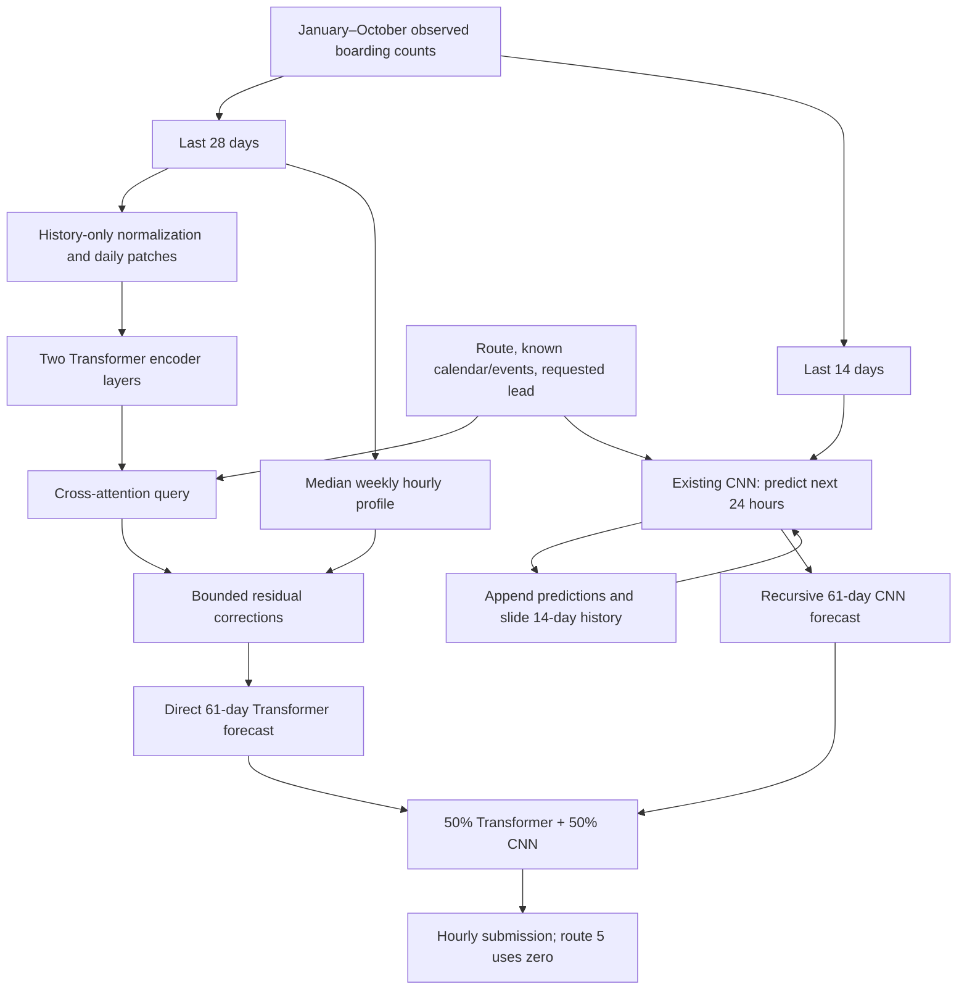

# Seasonal patch Transformer and recursive CNN blend

This branch adds a compact daily-patch Transformer and combines it with the
existing CNN to forecast all 61 days of November–December 2025. The selected
submission is an equal-weight average of a **direct Transformer trajectory** and
an **autoregressive CNN trajectory**. Both components are refitted on observed
January–October labels. Actual labels after October 31 are unavailable and never
enter either forecast.

The Transformer is PatchTST-inspired, with calendar-conditioned cross-attention
and a weekly seasonal residual head. It is not a reproduction of TFT or PatchTST,
and it does not use pretrained weights or additional external training data.

## Forecast graph



The two trajectories are generated independently. The blended prediction is not
fed back into the CNN. Only the CNN's own predicted counts advance its history.

## Transformer inputs and layers

Implementation: [`PatchForecastNetwork`](../src/tram_forecast/patch_model.py).
The selected configuration has 28 history days, width 48, two encoder layers,
four attention heads, dropout 0.1 and **65,720 trainable parameters**. The existing
CNN has 531,804 parameters.

For `B` route/cutoff contexts and `R` requested future days:

| Stage | Shape | Meaning |
|---|---|---|
| Observed hourly counts | `B × 1 × 672` | 28 complete days before the cutoff |
| History features | `B × 12 × 672` | Nine calendar channels and three event channels |
| Daily patch | `B × 28 × 36` | 24 normalized counts plus 12 daily mean features |
| Linear projection + learned position | `B × 28 × 48` | One token per observed day |
| Two pre-norm Transformer layers | `B × 28 × 48` | Four heads, FFN width 96, GELU |
| Target-day query input | `R × 21` | Ten calendar/event features, route embedding of 8, three lead features |
| Projected query + cross-attention | `R × 48` each | Attend from a requested day to its context's observed-day tokens |
| Residual head input | `R × 121` | Query, attended context, 24-hour seasonal profile, log local scale |
| MLP head | `121 → 96 → 24` | GELU, dropout, zero-initialized final layer |
| Count prediction | `R × 24` | Nonnegative hourly boarding counts |

History calendars encode sine/cosine of hour, weekday and day of month, plus
Russian holiday, day-off and short-working-day flags. Requests omit the two hour
channels. Event features are `extended_night_service`, `event_near_route` and
`is_citywide_event`; target-day event flags use the maximum over the day's hours.
Historical patch features use daily means. In particular, hourly event timing is
compressed rather than supplied to an hourly future decoder.

Lead features are `(lead − 1)/60`, `sin(2π lead/7)` and `cos(2π lead/7)`.
No target count contributes to features or normalization.

### Seasonal residual prediction

For each context, let `s = max(1, mean(observed history counts))`. Normalize all
observed counts by `s`. At each weekday/hour position, take the median across the
four observed weeks, producing a `7 × 24` normalized seasonal profile. For lead
`l`, select profile day `(l − 1) mod 7`; this also works for cutoffs that are not
Mondays because the history covers complete weeks immediately before the cutoff.

For hourly baseline `b` and MLP output `r`, the prediction is:

```text
prediction = s × expm1(max(0, log1p(b) + 2 × tanh(r)))
```

Zero initialization of the final MLP layer starts the model exactly at the
seasonal median. Learned corrections are bounded in normalized log space, while
history-only scaling accommodates route volumes. The outer clamp enforces
nonnegative counts. This is a stability mechanism, not a guarantee of bounded
errors when predictions are repeatedly fed back.

### Context reuse

The encoder runs once per route/cutoff context. The context packs flattened tokens
(`28 × 48`), the weekly profile (`7 × 24`) and local scale into a 1,513-element
vector. Request indices reuse that vector across future days. This keeps the
existing two-dimensional `encode_history` / `predict_day` interface compatible
with `fixed_forecast` and `InferenceRunner`.

The direct Transformer predicts every future day against the original cutoff.
It never consumes its own predictions as history.

## Autoregressive CNN inference

Implementation: [`recursive_forecast`](../src/tram_forecast/autoregressive.py).
The CNN architecture remains unchanged; see [the baseline architecture](architecture.md).
For the selected daily recursion:

1. Copy the last 14 days of actual observations into private forecast state.
2. Predict the next day's 24 counts with relative lead 1 and that day's known
   calendar/event inputs.
3. Append those predictions, discard the oldest day from the input window and
   repeat until 61 days have been generated.

After 14 generated days the CNN history consists entirely of predicted counts.
No observed November–December counts are used, even if an evaluation data object
also contains held-out labels. The caller's original counts are never modified.
Daily and weekly block recursion and anchored recursion were compared; the final
submission uses daily unanchored CNN recursion.

## Training and model selection

The direct-model experiment uses original-unit MAE divided by a constant fitting
scale, AdamW (learning rate 0.001, weight decay 0.01), batch size 32 and gradient
clipping at 1. Each context samples up to 12 target days from leads 1–61, with
partial horizons retained near the end of training data. Scaling the loss by a
constant preserves the MAE minimizer. Evaluation uses complete, frozen-cutoff
61-day forecasts and aggregate WAPE rather than rolling observed validation
history.

The selected Transformer uses seed 123 and the CNN seed 67, both with seven
training epochs. Final refits train from scratch on January–October for those
fixed epoch counts. The earlier July backtest retrains on data through July 1;
September validation models train only through August 31. The July check uses
epoch counts originally selected using September validation, so it is a
retrospective robustness check, not a fully nested or untouched test.

The final blend weight was chosen from a small grid by pooled WAPE over both
origins. Pooled WAPE sums absolute errors and actual counts across both periods;
it is not an unweighted average of their scores.

| Strategy | July 2–August 31 | September–October | Pooled WAPE-score |
|---|---:|---:|---:|
| Previous direct Transformer/CNN blend | 0.8373 | 0.8366 | 0.8369 |
| Pure recursive CNN | 0.7672 | 0.8553 | 0.8155 |
| 75% direct Transformer / 25% recursive CNN | 0.8378 | 0.8458 | 0.8422 |
| Selected 50% direct Transformer / 50% recursive CNN | 0.8297 | 0.8543 | 0.8432 |

Pure Transformer recursion, short-step Transformer training, four-week
free-running Transformer training and seasonal linear ARX models did not improve
on the selected hybrid in this search. Detailed results and data fingerprints
are recorded in [the architecture experiment](../experiments/patch_transformer/results.json)
and [the autoregression experiment](../experiments/autoregression/results.json).

### Reported competition feedback and limitations

After downloading and submitting the forecast, the user reported an improvement
of **only +0.003 score**. The exact absolute score and the comparison submission
were not supplied, so this is recorded as user-reported feedback rather than a
verified model-to-model benchmark. It must not be replaced by the larger local
validation improvement in claims about hidden-test performance.

Architecture, checkpoint and blend choices were all tuned against a small amount
of available 2025 data. The selected blend loses accuracy on July–August while
improving September–October. Possible reasons for weak hidden-period transfer
include different seasonal demand, validation-selection bias and recursive error
accumulation; the available evidence does not establish a specific cause. A newer
architecture and a higher tuned validation score do not establish the best
possible November–December forecast.

## Checkpoints, inference and export

`tram_forecast.train.load_model` recognizes the `patch` and `cnn` experiment
checkpoint architecture tags and still accepts the original CNN checkpoint
format. `InferenceRunner` uses the loaded model's history length (28 for the
Transformer; 14 for the CNN fallback). Existing CNN weights cannot be loaded as
Transformer weights. The legacy Go head exporter does not support this attention
model or the hybrid recursive workflow.

Reproduction commands, including training before export, are in the
[Transformer experiment guide](../experiments/patch_transformer/README.md) and
[autoregression guide](../experiments/autoregression/README.md). To reproduce the
specific original checkpoint directory in a fresh checkout with local datasets:

```bash
.venv/bin/python experiments/patch_transformer/run.py \
  --output outputs/patch_transformer_trial \
  --epochs 18 --patience 5 --seeds 67 123 --refit
.venv/bin/python experiments/autoregression/probe.py
.venv/bin/python experiments/autoregression/backtest.py
.venv/bin/python experiments/autoregression/tune_cnn.py
.venv/bin/python experiments/autoregression/select_and_export.py --include-tuned
.venv/bin/python experiments/autoregression/export_submission.py
```

Training/selection commands require fresh output directories. The last command
regenerates the canonical files from already trained checkpoints and overwrites
those export files. Checkpoints, submissions and large generated artifacts remain
Git-ignored under `outputs/`; they are not included in the branch. The official
`dataset/test_submission.csv` template is also a local prerequisite.

The canonical `outputs/submission_nov_dec.csv` covers all ten routes and all 61
days, preserving the template's order and `route;date;hour;prediction` header.
`outputs/predicted_labels_nov_dec.csv` contains identical predictions under a
`boardings` header for label-style consumers; it is not observed ground truth.
Route 5 receives zero. Export metadata records source/checkpoint SHA-256 hashes,
cutoff, weights and coverage. The exporter follows the notebook's format but is
a separate implementation rather than a call to the existing `write_submission`.

## Verification

```bash
.venv/bin/python -m pytest -q --confcutdir=experiments \
  experiments/patch_transformer experiments/autoregression
```

Eight focused tests cover cached features, partial horizons, seasonal
initialization, grouped inference, encoder gradients, checkpoint compatibility,
runner integration and recursive feedback. They also verify that forecasts are
unchanged when future labels are altered or physically removed. Generated
submissions were checked for 14,640 unique route/date/hour keys, finite
nonnegative values and agreement with reloaded checkpoints.

The pre-existing full test suite cannot collect because `tests/conftest.py`
imports the absent `tram_forecast.config` module. The standalone experiment
commands avoid the stale CLI/preparation APIs; this branch does not claim to
repair those existing repository issues.
