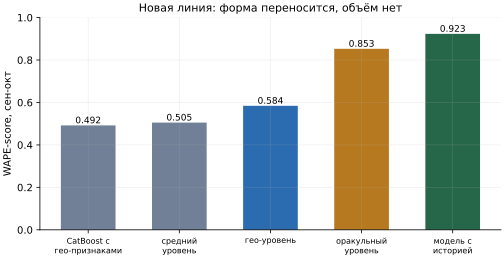
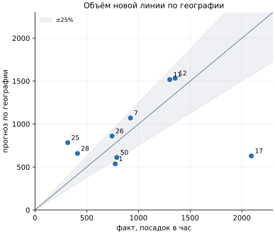
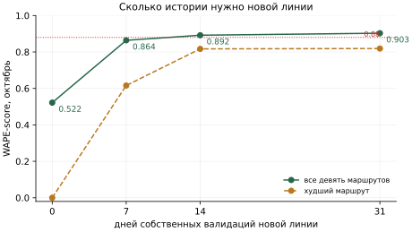

# Исследование: прогноз новой линии без истории

> **Статус: в работе.** Эксперимент проведён целиком, числа ниже - результаты замеров, но
> исследование ещё не закрыто: план дополнительных проверок - в конце документа. Выводы можно
> использовать для направления развития, но не как доказательство готового решения.

Кейс требует понимать область адаптации модели: что нужно, чтобы перенести её на новые
маршруты. Исследование отвечает на вопрос, **может ли модель прогнозировать загрузку только
что введённой линии, и если да, то с какой точностью и неопределённостью.**

Эксперимент проведён на календарной модели (см. [model-ml.md](model-ml.md)). В ней маршрут
входит категориальным признаком и эмбеддингом, как и в основной CNN-модели (см.
[model-ai.md](model-ai.md)). Поэтому ни одна из двух моделей в текущем виде не переносится на
маршрут, которого не было в обучении, и вопрос в том, чем заменить номер маршрута.

## Коротко

Прогноз новой линии распадается на два независимых вопроса с разными ответами.

**Форма - да.** Суточный и недельный профиль переносится между маршрутами почти бесплатно.
Модель без номера маршрута при известном объёме даёт **WAPE-score 0.853** против 0.923 у
модели с историей. Профили маршрутов похожи: отклонение суточной формы от общей 4.4-10.4%,
утренний пик у всех девяти маршрутов в 8 часов.

**Объём - нет.** Географические признаки дают медианную ошибку уровня 23.3% и итоговый
**WAPE-score 0.584** против 0.505 у варианта «считаем линию средней» и 0.923 у линии с
историей. Перестановочный контроль даёт p = 0.064: **на пороге значимости, не за ним.** При
восьми обучающих маршрутах связь «география - объём» установить нельзя.

**Неопределённость честная и огромная.** Интервал 80% на суммарный объём новой линии - это
разброс в 3.8-6.5 раза, и даже он накрывает факт в 7 случаях из 9.

**Практический ответ другой и лучше.** Линии нужна не вся история, а одна-две недели своей.
Обучение на восьми маршрутах плюс первые 7 дней новой линии даёт 0.864, 14 дней - 0.892,
31 день - 0.903. **В день открытия - нет, через неделю - почти как обычную.**

## Дизайн эксперимента

Девять маршрутов с историей: 1, 7, 11, 12, 17, 25, 26, 28, 50. Маршрут 5 исключён: в
истории январь-октябрь у него нет успешных валидаций, проверить на нём точность нечем. По
данным Дептранса маршрут 5 в текущей нумерации открылся 16 декабря 2025 года - то есть это и
есть реальный пример новой линии, но уже за пределами имеющихся данных.

**Leave-one-route-out.** Каждый маршрут по очереди полностью убирается из обучения, модель
учится на восьми остальных и прогнозирует выкинутый. Оценка всегда на сентябре-октябре. Два
информационных окна:

| Вариант | Обучение на 8 маршрутах | Что изолирует |
|---|---|---|
| A | январь-октябрь, включая оценочное окно | чистый перенос по географии |
| B | январь-август, осени не видел никто | география плюс горизонт 61 день, как в задаче |

**Географические признаки** собраны из OpenStreetMap через Overpass API, 22 признака на
маршрут: длина линии, число остановок, средний перегон, пересадки на метро и железную дорогу
в 300 и 500 м, остановки дальше 800 м от метро, расстояние до центра, доля линии в радиусе 5 и
10 км от центра, длина общего пути с другими трамваями, жилые, многоквартирные и дома от
девяти этажей в 500 м, магазины, учебные заведения, автобусные остановки в 300 м.

| Маршрут | Доля объёма | Посадок в час | Длина, км | Остановок | Метро | Общий путь, км | Жилых домов | До центра, км |
|---|---:|---:|---:|---:|---:|---:|---:|---:|
| 17 | 23.6% | 1932 | 11.2 | 26 | 1 | 2.2 | 520 | 10.4 |
| 12 | 15.7% | 1280 | 18.6 | 46 | 10 | 7.6 | 1185 | 6.8 |
| 11 | 15.0% | 1226 | 16.8 | 40 | 4 | 14.3 | 970 | 8.0 |
| 7 | 10.9% | 890 | 16.1 | 44 | 14 | 7.5 | 1132 | 5.0 |
| 50 | 10.1% | 826 | 13.4 | 40 | 13 | 5.7 | 731 | 3.1 |
| 1 | 8.6% | 702 | 7.2 | 21 | 2 | 0.0 | 500 | 13.2 |
| 26 | 8.2% | 669 | 10.2 | 26 | 2 | 0.0 | 714 | 6.4 |
| 28 | 4.7% | 380 | 7.0 | 16 | 1 | 0.0 | 401 | 10.7 |
| 25 | 3.3% | 273 | 8.1 | 21 | 2 | 4.9 | 271 | 7.4 |

**Конфигурации.** В первых четырёх прогноз собирается как «уровень x форма»: форма - общая
для всех маршрутов модель на нормированной цели, уровень - средние посадки в час, которые
оцениваются разными способами.

| Конфигурация | Что показывает |
|---|---|
| средний и медианный уровень | уровень как у среднего или медианного из восьми известных маршрутов, без географии - планка |
| оракульный уровень | настоящий уровень выкинутого маршрута подставлен вручную - потолок при идеально угаданном объёме |
| гео-уровень | уровень предсказан из географии - рабочий вариант, ответ на вопрос |
| CatBoost с гео-признаками | текущий CatBoost без номера маршрута, но с гео-признаками - «просто подменить признак» |
| модель с историей | текущий CatBoost, маршрут в обучении есть - референс |

## Результат

Все девять выкинутых маршрутов одной дробью, как считается лидерборд. 95%-й интервал -
бутстрепом по дням.

| Вариант | Конфигурация | WAPE-score | 95% ДИ | Смещение уровня | Медианная ошибка уровня | Форма |
|---|---|---:|---|---:|---:|---:|
| A | средний уровень | 0.5051 | 0.483-0.524 | -0.4% | 32.3% | 0.853 |
| A | медианный уровень | 0.5318 | 0.516-0.546 | -15.3% | 40.1% | 0.853 |
| A | **гео-уровень** | **0.5841** | 0.574-0.593 | -6.2% | 23.3% | 0.853 |
| A | оракульный уровень | 0.8527 | 0.836-0.866 | -0.4% | 0.5% | 0.853 |
| A | CatBoost с гео-признаками | 0.4920 | 0.465-0.514 | +10.9% | 38.7% | 0.829 |
| A | модель с историей | 0.9231 | 0.920-0.926 | -0.5% | 0.7% | 0.923 |
| B | средний уровень | 0.5055 | 0.484-0.524 | -1.3% | 32.3% | 0.854 |
| B | медианный уровень | 0.5174 | 0.500-0.532 | -11.0% | 37.4% | 0.854 |
| B | **гео-уровень** | **0.5770** | 0.565-0.587 | -6.8% | 25.1% | 0.854 |
| B | оракульный уровень | 0.8374 | 0.823-0.850 | +7.1% | 6.8% | 0.854 |
| B | CatBoost с гео-признаками | 0.5215 | 0.499-0.540 | +4.3% | 27.3% | 0.831 |
| B | модель с историей | 0.8869 | 0.874-0.897 | -0.6% | 3.8% | 0.889 |

Колонка «форма» - WAPE-score после пересчёта прогноза под настоящий объём внутри каждого
маршрута: ошибка формы без ошибки уровня.

Четыре вывода из таблицы:

- **Горизонт холодному маршруту почти ничего не стоит.** Гео-уровень теряет от A к B 0.7
  пункта, модель с историей - 3.6 пункта. Ошибка холодной модели определяется уровнем, и
  календарная экстраполяция на этом фоне - шум.
- **«Просто подменить признак» не работает.** CatBoost с гео-признаками хуже планки «линия
  средняя»: 0.492 против 0.505. Дерево выдаёт только значения, встречавшиеся в листьях, и
  линию крупнее всех обучающих недооценивает принципиально.
- **Отбор признака по средней ошибке вредит метрике.** Лучший по таблице одиночный признак
  (см. ниже) улучшает медианную ошибку уровня с 23.3% до 14.1%, но ухудшает итоговую
  метрику с 0.584 до 0.563: WAPE взвешен объёмом, а промах приходится на самый крупный
  маршрут 17.
- **Цена отсутствия истории - 34 пункта:** 0.584 против 0.923.

## Что переносится: форма суток и недели

Нормированные суточные профили девяти маршрутов по рабочим дням сентября-октября отличаются
от общего профиля на 4.4-10.4%, пик у всех приходится на 8 часов. Недельные профили - на
3.1-12.8%, с одним исключением.

Исключение - **маршрут 50, и это не география, а режим работы.** В сентябре-октябре у него
исчезли выходные: отношение выходных к будням упало с 0.555 в августе до 0.030 в октябре (у
остальных маршрутов 0.36-0.75). Маршрут стоял под ограничениями с середины августа. Общая
модель формы предсказывает ему нормальные выходные и получает по форме 0.652 против
0.79-0.90 у остальных.

Отсюда ограничение, которое из географии не следует: **для новой линии нужно знать режим её
работы**, ходит ли она по выходным. Это берётся из расписания, а не из модели. Без маршрута 50
форма поднимается с 0.853 до 0.873, гео-уровень - с 0.584 до 0.609.

## Что не переносится: объём

Уровень выкинутого маршрута, предсказанный из географии, вариант A:

| Маршрут | Факт, посадок в час | Гео-прогноз | Ошибка | WAPE-score маршрута |
|---|---:|---:|---:|---:|
| 12 | 1355 | 1534 | +13% | 0.822 |
| 26 | 745 | 861 | +15% | 0.837 |
| 11 | 1303 | 1518 | +16% | 0.789 |
| 7 | 923 | 1071 | +16% | 0.804 |
| 50 | 791 | 611 | -23% | 0.521 |
| 1 | 776 | 537 | -31% | 0.674 |
| 28 | 411 | 658 | +59% | 0.409 |
| 17 | 2092 | 629 | **-70%** | 0.300 |
| 25 | 317 | 784 | **+147%** | 0.000 |

Пять маршрутов из девяти предсказаны в пределах ±25%. Промахи - на обоих концах диапазона:
самый крупный маршрут недооценён втрое, самый мелкий переоценён в 2.5 раза. Это худшее
распределение ошибок для метрики, взвешенной объёмом. Без маршрута 17 гео-уровень даёт 0.696,
без 17 и 50 - 0.720.

**Почему маршрут 17 не предсказывается.** Он почти геометрический двойник маршрута 26: по 26
остановок, 11.2 против 10.2 км, 1 против 2 пересадок на метро, 520 против 714 жилых домов
вдоль линии. И при этом 1932 против 669 посадок в час - разница в 2.9 раза. Никакой набор
признаков, различающий эти линии хуже, чем втрое, их объёмы не предскажет.

Проверена и версия, что виноват прокси населения (число зданий, а не жителей). Добавлены
счётчики многоквартирных домов и домов от девяти этажей - версия отклонена: у маршрута 17 это
520, 513 и 359, у маршрута 1 - 499, 497 и 419. Почти все жилые дома вдоль трамвайных линий и
так многоквартирные и высокие.

## Признаки уровня и цена отбора

Предсказуемость уровня из одного признака: каждый маршрут предсказывается по восьми
остальным гребневой регрессией, цель - логарифм средних посадок в час.

| Признаки | Медианная ошибка | Максимальная ошибка |
|---|---:|---:|
| длина общего пути с другими трамваями | 10.5% | 230.6% |
| жилые дома в 500 м | 20.9% | 142.7% |
| многоквартирные дома в 500 м | 21.4% | 137.6% |
| число маршрутов на общем пути | 21.5% | 264.2% |
| автобусные остановки в 300 м | 22.5% | 159.2% |
| учебные заведения в 500 м | 25.2% | 124.4% |
| число остановок | 26.7% | 161.3% |
| длина линии | 28.6% | 150.2% |
| **заявлено заранее: пересадки на метро + длина + жилые дома** | **30.6%** | **170.8%** |
| остановки дальше 800 м от метро | 33.2% | 266.3% |
| пересадки на метро | 36.8% | 212.9% |
| **без признаков, среднее по остальным** | **39.7%** | **227.1%** |
| расстояние до центра | 39.8% | 229.7% |
| средний перегон | 40.1% | 227.2% |

Половина признаков не отличима от отсутствия признаков, и при девяти точках это ожидаемо.

Заявленная до замеров тройка признаков оставлена рабочей именно поэтому: взять победителя
из таблицы - значит сделать 22 попытки вместо одной. Цена такого отбора измерена
перестановками: если перемешать географию между маршрутами и тоже брать лучший из 22
признаков, настоящий победитель обгоняет 99.7% перемешанных наборов по медианной ошибке.
Сигнал по медиане есть. Но медиана при девяти наблюдениях не видит четырёх худших: у того же
признака максимальная ошибка 230.6%, и на итоговой метрике он проигрывает заявленной тройке.

**Главный контроль - на самой метрике, и он отрицательный.** Перестановочный тест на итоговом
WAPE с заявленными признаками: настоящая модель 0.584, медиана нулевого распределения 0.440,
95-й процентиль 0.597. Настоящая модель обгоняет 93.6% перемешанных, p = 0.064 ± 0.011 при
2000 перестановках. География, возможно, несёт сигнал об уровне, но на девяти маршрутах это
не доказывается.

## Неопределённость

**Разброс между маршрутами.** Девять значений WAPE-score, вариант A: минимум 0.000, медиана
0.673, максимум 0.837. Модель с историей на тех же маршрутах: 0.873, 0.917, 0.949.

**Предсказательные интервалы 80%** - неопределённость уровня (разброс регрессии внутри
обучающих маршрутов), умноженная на неопределённость формы (квантильные модели 10% и 90%):

| Маршрут | Факт, посадок за 2 месяца | Интервал 80% | Накрыл | Ширина |
|---|---:|---|---|---:|
| 1 | 1 136 093 | 330 тыс. - 1 736 тыс. | да | 5.3x |
| 7 | 1 350 573 | 608 тыс. - 3 920 тыс. | да | 6.5x |
| 11 | 1 907 061 | 872 тыс. - 5 314 тыс. | да | 6.1x |
| 12 | 1 983 604 | 875 тыс. - 5 332 тыс. | да | 6.1x |
| 17 | 3 063 025 | 433 тыс. - 1 657 тыс. | **нет** | 3.8x |
| 25 | 464 537 | 559 тыс. - 2 218 тыс. | **нет** | 4.0x |
| 26 | 1 089 964 | 465 тыс. - 2 896 тыс. | да | 6.2x |
| 28 | 602 164 | 402 тыс. - 2 018 тыс. | да | 5.0x |
| 50 | 1 157 460 | 394 тыс. - 1 995 тыс. | да | 5.1x |

Покрытие 7 из 9 при номинальных 80% формально в порядке. Но прогноз вида «от 0.4 до 2.0
миллиона посадок за два месяца» для планирования подвижного состава бесполезен. Честная
неопределённость здесь настолько велика, что сама является ответом.

Узкий бутстреп-интервал точечных оценок (0.574-0.593 у гео-уровня) не должен вводить в
заблуждение: он описывает разброс от выбора дней, а не от выбора маршрута.
Неопределённость эксперимента определяется девятью маршрутами, а не тысячами часов.

## Сколько своей истории нужно новой линии

Обучение: восемь известных маршрутов до 1 октября плюс первые N дней новой линии начиная с
1 сентября. Оценка всегда на 2-31 октября, поэтому строки сравнимы. При N = 0 модель с номером
маршрута применяется к категории, которой не видела.

| Своей истории | WAPE-score | Худший маршрут | Смещение |
|---|---:|---:|---:|
| 0 дней | 0.522 | 0.000 | -10.9% |
| 7 дней | 0.864 | 0.616 | -3.7% |
| 14 дней | 0.892 | 0.817 | -3.9% |
| 31 день | 0.903 | 0.819 | -3.5% |

Ноль дней даёт 0.522 - столько же, сколько «линия средняя»: модель без истории маршрута не
работает никак. Неделя собственных данных даёт 0.864, две недели - 0.892, на 1.1 пункта ниже
месяца истории. Дальше кривая плоская. **Новая линия становится прогнозируемой через одну-две
недели после открытия, и всё, что для этого нужно, - подключить её валидации к пайплайну.**

## Насколько точной должна быть внешняя оценка объёма

Если объём новой линии приходит извне (обследование, аналогия с похожей линией, экспертная
оценка), таблица показывает требуемую точность. Настоящий уровень умножается на k, форма
общая, вариант A:

| Ошибка в объёме | -50% | -30% | -20% | -10% | 0 | +10% | +25% | +50% | +100% |
|---|---:|---:|---:|---:|---:|---:|---:|---:|---:|
| WAPE-score | 0.483 | 0.670 | 0.757 | 0.829 | 0.853 | 0.824 | 0.723 | 0.498 | 0.006 |

Чтобы удержать 0.80, объём нужно знать с точностью около ±15%, для 0.70 - около ±25%.
Гео-модель даёт медианную ошибку 23.3% и максимальную 147%: в лучшем случае попадает в
нижнюю границу применимости, а в двух случаях из девяти далеко за неё выходит.

## Что проверено и отклонено

| Гипотеза | Замер | Вердикт |
|---|---|---|
| география предсказывает объём новой линии | p = 0.064, 0.584 против 0.505 у планки | не доказано |
| подставить гео-признаки в текущий CatBoost вместо номера маршрута | 0.492 против 0.505 у планки | отклонено |
| виноват плохой прокси населения | многоквартирных 513 из 520 домов у маршрута 17 | отклонено |
| остановки вне пешей доступности метро описывают безальтернативность | 65% у маршрута 17 и 67% у маршрута 25 при разнице объёмов в 7 раз | отклонено |
| взять лучший признак из таблицы | медиана 14.1% против 23.3%, метрика 0.563 против 0.584 | отклонено |
| форма суток и недели переносится между маршрутами | 0.853 против 0.923, отклонение профилей 4-10% | подтверждено |
| одна-две недели своей истории заменяют географию | 0.864 и 0.892 против 0.522 | подтверждено |

**Качество разметки OSM.** Остановки нельзя считать по членам отношения маршрута: разметка
платформ неполна, у маршрута 28 платформами помечены 3 точки из 16, у маршрута 25 - 11 из 21.
Остановки считаются по уникальным названиям узлов трамвайных остановок вдоль путей. Первый
вариант признака давал маршруту 28 две остановки и перегон 6.9 км - и такой признак сломал бы
модель уровня молча. Сырые ответы OSM сохраняются, потому что OSM живой, и без снимка числа
перестали бы воспроизводиться.

## Как применять на практике

1. **До открытия линии** - только сценарный режим. Объём задаёт человек числом или
   коэффициентом, модель раскладывает его по часам и дням недели с точностью формы 0.853.
2. **С первой недели работы** - подключить валидации линии, переобучить, перейти на обычный
   режим: 0.864 через 7 дней, 0.892 через 14.
3. **Режим работы линии** (выходные, ночные часы) брать из расписания, а не из модели.
4. **Не заявлять** точечный прогноз новой линии в день открытия: ожидаемый WAPE-score 0.58 с
   провалами до 0.30 и 0.00 на отдельных маршрутах.

## Границы замера и что осталось сделать

Девять маршрутов, два месяца оценки, один город. Модель уровня обучается на восьми точках,
поэтому любое утверждение о важности гео-признака описательное, а не причинное. Оценочное
окно содержит одну операционную аномалию - закрытие маршрута 50 по выходным, и она влияет на
числа.

Что планируется, чтобы закрыть исследование:

- проверить устойчивость выводов к выбору оценочного окна и к исключению аномальных маршрутов;
- вручную проверить OSM-геометрию и направления всех девяти маршрутов;
- повторить кривую «сколько своей истории нужно» на основной CNN-модели;
- проверить на реальном примере - маршруте 5, открытом в декабре 2025 года, - как только
  появятся его валидации.

Что закрыло бы вопрос об объёме окончательно: все около 40 трамвайных маршрутов Москвы вместо
девяти, чтобы перестановочный контроль стал разрешающим, либо модель спроса на уровне
остановок (матрица перемещений, население и рабочие места в зоне охвата) вместо счётчиков
объектов вдоль линии. Ни того, ни другого в данных хакатона нет.
