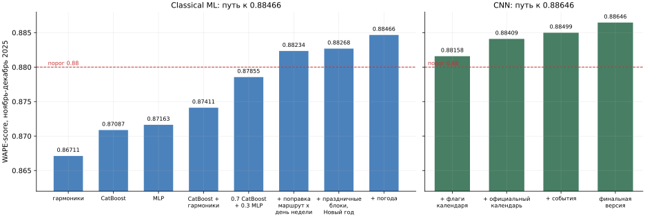
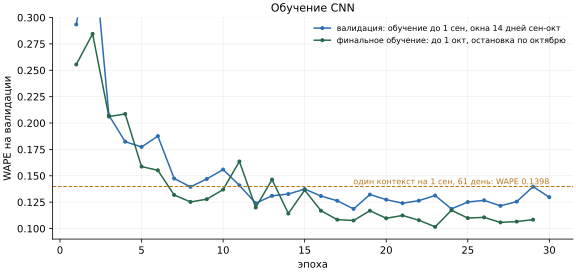
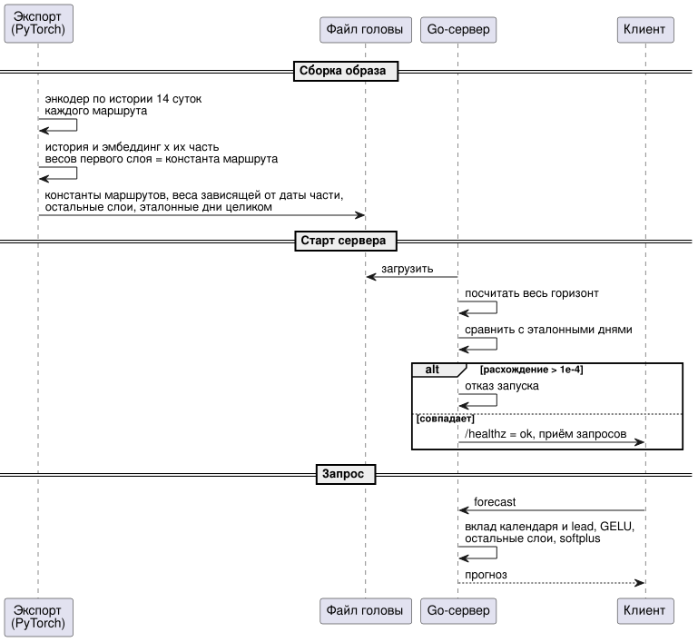

# Основная модель: CNN по почасовой истории маршрута

Флагманская модель решения. Документ описывает идею, входы, архитектуру, обучение,
результат, путь к инференсу и границы применимости.

## Роль в решении

CNN - основная модель прогноза в сервисе. Ансамбль на календарных признаках (см.
[model-ml.md](model-ml.md)) остаётся резервом и используется там, куда CNN по устройству не
дотягивается: горизонт дальше 61 дня и маршрут без истории.

| | CNN | Classical ML |
|---|---|---|
| WAPE-score на ноябре-декабре 2025 | **0.88499** | 0.88466 |
| Что видит на входе | последние 14 суток посадок маршрута, календарь, события | только календарь, маршрут и погоду |
| Постобработка в сабмите | нет, сырой выход сети, маршрут 5 нулями | калибровка, маршрут 5, новогодние множители |
| Горизонт | 1-61 день от последних наблюдённых суток | любой, пока есть календарь |
| Реакция на сдвиг уровня маршрута | видит его в недавней истории | не видит, интерполирует календарь |

## Идея

Классическая календарная модель восстанавливает профиль спроса по часу, дню недели и типу
дня, но не знает, в каком состоянии маршрут находится сейчас. Если маршрут последние
недели работает с ограничениями или его уровень сместился, календарь этого не отражает.

CNN решает задачу иначе. Она один раз **кодирует последние 14 суток почасовой истории
маршрута** свёрточным энкодером в вектор фиксированной длины, а затем общая голова по этому
вектору, идентификатору маршрута, календарю целевого дня и расстоянию до него (lead) выдаёт
**24 почасовых значения на каждый запрошенный день**.

Прогноз прямой, не авторегрессионный: собственные предсказания обратно на вход не подаются,
и ошибка не накапливается от шага к шагу. Каждый день горизонта получается одним проходом
головы от одного и того же кода истории.

## Как пришли к этой архитектуре

1. **Многомасштабная сеть по сырым событиям валидаций.** Первая версия работала с потоком
   отдельных валидаций и параллельными ветками свёрток разного масштаба по образцу TFT.
   Она оказалась тяжёлой в обучении и хрупкой.
2. **Серия архитектурных экспериментов.** Сравнивались десять вариантов: число общих
   стадий, длины ядер, дилатации, ширина головы, ёмкость от 6.6 тыс. до 716 тыс. параметров,
   с недельными профилями в качестве бейзлайна.
3. **Упрощение до сети по почасовым посадкам.** Поток событий убран, архитектура
   зафиксирована: три свёрточные стадии и голова, без конфигурируемых вариантов.
4. **Календарь и события.** Дальше качество росло за счёт входов, а не архитектуры:

| Шаг | WAPE-score |
|---|---:|
| + флаги производственного календаря | 0.88158 |
| + календарь из официального производственного календаря вместо эвристики | 0.88409 |
| + заранее известные события | **0.88499** |

## Входы

**История, 14 суток = 336 часов, 13 каналов на каждый час:**

| Канал | Значение |
|---|---|
| посадки | число посадок, делённое на масштаб: среднее посадок за период обучения |
| sin/cos часа | суточный цикл |
| sin/cos дня недели | недельный цикл |
| sin/cos дня месяца | месячный цикл |
| праздник | официальный праздник или перенесённый выходной |
| выходной | включая обычные выходные, с учётом рабочих суббот |
| сокращённый день | предпраздничный сокращённый рабочий день |
| продлённая ночная работа | часы 0-3 ночей, когда транспорт работает дольше: Новый год, Рождество, Крещение, Пасха, День города |
| событие рядом с линией | мероприятие в 1.5 км от линии маршрута, окно от 2 часов до начала до 2 часов после конца |
| общегородское событие | праздник или массовое событие без одной площадки |

**Запрос на каждый целевой день, 10 признаков плюс контекст:**

- календарь дня: sin/cos дня недели и дня месяца и три флага типа дня, всего 7 значений;
- три флага событий, сведённые максимумом по 24 часам дня: если событие активно хотя бы в
  один час, флаг равен 1;
- идентификатор маршрута, через эмбеддинг размерности 8;
- lead - номер дня от начала прогноза, 1-61, нормированный как `(lead - 1) / 60`.

Календарь берётся из официального производственного календаря РФ в формате XML с явными
переопределениями: рабочие субботы, переносы и сокращённые дни обрабатываются раньше
обычного правила выходных. Для каждого года нужен свой проверенный файл; отсутствующий или
некорректный календарь - ошибка, а не тихая подстановка. Региональные праздники не
учитываются.

События берутся из заранее известного расписания, которое хранится отдельно от посадок.
Поэтому для прогноза не нужны ни будущие посадки, ни будущие строки обучающей выборки.
Пропуск строки в расписании, дубли и небинарные значения - ошибка данных.

Сознательно **не используются**: изменения маршрутов и загрузка парковок. Их покрытие в
обучении и в прогнозе несимметрично, и на календарной модели признак изменений маршрутов
уже показал, что такое несоответствие вредит сильнее, чем помогает (см.
[data.md](data.md)).

## Архитектура

| Слой | Выход на один контекст |
|---|---|
| 13 входных каналов x 336 часов | 13 x 336 |
| Conv1d 13 -> 40, ядро 50, GELU, MaxPool 2, dropout 0.2 | 40 x 168 |
| Conv1d 40 -> 40, ядро 50, GELU, MaxPool 2, dropout 0.2 | 40 x 84 |
| Conv1d 40 -> 20, ядро 50, GELU, MaxPool 2, dropout 0.2 | 20 x 42 |
| Flatten | 840 |
| + эмбеддинг маршрута 8, календарь и события дня 10, lead 1 | 859 |
| Linear 859 -> 320, GELU, dropout 0.1 | 320 |
| Linear 320 -> 320, GELU, dropout 0.1 | 320 |
| Linear 320 -> 24 | 24 |
| softplus x масштаб | 24 неотрицательных значения посадок |

Свёртки сохраняют длину до пулинга. Ядро длиной 50 часов на первой стадии охватывает
двое суток, а после двух пулингов то же ядро покрывает больше недели: сеть видит и
суточный, и недельный цикл. Всего около 532 тыс. параметров: 146 тыс. в энкодере, 386 тыс.
в голове.

Софтплюс на выходе гарантирует неотрицательность, а умножение на масштаб возвращает
прогноз в единицы посадок. Смещение последнего слоя инициализировано так, что в начале
обучения сеть выдаёт средний уровень.

Ключевое свойство для производительности: **энкодер считается один раз на контекст**, а
голова - на каждый целевой день. Запрос на 61 день по одному маршруту - это один проход
энкодера и 61 проход небольшой головы.

## Обучение

- **Данные:** почасовые посадки девяти маршрутов с историей. Маршрут 5 в обучении не
  участвует: в его истории нет ни одной успешной валидации.
- **Примеры:** каждый пример - контекст «маршрут + дата отсечки», 14 суток истории до
  отсечки и до 14 целевых дней после неё. На обучении 1 944 контекста, на валидации 495.
- **Функция потерь:** MAE в исходных единицах посадок, согласованная с метрикой WAPE.
- **Оптимизация:** AdamW, learning rate 8e-4, батч 60 контекстов, до 50 эпох, остановка
  через 5 эпох без улучшения на валидации, обрезка градиента по норме 1.0.
- **Утечки:** будущие посадки в историю не попадают никогда, прогнозы не подаются обратно
  как наблюдения.

**Валидация.** Обучение на данных до 1 сентября, валидация - на сентябре-октябре. Лучшая
эпоха дала WAPE 0.1186 на окнах по 14 дней. Отдельно проверен режим, в котором модель
работает в задаче: один контекст на 1 сентября и прогноз на все 61 день сентября-октября
без обновления истории. Здесь WAPE 0.1398, то есть WAPE-score 0.860 на полном горизонте
61 день, начиная с перехода от лета к учебному году.

**Финальное обучение.** Модель обучается заново на данных до 1 октября, октябрь служит
критерием остановки (лучшая эпоха WAPE 0.1016). Прогноз на ноябрь-декабрь строится от
отсечки 1 ноября по истории 18-31 октября: один контекст на маршрут, 61 целевой день.

## Результат

**WAPE-score 0.88499** на скрытом эталоне ноября-декабря 2025 года. Это лучший результат
решения.

Результат получен на сыром выходе сети: без групповой поправки, без новогодних множителей и
с нулями по маршруту 5. Только нули по маршруту 5 стоят около 0.0065 метрики. Групповая
поправка и новогодние множители измеримо помогали календарной модели (+0.38 и +0.135 пункта
соответственно), так что у CNN есть непроверенный, но понятный запас: перенести на неё
постобработку и заполнение маршрута 5.

Сравнение с календарной моделью честное с одной оговоркой: CNN не использует погоду, а
лучший результат ансамбля получен именно с погодным блоком. Без погоды ансамбль даёт
0.88268, и CNN обгоняет его на 0.23 пункта.

## Инференс

**Python.** Интерфейс из двух шагов повторяет устройство сети:

| Шаг | Вход | Выход |
|---|---|---|
| построить контекст | данные, маршрут, дата отсечки | закодированные 14 суток истории |
| прогноз на день | контекст, целевая дата | 24 значения посадок, часы 0-23 |

Контекст строится без будущих посадок и будущих строк событий и переиспользуется для любого
дня в пределах от отсечки до отсечки плюс 60 дней. Подготовка входов идёт теми же функциями,
что и при обучении, поэтому расхождение «обучение - инференс» исключено по построению.

**Go.** Для сервиса голова сети перенесена в Go, без Python и PyTorch в рантайме. История
и эмбеддинг маршрута при фиксированной дате отсечки не меняются между запросами. Поэтому при
сборке образа PyTorch один раз прогоняет энкодер и умножает вектор истории и эмбеддинг на их
часть весов первого слоя головы. На запрос Go досчитывает только то, что зависит от даты:
вклад календаря и lead в первый слой, активации, остальные слои и softplus. Это точная
перестановка слагаемых, а не аппроксимация.

В экспорт включаются дни, посчитанные PyTorch целиком. При старте Go-сервер пересчитывает
весь горизонт и сверяет с ними; при расхождении больше 1e-4 он не запускается. Несовместимая
версия модели или ошибка в ручной реализации слоя не может молча уйти в работу.

Производительность этой схемы - около 30 000 RPS при p95 0.91 мс на двух ядрах, см.
[perfomance.md](perfomance.md).

## Ограничения

- **Горизонт 61 день от последних наблюдённых суток.** Сеть обучена на окнах до 14 дней, а
  lead 15-61 она экстраполирует. Проверка на 61 дне сентября-октября дала WAPE-score 0.860,
  на ноябре-декабре итог 0.88499. Дальше 61 дня модель не применяется, год вперёд
  прогнозирует календарная модель.
- **Нужна свежая история.** Контекст - последние 14 суток посадок. Если валидации маршрута
  перестали поступать, прогноз строить не от чего.
- **Маршрут 5 и новые маршруты.** Эмбеддинг маршрута обучен на девяти маршрутах. Для нового
  маршрута нужна хотя бы неделя-две собственных валидаций, как показало исследование на
  календарной модели ([research-geo.md](research-geo.md)).
- **Календарь на год вперёд.** Для каждого нового года нужен файл производственного
  календаря.
- **События - ретроспективный каталог.** Каталог мероприятий собран из анонсов, часть
  которых опубликована после 31 октября 2025 года, что организаторы разрешили. Для строгой
  исторической проверки каждое событие нужно фильтровать по дате публикации анонса.
- **Один год истории.** Межгодовой тренд модель не видит, как и календарная.
- **Сервис отстаёт от модели на одну версию.** Go-сервис и замеры производительности
  сделаны для предыдущей версии CNN: история 21 день, голова `685 -> 250 -> 24`, только
  календарь дня. Финальная версия добавила входы и второй скрытый слой, поэтому экспорт
  головы и её реализацию в Go нужно обновить синхронно и повторить сверку. Это первая
  задача плана развития ([roadmap.md](roadmap.md)).
