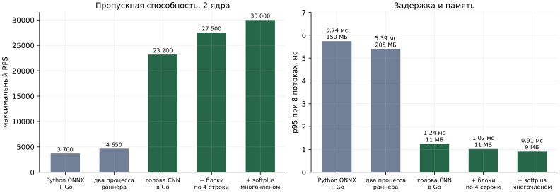
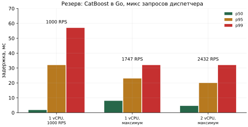

# Производительность

Замеры пропускной способности, задержки и памяти сервиса прогноза. Имя файла сохранено в
согласованной структуре документов.

> **Статус.** Ниже - результаты проведённых замеров. Сырые артефакты прогонов (логи
> нагрузочного клиента, конфигурация запуска, профили CPU и памяти) будут добавлены отдельным
> разделом «Артефакты замера» в конце документа.

## Требование кейса

Один контейнер 2-4 vCPU и 2-4 ГБ RAM, держащий сотни RPS при p95 меньше 200-300 мс и
утилизации CPU 60-80% с запасом, память стабильна без swap.

## Итог

| Сервис | Ресурсы | Максимум RPS | p95 | Память |
|---|---|---:|---:|---:|
| основной: голова CNN в Go | 2 ядра | **30 000** | **0.91 мс** при 8 потоках | **9 МБ** |
| резерв: CatBoost в Go | 1 ядро | 1 747 | 23 мс | 28 МБ |
| резерв: CatBoost в Go | 2 ядра, общие с генератором нагрузки | 2 432 | 20 мс | 34 МБ |

Оба варианта перекрывают требование кейса на один-два порядка по RPS и на два порядка по
задержке, при памяти в десятки мегабайт вместо гигабайтов. Кэш и предрасчёт не используются:
каждый ответ считается моделью заново.

## Методика

- **Стенд:** Docker Desktop на Apple Silicon. Сервису выделены два ядра (`cpuset: "0,1"`), как
  требует кейс; генератор нагрузки работает в той же сети compose на остальных ядрах.
- **Нагрузочный клиент** на Go: заданный RPS или максимум, фиксированное число потоков,
  латентности p50/p95/p99; CPU и RSS сервиса снимаются с самого процесса и через
  `/api/v1/stats`.
- **Микс запросов диспетчера** - генерируемый список URL, повторяющий реальные сценарии:

| Доля | Запрос | Строк модели |
|---:|---|---:|
| 60% | один маршрут за день по часам | 24 |
| 20% | все маршруты за день | 240 |
| 15% | один маршрут за 30 дней по суткам | 720 |
| 5% | все маршруты за 30 дней по часам | 7 200 |

Для CNN строка модели - это один проход головы на пару «маршрут x день», в среднем около 20 на
запрос; для CatBoost - одна ячейка «маршрут x дата x час».

## Основной сервис: голова CNN в Go

| Вариант | Максимум RPS | p50 / p95 при 8 потоках | Память |
|---|---:|---:|---:|
| Python-раннер на ONNX Runtime + Go-фронт | 3 700 | 1.66 / 5.74 мс | 150 МБ |
| два процесса Python-раннера | 4 650 | 1.19 / 5.39 мс | 205 МБ |
| голова CNN перенесена в Go | 23 200 | 0.18 / 1.24 мс | 11 МБ |
| + строки блоками по 4 | 27 500 | 0.16 / 1.02 мс | 11 МБ |
| + softplus многочленом Чебышёва | **30 000** | **0.15 / 0.91 мс** | **9 МБ** |

Как пришли к этой схеме:

- **С Python-раннером** CPU уходил на HTTP-сервер Python и сериализацию JSON: из примерно 300 мкс
  на запрос сама сеть занимала 7-35 мкс. Один процесс упирается в GIL, второй добавляет только
  25%: на двух ядрах им тесно рядом с Go.
- **Перенос головы в Go** убрал второй HTTP-переход, JSON между процессами и GIL и дал рост в
  шесть раз.
- **Блоки по 4 строки** читают веса второго слоя один раз на блок.
- **Softplus через многочлен** вместо стандартного `log1p`, который занимал пятую часть времени.
- Деление тяжёлого запроса между двумя ядрами не ускорило ни одиночные запросы, ни пропускную
  способность, поэтому его нет.

**Голова на одном ядре**, микросекунды на вызов:

| Строк | PyTorch | ONNX Runtime | Go |
|---:|---:|---:|---:|
| 1 | 30 | 8.5 | 3.1 |
| 270 | 207 | 206 | 490 |

На больших пачках ONNX Runtime быстрее за счёт SIMD, но в сумме Go выигрывает: сквозной путь
запроса важнее скорости одного умножения матриц. Большую часть CPU запроса по-прежнему
занимает голова: Go считает её скалярно, без SIMD, и это резерв на будущее.

**Куда уходит задержка.** Лёгкий запрос сервер обрабатывает примерно за 0.07 мс. Задержка при
300 RPS (p50 1.2 мс) почти целиком - виртуальная сеть Docker Desktop: пустой `/healthz` там
отвечает за 1.0 мс.

## Резерв: CatBoost в Go

| Конфигурация | Нагрузка | Факт RPS | p50 | p95 | p99 | CPU | RSS |
|---|---|---:|---:|---:|---:|---:|---:|
| 1 vCPU | 1000 RPS | 1 000 | 1.8 мс | 32 мс | 57 мс | 73% | 30 МБ |
| 1 vCPU | максимум | 1 747 | 8.0 мс | 23 мс | 32 мс | 99% | 28 МБ |
| 2 vCPU, общие с генератором | максимум | 2 432 | 4.6 мс | 20 мс | 32 мс | 165% | 34 МБ |

При 1000 RPS на одном ядре утилизация 73% - ровно та зона 60-80% с запасом, которую просит
кейс. Модель: около 0.7 мкс на строку в батче, 625 деревьев глубины 8. **Вся сетка
ноября-декабря, 14 640 строк, считается за 11 мс на одном ядре.**

Почему в сервисном резерве нет MLP: она стоит около 5 мкс на строку против 0.7 у CatBoost и
снижает пропускную способность до 458 RPS на ядро ради +0.001 WAPE-score на фолдах.

## Ограничения замеров

- Замеры основного сервиса сделаны на предыдущей версии CNN: голова `685 -> 250 -> 24`. У
  финальной версии голова шире - `859 -> 320 -> 320 -> 24`, около 386 тыс. параметров против
  примерно 177 тыс., - поэтому стоимость строки вырастет примерно вдвое. Даже с таким запасом
  пропускная способность остаётся на порядки выше требования; замер будет повторён после
  переноса финальной головы в Go.
- Docker Desktop на macOS добавляет около 1 мс сетевой задержки, которой не будет на Linux-хосте.
- Браузерная нагрузка из интерфейса - оценка снизу: браузер держит не больше 6 соединений.

## Артефакты замера

Раздел будет дополнен: команды запуска нагрузочного клиента, версии окружения, сырые результаты
каждого сценария, доля ошибок, p99, CPU и RSS во времени, длительный прогон на стабильность
памяти.
