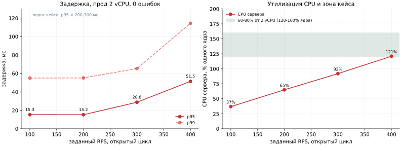
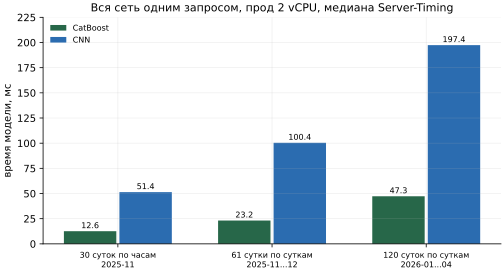

# Производительность

Замеры пропускной способности, задержки и памяти сервиса прогноза. Имя файла сохранено в
согласованной структуре документов.

Сервис - Go-сервис в `service/` с двумя моделями, CatBoost и CNN, развёрнутый на
https://mttech.k1rles.ru. Команды замеров и их описание - в `service/README.md`, раздел
«Производительность». В конце документа для сравнения сохранены замеры предыдущего стенда.

## Требование кейса

Один контейнер 2-4 vCPU и 2-4 ГБ RAM, держащий сотни RPS при p95 меньше 200-300 мс и
утилизации CPU 60-80% с запасом, память стабильна без swap.

## Итог

| Замер | Где | Результат |
|---|---|---|
| смесь запросов, 200 RPS, открытый цикл | прод, 2 vCPU | p95 **15.22 мс**, p99 55.12 мс, 0 ошибок, CPU сервера 65% ядра |
| смесь запросов, 400 RPS, открытый цикл | прод, 2 vCPU | p95 51.46 мс, p99 114.43 мс, 0 ошибок, CPU сервера 121% ядра |
| смесь запросов, 2 и 8 потоков, замкнутый цикл | прод, 2 vCPU | **572-582 RPS**, 0 ошибок, генератор на тех же 2 vCPU |
| смесь запросов, 8 потоков, замкнутый цикл | Apple M4, 10 ядер | **3 403 RPS**, p95 8.29 мс, p99 37.79 мс, 0 ошибок |
| смесь запросов, 8 потоков, замкнутый цикл | Apple M4, `GOMAXPROCS=2` | 1 272 RPS, p95 24.31 мс, p99 42.31 мс, 0 ошибок |
| вся сеть, 30 суток по часам, время модели | прод, 2 vCPU | CatBoost **13 мс**, CNN **51 мс** |
| вся сеть, 61 сутки по суткам, время модели | прод, 2 vCPU | CatBoost **23 мс**, CNN **100 мс** |
| вся сеть, 120 суток по суткам 2026-01...04, время модели | прод, 2 vCPU | CatBoost **47 мс**, CNN **197 мс** |
| память контейнера в простое | прод | **19.65 МиБ** по `docker stats` |

Кэш и предрасчёт не используются: каждый ответ считается моделью заново. На прод-хосте смесь
запросов при 200-300 RPS держит p95 15-29 мс, на порядок ниже порога кейса; сравнение по
пунктам - в разделе «Сравнение с требованием кейса».

## Методика

- **Нагрузочный клиент** `cmd/load` на Go: замкнутый цикл с заданным числом потоков или
  открытый цикл с заданным RPS (64 соединения), латентности p50/p95/p99 и число ошибок.
  Задержка - от отправки запроса до конца ответа на стороне клиента.
- **Порядок** на обеих машинах один: 5 секунд прогрева по 8 потокам, затем замкнутый цикл по
  8 и по 2 потока и открытый цикл 100, 200, 300, 400 RPS, каждый замер 15 секунд. На M4 при
  10 ядрах добавлены 500 и 1000 RPS.
- **Смесь запросов** - 4 000 тел из `scripts/gen_load.py` (seed 1), один и тот же файл на обеих
  машинах, модель CatBoost или CNN поровну:

| Доля | Запрос |
|---:|---|
| 60% | один маршрут на сутки по часам, половина с дождём на 16-22 ч |
| 20% | вся сеть на сутки по часам, половина с дождём |
| 15% | один маршрут на 30 суток по дням, горизонт месяц |
| 5% | вся сеть на 30 суток по часам |

  В среднем около 600 строк модели на запрос, средний ответ 7.8-9.9 КБ в разных замерах.
- **CPU и память на проде** - процесс сервера через `/proc` (`cmd/load -pid`), в процентах
  одного ядра; память контейнера - `docker stats` до и после серии.
- **CPU и память на M4** - `cmd/load` не читает `/proc` на macOS, поэтому CPU берётся из
  `cpu_pct` в `/api/v1/stats` за время замера в процентах одного ядра: `/stats` вызывается до и
  после каждого замера, потому что `cpu_pct` считается с предыдущего вызова. Память - RSS
  процесса по `ps`.
- **Время модели на тяжёлый запрос** - часть `model` заголовка `Server-Timing`, медиана 5
  запросов после одного прогревочного, через публичный адрес: вся сеть одной моделью с
  коридором и без условий.

Команды на Apple M4, из `service/`:

    uv run --quiet --python 3.12 python scripts/gen_load.py > bodies.jsonl
    go build -o bin/server ./cmd/server && go build -o bin/load ./cmd/load
    GOMAXPROCS=2 ./bin/server -addr :18080 &
    ./bin/load -url http://localhost:18080/api/v1/forecast -bodies bodies.jsonl -c 8 -d 5s -label "прогрев"
    curl -s localhost:18080/api/v1/stats
    ./bin/load -url http://localhost:18080/api/v1/forecast -bodies bodies.jsonl -c 8 -d 15s -label "8 потоков"
    curl -s localhost:18080/api/v1/stats
    ./bin/load -url http://localhost:18080/api/v1/forecast -bodies bodies.jsonl -rate 200 -c 64 -d 15s -label "200 RPS"
    curl -s localhost:18080/api/v1/stats

Команды на прод-хосте: клиент собирается под Linux и копируется на хост вместе с
`bodies.jsonl`:

    GOOS=linux GOARCH=amd64 CGO_ENABLED=0 go build -o load ./cmd/load
    PID=$(docker inspect -f '{{.State.Pid}}' trans_predicting-server-1)
    ./load -url http://localhost:8090/api/v1/forecast -bodies bodies.jsonl -c 8 -d 15s -pid $PID -label "8 потоков"
    ./load -url http://localhost:8090/api/v1/forecast -bodies bodies.jsonl -rate 200 -c 64 -d 15s -pid $PID -label "200 RPS"

## Нагрузка на прод-хосте

Хост: 2 vCPU Intel Xeon Gold 6240 2.60 ГГц, 3.9 ГБ RAM (2.0 ГБ свободно), общий с другими
проектами; load average перед замером 0.02. Сервер в Docker, `GOMAXPROCS=2`. Генератор
`cmd/load` запущен на том же хосте и бьёт в `http://localhost:8090` в обход nginx и TLS, то
есть делит с сервером те же 2 vCPU.

| Сценарий | RPS | p50, мс | p95, мс | p99, мс | max, мс | Ошибки | CPU сервера | RSS |
|---|---:|---:|---:|---:|---:|---:|---:|---:|
| 8 потоков, замкнутый цикл | 572 | 6.38 | 48.07 | 117.43 | 414.5 | 0 | 173% | 46 МБ |
| 2 потока, замкнутый цикл | 582 | 0.77 | 12.88 | 53.55 | 112.7 | 0 | 173% | 45 МБ |
| 100 RPS, открытый цикл | 100 | 1.95 | 15.29 | 55.01 | 98.5 | 0 | 37% | 44 МБ |
| 200 RPS, открытый цикл | 200 | 1.74 | 15.22 | 55.12 | 73.7 | 0 | 65% | 44 МБ |
| 300 RPS, открытый цикл | 300 | 1.96 | 28.76 | 65.32 | 209.9 | 0 | 92% | 44 МБ |
| 400 RPS, открытый цикл | 399 | 2.95 | 51.46 | 114.43 | 319.8 | 0 | 121% | 47 МБ |

- CPU - процент одного ядра; бюджет контейнера - 200%.
- В замкнутом цикле сервер получает 173% из 200%, остальное забирает генератор, поэтому
  572-582 RPS - потолок пары «сервер + генератор» на 2 vCPU, а не одного сервиса.
- Память контейнера по `docker stats`: 19.65 МиБ до серии, 29.03 МиБ после.

## Нагрузка на Apple M4

Машина: Apple M4 (10 ядер), 16 ГБ, macOS 15.7.7, сервер без контейнера, генератор на той же
машине. Одна и та же серия с `GOMAXPROCS=10` и с `GOMAXPROCS=2`, то есть на двух ядрах, как на
проде. CPU - процент одного ядра.

| Сценарий | RPS, 10 ядер | p95, мс | p99, мс | CPU | RPS, 2 ядра | p95, мс | p99, мс | CPU |
|---|---:|---:|---:|---:|---:|---:|---:|---:|
| 8 потоков, замкнутый цикл | 3 403 | 8.29 | 37.79 | 744% | 1 272 | 24.31 | 42.31 | 199% |
| 2 потока, замкнутый цикл | 1 181 | 6.62 | 29.32 | 197% | 1 236 | 6.43 | 29.11 | 194% |
| 100 RPS, открытый цикл | 100 | 11.39 | 45.98 | 28% | 100 | 11.46 | 49.32 | 31% |
| 200 RPS, открытый цикл | 200 | 7.99 | 38.15 | 41% | 200 | 10.43 | 39.05 | 45% |
| 300 RPS, открытый цикл | 300 | 7.05 | 33.69 | 55% | 300 | 10.73 | 36.05 | 55% |
| 400 RPS, открытый цикл | 400 | 6.99 | 30.41 | 67% | 400 | 11.31 | 32.50 | 68% |
| 500 RPS, открытый цикл | 500 | 6.93 | 29.68 | 85% | - | - | - | - |
| 1000 RPS, открытый цикл | 1 000 | 6.75 | 30.05 | 165% | - | - | - | - |

- Ошибок нет ни в одном замере. RSS процесса по `ps`: 57-58 МБ в простое, 37-68 МБ под
  нагрузкой.
- Хвост p95-p99 дают тяжёлые запросы по всей сети на 30 суток по часам: около 6 500 строк
  модели на запрос против 24-720 у остальных.
- Прежний замер на этой же машине дал 2 544 RPS при 8 потоках, новый - 3 403: разброс между
  прогонами на ноутбуке заметный, сравнивать стоит порядок, а не проценты.
- В смеси запрос к CNN стоит примерно в 2.4 раза больше CPU, чем запрос к CatBoost.

## Тяжёлые запросы по моделям

Вся сеть одной моделью с коридором и без условий, время модели по `Server-Timing`.

| Запрос | CatBoost, прод | CNN, прод | CatBoost, M4 | CNN, M4 |
|---|---:|---:|---:|---:|
| 30 суток по часам, 2025-11-01...2025-11-30 | 13 мс | 51 мс | около 8 мс | около 29 мс |
| 61 сутки по суткам, 2025-11-01...2025-12-31 | 23 мс | 100 мс | около 14 мс | около 56 мс |
| 120 суток по суткам, 2026-01-01...2026-04-30 | 47 мс | 197 мс | - | - |

Прод - 2 vCPU Xeon Gold 6240; там на запрос уходит примерно в 1.6-1.8 раза больше времени,
чем на M4. Почти всё время запроса - сама модель: разбор, признаки, поправки и JSON вместе
занимают 0.4-2.1 мс. CatBoost считает деревья через `libcatboostmodel`, CNN - голову
`859 -> 320 -> 320 -> 24` в Go скалярно, без SIMD, по одному проходу на пару маршрут x день.
Самый тяжёлый запрос - CNN по всей сети на 120 суток - укладывается в 197 мс, у нижней
границы порога кейса в 200 мс; это одиночный запрос, в смеси диспетчера таких нет.

## Сравнение с требованием кейса

| Требование | Прод, 2 vCPU |
|---|---|
| сотни RPS | 100-400 RPS в открытом цикле без ошибок; в замкнутом цикле 572-582 RPS вместе с генератором на тех же 2 vCPU |
| p95 меньше 200-300 мс | 15.22 мс при 200 RPS, 28.76 мс при 300 RPS, 51.46 мс при 400 RPS |
| CPU 60-80% с запасом | 65% ядра при 200 RPS - около трети бюджета 2 vCPU; 92% ядра при 300 RPS; 121% ядра при 400 RPS - 60% бюджета, нижняя граница зоны кейса |
| память стабильна без swap | 44-47 МБ RSS в 15-секундных замерах, 19.65 МиБ контейнера в простое |

Генератор нагрузки забирает часть тех же 2 vCPU, поэтому у самого сервиса запас выше
570-580 RPS; насколько выше, этот замер не показывает.

## Что ещё не замерено

- **Сетевой путь снаружи.** Нагрузка на прод-хосте подана через `localhost:8090`; путь через
  nginx и TLS от внешнего клиента под нагрузкой не измерялся.
- **Длительный прогон.** Стабильность памяти под нагрузкой за 30 минут не проверялась;
  известна только память в простое и в 15-секундных замерах.
- **Сервис отдельно от генератора.** На проде генератор делит с сервером те же 2 vCPU, поэтому
  предельный RPS одного сервиса там не измерен.
- `cmd/load` с `-pid` снимает CPU и память процесса через `/proc`, то есть только на Linux; на
  macOS эти поля нулевые.

## Предыдущий стенд

Замеры ниже сделаны до слияния сервиса, на стенде из ветки `feature/cnn` с предыдущей версией
CNN (голова `685 -> 250 -> 24`, только календарь дня, три плоских коэффициента) и на отдельном
стенде CatBoost. Они не описывают текущий сервис и оставлены как история оптимизаций.

**Стенд:** Docker Desktop на Apple Silicon, сервису выделены два ядра (`cpuset: "0,1"`),
генератор нагрузки в той же сети compose на остальных ядрах. Смесь запросов та же по долям,
но без условий. Для CNN строка модели - один проход головы на пару «маршрут x день», для
CatBoost - одна ячейка «маршрут x дата x час».

| Стенд | Ресурсы | Максимум RPS | p95 | Память |
|---|---|---:|---:|---:|
| голова предыдущей CNN в Go | 2 ядра | 30 000 | 0.91 мс при 8 потоках | 9 МБ |
| CatBoost в Go | 1 ядро | 1 747 | 23 мс | 28 МБ |
| CatBoost в Go | 2 ядра, общие с генератором нагрузки | 2 432 | 20 мс | 34 МБ |

### Голова предыдущей CNN в Go

| Вариант | Максимум RPS | p50 / p95 при 8 потоках | Память |
|---|---:|---:|---:|
| Python-раннер на ONNX Runtime + Go-фронт | 3 700 | 1.66 / 5.74 мс | 150 МБ |
| два процесса Python-раннера | 4 650 | 1.19 / 5.39 мс | 205 МБ |
| голова CNN перенесена в Go | 23 200 | 0.18 / 1.24 мс | 11 МБ |
| + строки блоками по 4 | 27 500 | 0.16 / 1.02 мс | 11 МБ |
| + softplus многочленом Чебышёва | **30 000** | **0.15 / 0.91 мс** | **9 МБ** |

Как пришли к этой схеме:

- **С Python-раннером** CPU уходил на HTTP-сервер Python и сериализацию JSON: из примерно 300 мкс
  на запрос сама сеть занимала 7-35 мкс. Один процесс упирается в GIL, второй добавляет только
  25%: на двух ядрах им тесно рядом с Go.
- **Перенос головы в Go** убрал второй HTTP-переход, JSON между процессами и GIL и дал рост в
  шесть раз.
- **Блоки по 4 строки** читают веса второго слоя один раз на блок.
- **Softplus через многочлен** вместо стандартного `log1p`, который занимал пятую часть времени.
- Деление тяжёлого запроса между двумя ядрами не ускорило ни одиночные запросы, ни пропускную
  способность, поэтому его нет.

**Голова на одном ядре**, микросекунды на вызов:

| Строк | PyTorch | ONNX Runtime | Go |
|---:|---:|---:|---:|
| 1 | 30 | 8.5 | 3.1 |
| 270 | 207 | 206 | 490 |

На больших пачках ONNX Runtime быстрее за счёт SIMD, но в сумме Go выигрывает: сквозной путь
запроса важнее скорости одного умножения матриц. Большую часть CPU запроса по-прежнему
занимает голова: Go считает её скалярно, без SIMD, и это резерв на будущее.

**Куда уходит задержка.** Лёгкий запрос сервер обрабатывает примерно за 0.07 мс. Задержка при
300 RPS (p50 1.2 мс) почти целиком - виртуальная сеть Docker Desktop: пустой `/healthz` там
отвечает за 1.0 мс.

### Стенд CatBoost в Go

| Конфигурация | Нагрузка | Факт RPS | p50 | p95 | p99 | CPU | RSS |
|---|---|---:|---:|---:|---:|---:|---:|
| 1 vCPU | 1000 RPS | 1 000 | 1.8 мс | 32 мс | 57 мс | 73% | 30 МБ |
| 1 vCPU | максимум | 1 747 | 8.0 мс | 23 мс | 32 мс | 99% | 28 МБ |
| 2 vCPU, общие с генератором | максимум | 2 432 | 4.6 мс | 20 мс | 32 мс | 165% | 34 МБ |

При 1000 RPS на одном ядре утилизация 73% - ровно та зона 60-80% с запасом, которую просит
кейс. Модель: около 0.7 мкс на строку в батче, 625 деревьев глубины 8. **Вся сетка
ноября-декабря, 14 640 строк, считается за 11 мс на одном ядре.**

Почему в сервисе нет MLP: она стоит около 5 мкс на строку против 0.7 у CatBoost и
снижает пропускную способность до 458 RPS на ядро ради +0.001 WAPE-score на фолдах.

### Ограничения замеров предыдущего стенда

- Замеры головы сделаны на предыдущей версии CNN; у текущей голова шире -
  `859 -> 320 -> 320 -> 24` и около 386 тыс. параметров против примерно 177 тыс., и в ней
  отсутствуют оптимизации предыдущей реализации (блоки по 4 строки, softplus многочленом).
- Docker Desktop на macOS добавляет около 1 мс сетевой задержки, которой не будет на Linux-хосте.
- Браузерная нагрузка из интерфейса стенда - оценка снизу: браузер держит не больше 6 соединений.
