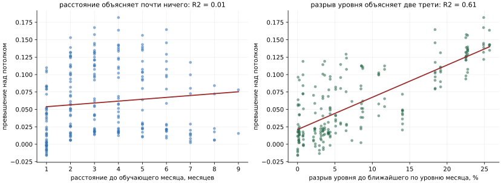
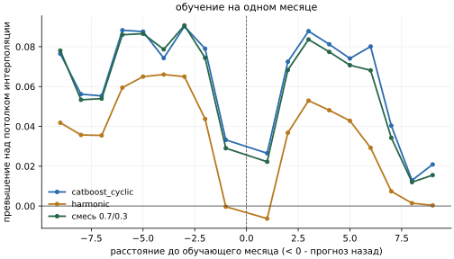
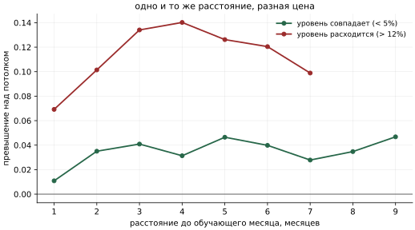
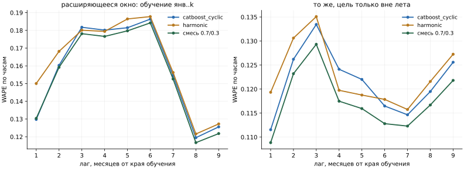
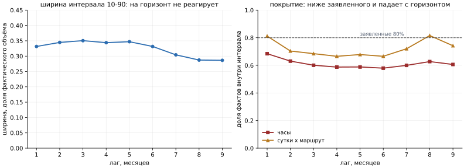
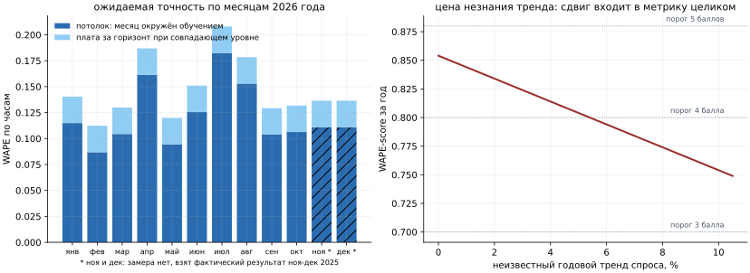

# Исследование: как точность зависит от горизонта и можно ли прогнозировать год

Кейс требует горизонт «год» хотя бы качественно, а история охватывает десять месяцев одного
года. Исследование отвечает на два вопроса: как деградирует прогноз, когда данных о целевом
периоде нет, и чего стоит прогноз на весь 2026 год.

Исследование проведено на календарной модели (см. [model-ml.md](model-ml.md)). Основная
CNN-модель (см. [model-ai.md](model-ai.md)) по устройству работает от последних 14 суток
истории и ограничена горизонтом 61 день, поэтому год вперёд в решении прогнозирует
календарная модель.

## Коротко

- **Ошибка не растёт с горизонтом. Она растёт с разрывом сезонного уровня** между обучением
  и целевым месяцем. Расстояние объясняет 1% разброса ошибки, разрыв уровня - 61-66%.
- **При совпадающем уровне дальность почти бесплатна:** плата за горизонт выходит на полку
  0.03-0.05 WAPE со второго месяца и дальше не растёт.
- **Потолок почасового прогноза по календарю - около 0.12 WAPE** в среднем за год при любой
  архитектуре. Остаток - шум конкретного дня.
- **Прогноз на 2026 год:** WAPE-score 0.854 по часам, 0.888 по суткам, 0.924 по месячным
  итогам. Оценка пессимистичная.
- **Главный риск года - неизвестный тренд.** 5% роста спроса стоят дороже, чем переход от
  двух месяцев прогноза к двенадцати.
- **Квантильные интервалы не годятся:** покрытие 58-68% вместо заявленных 80%. Коридор нужно
  строить эмпирически.

## Почему это можно измерить без данных за 2026 год

Прямо проверить прогноз на 2026 год нельзя: фактов нет. Но можно обеднять обучающую выборку
на известной истории и смотреть, как ошибка реагирует на нехватку информации. Из этого
выводится закон деградации, а из закона - оценка для года.

## Дизайн эксперимента

Данные: январь-октябрь 2025 года, плотная сетка `маршрут x дата x час`, 72 960 строк.
Маршрут 5 из замера исключён: в истории у него ноль успешных валидаций, и в прогнозе он
заполняется отдельной процедурой.

Четыре схемы разбиения, всего 56 конфигураций:

| Схема | Конфигураций | Что развязывает |
|---|---:|---|
| расширяющееся окно | 9 | обучение с января по месяц k, прогноз всех следующих: горизонт растёт вместе с объёмом обучения, как в жизни |
| скользящее окно 1, 2 и 3 месяца | 27 | окно фиксированной ширины, прогноз всех остальных месяцев, включая более ранние |
| leave-one-month-out | 10 | обучение на девяти месяцах, прогноз пропущенного: потолок интерполяции |
| leave-one-month-out с равными весами | 10 | то же без затухания весов наблюдений |

Скользящие окна нужны потому, что в расширяющемся окне горизонт и целевой месяц связаны
жёстко: горизонт 9 месяцев встречается ровно один раз, у октября по январю. В скользящих
окнах один и тот же месяц прогнозируется с разных расстояний, и свойства месяца отделяются от
расстояния.

Вариант с равными весами нужен потому, что затухание весов отсчитывается от края обучения,
а в схеме leave-one-month-out край всегда октябрь, и январь получил бы вес 0.03. Разница
между двумя вариантами оказалась мала (в среднем 0.003, максимум 0.011, без систематического
знака), выводы ниже строятся на варианте с равными весами.

Три модели, все без калибровки и постобработки, чтобы мерить модель, а не обвязку:

- CatBoost с циклическими признаками - основная модель календарного ансамбля;
- гармоническая регрессия - единственная, кто экстраполирует аналитически;
- смесь 0.7 CatBoost + 0.3 MLP - состав ансамбля.

Метрика - та же глобальная WAPE, что на лидерборде, для каждого целевого месяца на трёх
уровнях агрегации: почасовая сетка, суточные итоги маршрута, месячный итог маршрута.
Дополнительно считается WAPE прогноза, перемасштабированного на истинный месячный объём:
ошибка формы, очищенная от ошибки уровня.

**Проверка харнесса.** Конфигурации с краем обучения 31 августа и 30 сентября совпадают с
фолдами 3 и 4 бэктеста ансамбля. Результаты сходятся в пределах различий обвязки: 0.1112
против 0.1108 и 0.0989 против 0.0968-0.0993.

## Главный результат: разрыв уровня, а не расстояние

Регрессия превышения ошибки над потолком интерполяции по скользящим окнам:

| Объясняющая переменная | R2, CatBoost | R2, гармоники | R2, смесь |
|---|---:|---:|---:|
| расстояние до обучающего месяца | 0.013 | 0.011 | **0.012** |
| разрыв уровня до ближайшего по уровню месяца обучения | 0.557 | 0.401 | 0.606 |
| разрыв уровня до среднего по обучению | 0.637 | 0.420 | **0.663** |

Механизм прозрачен. У модели нет лаговых признаков: ни авторегрессии, ни скользящих средних,
ни состояния, которое «стареет». Признаки - час, день недели, тип дня, сезон, расстояние до
праздничного блока. Такая модель не помнит прошлое и не забывает его: она интерполирует
календарь. Ей безразлично, на сколько месяцев вперёд её спрашивают; ей важно, встречался ли
в обучении день с похожим уровнем спроса.

Три следствия, каждое замерено.

**Прогноз назад стоит столько же, сколько вперёд.** Средняя почасовая WAPE по конфигурациям
с окном в один месяц:

| Модель | вперёд | назад |
|---|---:|---:|
| CatBoost | 0.1890 | 0.1918 |
| гармоники | 0.1845 | 0.1831 |
| смесь | 0.1845 | 0.1877 |

**При совпадающем уровне расстояние не важно.** Превышение над потолком для конфигураций,
где в обучении есть месяц с уровнем рабочего дня в пределах 5% от целевого:

| Расстояние, мес | 1 | 2 | 3 | 4 | 5 | 6 | 7 | 8 | 9 |
|---|---:|---:|---:|---:|---:|---:|---:|---:|---:|
| смесь | 0.011 | 0.035 | 0.041 | 0.031 | 0.047 | 0.040 | 0.028 | 0.035 | 0.047 |
| гармоники | -0.011 | 0.018 | 0.026 | 0.022 | 0.029 | 0.017 | 0.008 | 0.018 | 0.021 |

Кривая выходит на полку 0.03-0.05 на втором месяце и дальше не растёт.

**При расходящемся уровне то же расстояние стоит втрое дороже.** Те же конфигурации с
разрывом уровня больше 12%:

| Расстояние, мес | 1 | 2 | 3 | 4 | 5 | 6 | 7 |
|---|---:|---:|---:|---:|---:|---:|---:|
| смесь | 0.069 | 0.101 | 0.134 | 0.140 | 0.126 | 0.120 | 0.099 |

Поэтому наивная кривая «ошибка по горизонту» в расширяющемся окне ведёт себя странно:
растёт до 6 месяцев и падает на 7-9. Горизонт 9 в данных - это пара «январь -> октябрь» с
разницей рабочего дня 4%, а горизонт 4 часто означает «апрель -> июль» с разрывом 22%. Кривая
описывает состав пар, а не горизонт.

## Потолок: чего стоит сама задача

Leave-one-month-out даёт нижнюю границу ошибки: месяц выброшен из обучения, но окружён им с
обеих сторон, уровень модели известен. Это чистая невязка - дневной шум, который календарём
не предсказывается.

| Модель | час x маршрут | сутки x маршрут | месяц x маршрут |
|---|---:|---:|---:|
| CatBoost | 0.1245 | 0.0882 | 0.0561 |
| гармоники | 0.1479 | 0.1170 | 0.0878 |
| смесь | **0.1233** | 0.0903 | 0.0602 |

По месяцам потолок различается вдвое: февраль 0.087, май 0.094, сентябрь и октябрь
0.104-0.106, январь 0.115, июнь 0.126, август 0.153, апрель 0.161, июль 0.183. Летние месяцы и
апрель предсказуемы хуже из-за самих данных: отпуска, дачи и погода делают спрос менее
регулярным.

Независимая проверка без модели: если взять истинный месячный объём и распределить его по
профилю часа недели, снятому на сентябре-октябре, почасовая WAPE для сентября и октября
выходит 0.115-0.121. Тот же порядок.

**Вывод: при календарных входах почасовой прогноз в среднем за год не может быть точнее
примерно 0.12 WAPE ни при каком объёме данных и ни при какой архитектуре.**

## Уровень против формы

Ошибку можно разложить на неверный общий уровень и неверную форму (распределение по часам,
дням недели, маршрутам). Первая снимается извне одним числом: если сценарий задаёт
ожидаемый объём, прогноз перемасштабируется. Вторая не снимается ничем.

Скользящие окна, смесь, почасовая WAPE:

| Разрыв уровня | сырой прогноз | задан уровень города | задан уровень маршрутов |
|---|---:|---:|---:|
| < 3% | 0.142 | 0.138 | 0.135 |
| 3-6% | 0.150 | 0.137 | 0.131 |
| 6-12% | 0.184 | 0.147 | 0.138 |
| 12-20% | 0.233 | 0.178 | 0.162 |
| > 20% | 0.278 | 0.190 | 0.163 |

Форма деградирует в разы медленнее: превышение по форме растёт на 0.016, полное превышение -
на 0.108. **При полном незнании режима около двух третей превышения - ошибка уровня**, и она
устраняется одним числом на месяц. Это прямое обоснование корректирующего коэффициента
уровня в интерфейсе: на дальнем горизонте он даёт больше, чем любое улучшение модели.

## Агрегация: где годовой прогноз уже пригоден

Расширяющееся окно, смесь:

| Горизонт, мес | час x маршрут | сутки x маршрут | месяц x маршрут | смещение |
|---:|---:|---:|---:|---:|
| 1 | 0.130 | 0.098 | 0.072 | +2.7% |
| 2 | 0.159 | 0.126 | 0.098 | +5.0% |
| 3 | 0.178 | 0.142 | 0.114 | +7.0% |
| 6 | 0.184 | 0.145 | 0.123 | +11.1% |
| 9 | 0.122 | 0.087 | 0.050 | -2.9% |

Суточный итог точнее почасового на 25-30%, месячный - на 50-60%. Для планирования
подвижного состава на месяц вперёд нужен именно суточный и месячный уровень, а не час.

## Интервалы: квантильная модель не годится

Естественная идея - получить интервал двумя дополнительными моделями CatBoost на квантилях
0.1 и 0.9. Замер:

| Горизонт, мес | ширина интервала 10-90 | покрытие, часы | покрытие, сутки |
|---:|---:|---:|---:|
| 1 | 0.332 | 0.684 | 0.812 |
| 3 | 0.350 | 0.601 | 0.685 |
| 6 | 0.332 | 0.580 | 0.666 |
| 9 | 0.286 | 0.606 | 0.742 |

Ширина на горизонт не реагирует и даже сужается, покрытие вместо 80% составляет 58-68%.
Квантильный лосс описывает шум конкретного часа при данных признаках и ничего не знает о том,
что сами параметры модели перенесены в незнакомый режим. Такой интервал обещает точность,
которой нет.

**Рабочая замена - эмпирический коридор** по этому эксперименту. Квантили отношения
прогноз/факт для суточного итога маршрута:

| Разрыв уровня | 10% | медиана | 90% |
|---|---:|---:|---:|
| < 3% | 0.85 | 0.99 | 1.21 |
| 3-6% | 0.81 | 0.99 | 1.21 |
| 6-12% | 0.74 | 0.95 | 1.27 |
| > 12% | 0.72 | 1.11 | 1.49 |

Даже в идеальных условиях суточный итог маршрута надо объявлять с коридором около ±15%,
летом - около ±30%, в незнакомом режиме - ±30% со смещением.

## Прогноз на весь 2026 год

### Может ли модель это сделать

Механически - да, без переделок. Ни один признак не требует фактических данных прогнозного
периода, всё считается из календаря. Нужны две вещи:

1. **Производственный календарь на 2026 год** в том же формате, что на 2025.
2. **Отключение групповой поправки на дальних месяцах.** Поправка `маршрут x день недели`
   снимается на последнем месяце с фактами и работает только внутри одного режима: для
   января 2026 года она осмысленна, для июля - нет.

Погодного блока на годовом горизонте нет: фактической погоды не будет, а сезонный прогноз на
12 месяцев несёт немногим больше климатической нормы. Для 2026 года модель работает без
погоды.

### С какой точностью

Оценка складывается из двух измеренных слагаемых: потолок интерполяции для месяца плюс плата
за горизонт при совпадающем уровне (0.026 по часам, 0.025 по суткам, 0.018 по месяцу).

Ключевое обстоятельство: каждый месяц 2026 года имеет в истории прямой аналог - тот же месяц
2025 года. Разрыв уровня даже до ближайшего постороннего месяца не превышает 5%, то есть весь
2026 год попадает в корзину «уровень совпадает», где плата за расстояние минимальна.

Оценка сознательно пессимистична: потолок снят в условиях, когда целевого месяца в обучении
нет вовсе, а для 2026 года тот же месяц в обучении есть, пусть из другого года. Сверху
добавлена ещё и плата за горизонт. Числа ниже - нижняя граница качества, а не ожидание.

| Месяц | потолок, WAPE | прогноз на 2026, WAPE | источник потолка |
|---|---:|---:|---|
| январь | 0.115 | 0.140 | leave-one-month-out |
| февраль | 0.087 | 0.112 | leave-one-month-out |
| март | 0.104 | 0.130 | leave-one-month-out |
| апрель | 0.161 | 0.187 | leave-one-month-out |
| май | 0.094 | 0.120 | leave-one-month-out |
| июнь | 0.126 | 0.151 | leave-one-month-out |
| июль | 0.183 | 0.208 | leave-one-month-out |
| август | 0.153 | 0.178 | leave-one-month-out |
| сентябрь | 0.104 | 0.129 | leave-one-month-out |
| октябрь | 0.106 | 0.132 | leave-one-month-out |
| ноябрь | 0.111 | 0.136 | факт лидерборда |
| декабрь | 0.111 | 0.136 | факт лидерборда |

Для ноября и декабря взят прямой факт: ансамбль без погоды дал на ноябре-декабре 2025 года
WAPE-score 0.88268, то есть WAPE 0.1173, из которых 0.0065 - цена нулей по маршруту 5. По
девяти оцениваемым маршрутам это 0.111, ровно на уровне осеннего потолка. **Два месяца,
которых модель не видела никогда, были предсказаны с точностью месяца, окружённого данными.**
Это самое сильное свидетельство в пользу всего вывода.

Взвешенная по объёму оценка на год:

| Уровень агрегации | WAPE | WAPE-score |
|---|---:|---:|
| час x маршрут | 0.146 | **0.854** |
| сутки x маршрут | 0.112 | **0.888** |
| месяц x маршрут | 0.076 | **0.924** |

С учётом цены маршрута 5, как на лидерборде, почасовая оценка на год была бы около 0.848.
Потеря при переходе от двух месяцев к двенадцати - 3-4 пункта почасовой метрики, а не
кратное падение.

### Классы горизонта

Неопределённость растёт не монотонно с горизонтом, а ступенчато, в зависимости от того,
знаком ли режим. Практическая форма для сервиса - три класса:

| Класс | Условие | Почасовая WAPE | Коридор суточного итога |
|---|---|---:|---|
| оперативный | до 2 месяцев, режим не меняется, есть свежая калибровка | 0.11-0.13 | ±15% |
| плановый | до 12 месяцев, режим целевого месяца представлен в истории | 0.13-0.16 | ±20% |
| незнакомый режим | месяц без аналога по уровню, новый режим сети | 0.18-0.26 | ±30%, со смещением |

Четвёртого класса, «дальше горизонт - больше ошибка», в данных нет.

Go-сервис использует эти классы в коридоре: на горизонте месяц полуширина коридора не меньше
20%, на горизонте сезон - не меньше 30%.

### Структурный дефект, видный только на годовом горизонте

В признаках календарной модели нет месяца: сезон задан четырьмя значениями, и внутри сезона
месяцы неразличимы. На двух месяцах это ничего не стоило, на годовом горизонте стоит.

Уровень рабочего дня внутри лета неравномерен: июнь 0.967 от среднего по году, июль и
август - 0.840. Модель, не отличающая июнь от июля, обязана промахнуться:

| Месяц | смещение CatBoost | смещение смеси | разрыв с соседями по сезону |
|---|---:|---:|---:|
| июнь | -11.4% | -6.3% | +15.1% |
| июль | +5.2% | +9.9% | -7.0% |
| август | +4.6% | +8.9% | -7.0% |
| март | -3.3% | -5.0% | +2.0% |
| май | +1.0% | -0.1% | -2.7% |

Знак смещения следует за разрывом. Месяц как признак был отклонён для задачи ноября-декабря
2025 года, потому что эти месяцы не встречались в обучении. Для прогноза 2026 года по истории
полного 2025 года это возражение отпадает, и месяц как категориальный признак стоит
перезамерить первым, как только появится история за полный год. До тех пор летние месяцы
2026 года нужно отдавать с пометкой о систематическом сдвиге уровня.

## Чего эксперимент не измеряет

**Годовой тренд.** Сезонный цикл наблюдён один раз, отделить сезонность от тренда невозможно
в принципе. Линейный тренд проверялся и отклонён. Сдвиг уровня между годами входит в WAPE
почти один к одному:

| Годовой тренд спроса | WAPE за год | WAPE-score |
|---:|---:|---:|
| 0% | 0.146 | 0.854 |
| 2% | 0.166 | 0.834 |
| 5% | 0.196 | 0.804 |
| 10% | 0.246 | 0.754 |

**Неизвестный тренд - более крупный источник ошибки, чем весь горизонт.** Это аргумент не за
более сложную модель, а за внешний ввод: годовой прогноз имеет смысл отдавать вместе с полем
«ожидаемый рост к прошлому году», по умолчанию 0%. Внешний ориентир для такого поля
существует: открытые данные о месячном пассажиропотоке трамвая Москвы (см. [data.md](data.md)).

**Изменения сети.** Продления, закрытия на ремонт, перенумерация маршрутов, новые станции
метро рядом с линией. Замерить нечем; правильное место таких событий - сценарный
коэффициент.

**Устойчивость формы через год.** Перенос профиля часа недели через границу года проверить
нельзя. Косвенный довод в пользу устойчивости: дрейф профиля не упорядочен по времени.
Расстояние между профилями соседних сентября и октября 0.197, между январём и октябрём -
0.094. Профиль колеблется, но не уходит монотонно.

**Тарифы и правила оплаты.** Цель - валидации, а не поездки. Изменение тарифов или правил
пересадок меняет число валидаций при неизменном пассажиропотоке.

## Что из этого следует для решения

1. **Горизонт «год» можно заявлять** с оценкой 0.854 по часам и 0.924 по месячным итогам и с
   явной оговоркой про тренд. Это не экстраполяция кривой, а сумма двух замеренных слагаемых.
2. **Основной формат годового прогноза - сутки и месяцы**, а не часы.
3. **Интервалы строить эмпирически** по таблице разброса, а не квантильными моделями.
4. **Поле «ожидаемый годовой тренд» важнее любого улучшения модели** на этом горизонте.
5. **Менять модель под дальний горизонт не нужно.** Гармоники деградируют меньше, но потолок
   у них хуже, и на сырой метрике разницы нет: 0.261 против 0.259 по часам при разрыве уровня
   больше 12%.
6. **Групповую поправку на дальних месяцах отключать.**
7. **Перезамерить месяц как признак**, как только появится полный год истории: цена его
   отсутствия измерена - до 10% систематического сдвига уровня летом.
