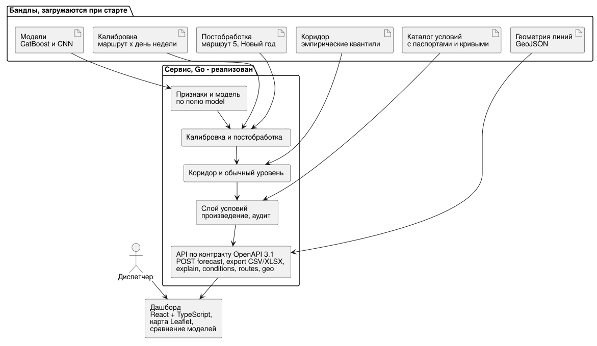

# Ограничения и план развития

Где решение сейчас, что его ограничивает и в каком порядке его развивать дальше.

## Исходная позиция

Две независимые модели выше верхнего порога кейса: CNN 0.88646 и календарный ансамбль 0.88466.
Обе модели работают в одном Go-сервисе (`service/`) по контракту `api/openapi.yaml`: слой
условий с паспортами, коридор, обычный уровень, разбор точки, выгрузка CSV и XLSX. Сервис
развёрнут на https://mttech.k1rles.ru одним контейнером, пока только как API.
Проведены два исследования применимости: горизонт до года и новая линия без истории.

Дальнейшее развитие - прежде всего интерфейс на новом API и замер нагрузки на прод-хосте, а уже
потом новые эксперименты.

## Ограничения

### Данные

- **Один неполный год истории.** Сезонный цикл наблюдён один раз, годовой тренд от сезонности
  не отделяется. Неизвестный тренд - крупнейший источник ошибки годового прогноза: 5% сдвига
  спроса стоят 5 пунктов WAPE-score.
- **Нет привязки к остановкам и направлениям.** Прогноз - на маршрут целиком.
- **Нет плана выпуска и вместимости.** Наполнение салона и нужное число вагонов не выводятся из
  посадок.
- **Маршрут 5** в истории пуст; в декабре 2025 года он открылся в новом виде.
- **Внешние данные с несимметричным покрытием.** Посты о перекрытиях покрывают периоды
  неравномерно, каталог событий не полная афиша, архив пробок фрагментарен.

### Модели

- **CNN** ограничена горизонтом 61 день от последних наблюдённых суток и требует свежих 14
  суток истории. Обучена на окнах до 14 дней, дальше экстраполирует lead.
- **Обе модели** не прогнозируют маршрут без собственной истории.
- **Календарная модель** не различает месяцы внутри сезона: до 10% систематического сдвига
  уровня на летних месяцах годового прогноза.
- **Квантильные интервалы** не годятся: покрытие 58-68% вместо 80%. Нужен эмпирический коридор.
- **Постобработка ансамбля** (калибровка, маршрут 5, новогодний блок) и CNN пока живут
  раздельно, их совместный вклад не замерен.

### Сервис

- Интерфейса на новом API нет: на хосте доступно только API, прежний стенд со встроенным
  интерфейсом на трёх коэффициентах оставлен как копия для отката.
- Нагрузочный замер на прод-хосте сделан с генератором на тех же 2 vCPU через
  `localhost:8090`: путь через nginx и TLS снаружи и предел одного сервиса без генератора не
  замерены, длительного прогона на стабильность памяти не было.
- CNN в сервисе - версия с календарём и событиями (0.88499), а не финальная 0.88646, и
  работает на 2025-11-01 ... 2026-04-30: до 2025-12-31 прямой прогноз, с 2026-01-01
  авторегрессия, посчитанная при сборке бандла. Точность авторегрессии дальше трёх месяцев и
  коридор на её днях не проверены.
- CatBoost в сервисе - сервисная конфигурация без погоды в признаках (0.88268 против 0.88466
  метрической): погода приходит условием.
- Коридор CNN построен по валидационной модели с WAPE-score 0.8205, поэтому скорее шире, чем
  нужно; в коридоры маршрутов 7 и 50 вошли ограничения движения августа-октября 2025 года.
- Условие `event` на CNN может учесть эффект дважды: события уже есть в её признаках.
- Basic auth на прод-хосте выключен.

## План

### Этап 0. Единый релиз - сделано

1. Сделано: голова финальной архитектуры CNN (`859 -> 320 -> 320 -> 24`, календарь и события
   целевого дня) перенесена в Go через бандл `export_cnn_bundle.py`.
2. Сделано: golden-сверка Python против Go на всей сетке (14 640 строк у CatBoost, 43 440 у CNN) при
   каждом старте сервера.
3. Сделано для CatBoost: калибровка `маршрут x день недели`, маршрут 5 и новогодний блок в
   сервисе. У CNN в сервисе только маршрут 5; групповая поправка на CNN не проверена.
4. Сделано: образ собран, сервис развёрнут на прод-хосте, обе сверки при старте прошли.
   Нагрузочный замер сделан на прод-хосте и на Apple M4.

Критерий готовности - одна команда поднимает сервис с той моделью, для которой заявлен score, -
выполнен частично: CNN в сервисе - версия 0.88499, CatBoost - без погоды в признаках.

### Этап 1. Требования кейса полностью

1. Сделано: каталог условий с паспортами вместо трёх множителей - дождь, температура, событие,
   задержка трамвая, отмена и изменение маршрута; область действия по маршрутам, датам, дням
   недели, часам; аудит вклада в ответе.
2. Сделано: эмпирический коридор с расширением по горизонту и полушириной не меньше 20% на
   месяце и 30% на сезоне по классам горизонта.
3. Сделано: горизонты день, неделя, месяц, сезон; календари 2024-2026 годов в сервисе, область
   CatBoost до 2026-04-30.
4. Сделано: выгрузка CSV и XLSX с базовым значением, множителем условий, итогом и коридором.
5. Сделано: геометрия всех десяти линий отдаётся на `/geo/routes.geojson`.
6. Дальше: дашборд на React и TypeScript по готовому контракту OpenAPI, со сплит-представлением
   «карта + графики», как просил заказчик; цвет линии - процент от обычного уровня, остановки -
   только геометрия.
7. Сделано: нагрузочный замер на прод-хосте с 2 vCPU, генератор на тех же ядрах. Дальше: замер
   снаружи через nginx и TLS и 30-минутный прогон на стабильность памяти; при нехватке -
   распараллелить голову CNN по ядрам.
8. Сделано: CNN в сервисе продлена до 2026-04-30 авторегрессией, посчитанной при сборке
   бандла (`InferenceRunner` ветки `feature/cnn`, ревизия `1014c1e`). Дальше: бандл CNN из
   финальной версии 0.88646, если её чекпойнт отличается от сервисного, бандлы с более
   поздней отсечкой истории и проверка авторегрессии на горизонте длиннее трёх месяцев.
9. Дальше: реструктуризация репозитория по `docs/RESTRUCTURE.md`.

### Этап 2. Качество модели

- Замерить сабмитами вклад каждой ступени постобработки ансамбля поверх CNN отдельно.
- Попробовать смесь CNN и календарного ансамбля: они ошибаются по-разному - одна видит недавний
  уровень, другая знает погоду и календарь.
- Добавить погоду в CNN как вход целевого дня в метрическом режиме.
- Обучить CNN на окнах до 61 дня, чтобы lead дальних дней не экстраполировался.

### Этап 3. Дальний горизонт

- Годовой прогноз как сценарный инструмент: основной уровень - сутки и месяцы, поле «ожидаемый
  рост к прошлому году» с ориентиром по открытым данным о пассажиропотоке трамвая.
- Отключать групповую поправку на месяцах другого режима.
- После накопления полного года перезамерить месяц как категориальный признак.

### Этап 4. Новые линии

Рекомендуемый процесс ввода новой линии, по результатам исследования:

1. До открытия - объём задаёт человек, модель даёт форму суток и недели, широкий коридор.
2. Первая неделя - сбор валидаций, осторожная калибровка уровня.
3. Через 7-14 дней - обычный режим: WAPE-score 0.864 и 0.892.
4. Режим работы линии (выходные, ночь) - из расписания.

Для настоящего прогноза в день открытия нужны данные, которых в хакатоне нет: все около 40
трамвайных маршрутов Москвы или модель спроса по остановкам (население и рабочие места в зоне
охвата, матрица перемещений).

### Этап 5. Данные и причинность

- Получать изменения маршрутов через структурированный официальный канал, а не посты.
- Хранить время публикации каждого внешнего события, чтобы исключить заглядывание в будущее.
- Измерять эффекты на нескольких годах.
- Добавить данные о выпуске, интервалах движения и вместимости.
- При появлении надёжной телематики с координатами - остановочная и направленная детализация,
  внешние факторы с привязкой к участку линии, а не к городу целиком.
- Поток валидаций в реальном времени и ноукаст на ближайшие часы по последним суткам.

## Что не следует обещать до появления данных

- наполнение салона и оптимальное число вагонов на линии;
- переток пассажиров между маршрутами и видами транспорта;
- прогноз новой линии в день открытия с качеством действующих маршрутов;
- точный почасовой прогноз на год;
- причинный эффект пробок или событий по одной наблюдательной выборке.

## Целевое состояние

Один контейнер с версионированным бандлом модели, быстрым Go API и интерактивным дашбордом с
картой. Оперативный горизонт даёт почасовой прогноз от CNN, плановый - суточный и месячный
сценарий от календарной модели с эмпирическим коридором и полем годового тренда. Каждое
изменение прогноза видно в аудите, каждая поправка опирается на измеренный эффект со ссылкой на
источник, каждая заявленная метрика связана с конкретной моделью, данными и командой.
