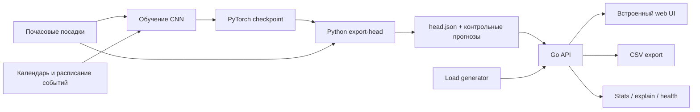
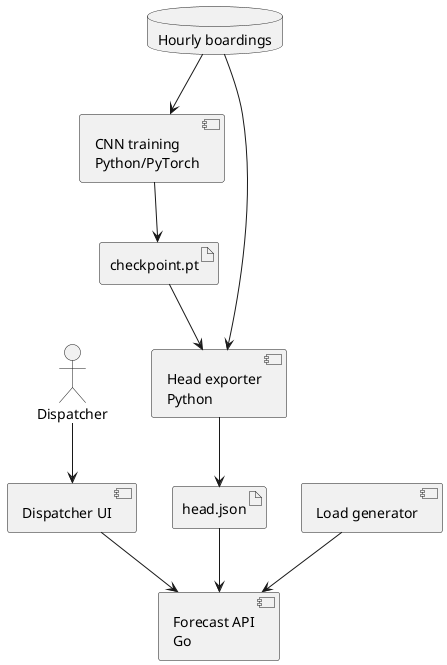

# Системный дизайн

## Статус документа

Документ описывает исходный код и ранее измеренный прототип из `origin/feature/cnn`, явно
отделяя его от текущего состояния вершины ветки. Classical ML и исследования находятся в
`main`. Единого собранного релиза обеих веток пока нет, а текущая CNN-ветка не выполняет
документированную Docker-сборку без восстановления CLI.

## Назначение системы

Система предоставляет диспетчеру прогноз посадок по маршрутам и периоду. Пользователь
может выбирать часовую или дневную детализацию, применять три сценарных коэффициента,
просматривать объяснение точки, выгружать CSV и запускать нагрузочную проверку.

## Компоненты



Тот же контур в PlantUML:



## Предусмотренная сборка прототипа

Docker использует три стадии:

1. Python-образ загружает PyTorch и экспортирует голову из чекпойнта.
2. Go-образ компилирует статический сервер.
3. Финальный `scratch`-образ содержит только бинарник и `head.json`, запускается от UID
   `65534` и не содержит Python.

Запуск, описанный в README ветки CNN:

```bash
docker compose up -d --build
# http://127.0.0.1:8090
```

Нужны два локальных файла, которые не хранятся в Git:

- `outputs/runs/final/boarding_only/final.pt`;
- `dataset/labels/labels_day_test.csv`.

Basic auth включается переменной `STAND_AUTH=user:pass`.

Эта инструкция сейчас не является рабочей для вершины ветки. Dockerfile выполняет
`python -m tram_forecast export-head`, но `src/tram_forecast/__main__.py` импортирует
отсутствующий `tram_forecast.cli`. Поэтому наличие Dockerfile и Compose доказывает
спроектированный и ранее работавший путь поставки, но не готовность текущего commit.

## Как работает инференс

История и embedding маршрута не меняются между запросами. При сборке PyTorch считает
свёрточный энкодер и постоянную часть головы. Go получает готовые параметры и на запросе
вычисляет только признаки даты, lead, линейные слои и активации.

В `head.json` включены контрольные прогнозы PyTorch. При старте Go пересчитывает их и
останавливается, если расхождение больше `1e-4`. Это защищает от несовместимого формата
модели и ошибок ручной реализации операций.

## API прототипа

| Метод | Назначение |
|---|---|
| `GET /api/v1/forecast` | прогноз по маршрутам, датам и гранулярности |
| `GET /api/v1/explain` | разбор одной прогнозной точки |
| `GET /api/v1/forecast/export` | CSV-выгрузка |
| `GET /api/v1/model` | версия и параметры модели |
| `GET /api/v1/stats` | запросы, CPU и память |
| `GET /healthz` | проверка готовности без авторизации |

Пример:

```text
GET /api/v1/forecast?route=7,11&from=2025-11-10&to=2025-11-16
    &granularity=hour&k_weather=0.9&k_event=1.1&k_season=1.0
```

Часовой запрос ограничен 31 днём. Пустой список маршрутов означает все маршруты. Три
коэффициента перемножаются и применяются к выходу модели. Ошибки возвращаются в JSON с
понятным сообщением и кодами 400/401.

## Интерфейс

Реализованный одностраничный UI включает:

- выбор одного, нескольких или всех маршрутов;
- день, неделю, месяц и полный период ноября—декабря;
- часовую диаграмму, дневную линию и тепловую карту;
- сценарные коэффициенты погоды, события и сезонности;
- `Server-Timing` с разложением времени запроса;
- объяснение выбранной точки;
- CSV-выгрузку;
- журнал последних запросов;
- встроенную нагрузку с 1–12 параллельными потоками;
- демонстрационные сценарии и обработку некорректного запроса.

## Реализовано и не реализовано

| Возможность | Состояние |
|---|---|
| Docker Compose, Go API и встроенный UI | исходный код присутствует; текущая сборка блокируется отсутствующим CLI |
| Прогноз и агрегация по маршруту и времени | реализовано |
| CSV | реализовано |
| XLSX | не подтверждено |
| Explain и технический аудит | реализовано |
| Basic auth, health и stats | реализовано |
| Сценарные коэффициенты | реализованы как три плоских множителя |
| Каталог измеренных коэффициентов с областью действия | спроектирован, не подтверждён в CNN-сервисе |
| Постобработка конкурсного сабмита | не перенесена в сервис |
| Карта маршрутов | не подтверждена в текущем CNN UI |
| Остановочная детализация | невозможна на текущих данных |
| Последняя CNN с событийными входами | пока несовместима с exporter/Go-головой |

## Критический интеграционный разрыв

Последняя модель ожидает вход головы размерности 859 и два скрытых слоя по 320. Сервисная
документация описывает предыдущую голову размерности 685 и один скрытый слой на 250.
Обновление только Python или только Go недостаточно. Требуется:

1. обновить формат экспортируемого JSON;
2. восстановить CLI или переписать Dockerfile на существующий интерфейс экспорта;
3. перенести новую голову в Go;
4. пересоздать контрольные прогнозы;
5. пройти unit- и golden-тесты;
6. пересобрать контейнер в чистом окружении;
7. повторить нагрузочный тест.

До этого исходный код и исторические замеры подтверждают жизнеспособность архитектуры
предыдущей CNN, но не являются готовым runtime для модели со score `0.88499`.
