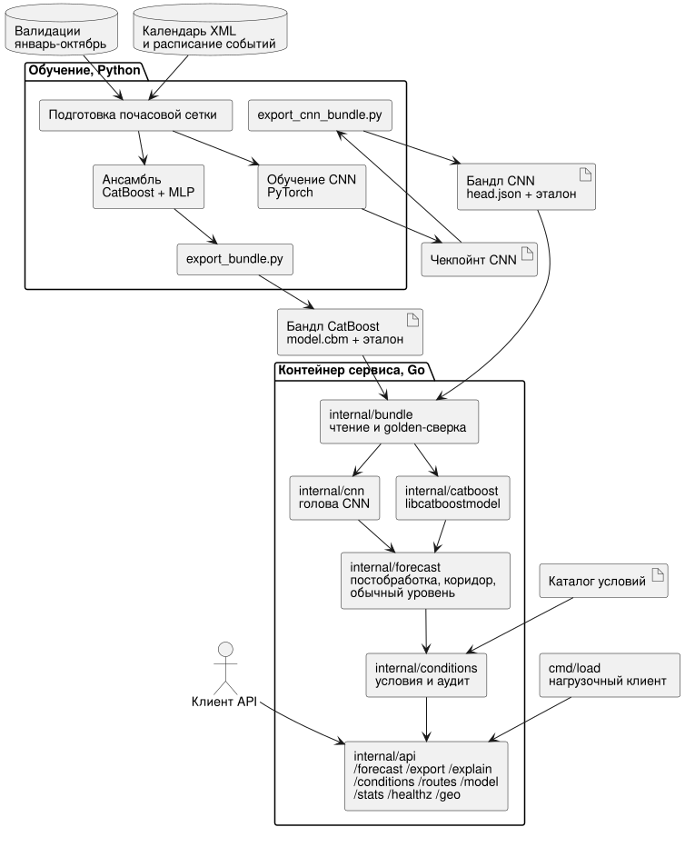
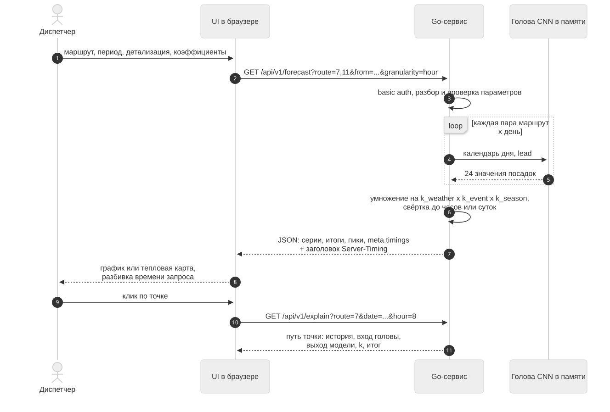
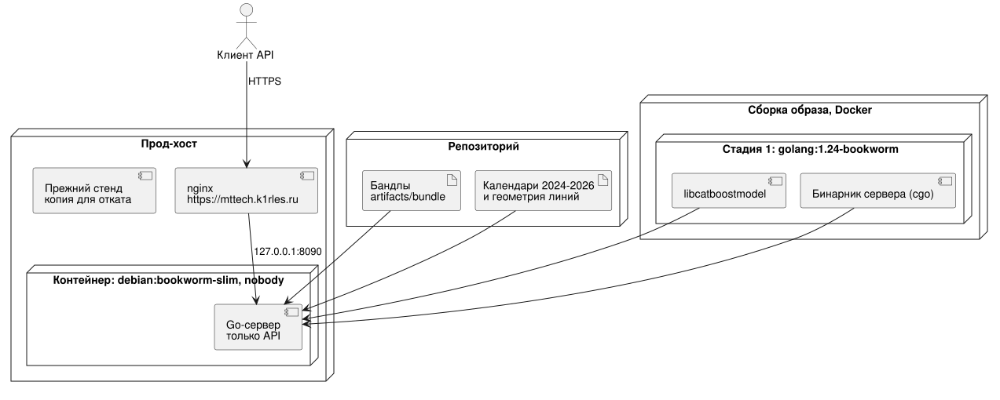

# Системный дизайн

Из чего состоит решение, как компоненты связаны между собой, как проходит запрос, как
собирается и запускается сервис, и что из спроектированного уже реализовано.

Диаграммы ниже отрендерены из исходников Mermaid и PlantUML, которые лежат рядом, в
[diagrams/](diagrams/): их можно править и перерисовывать. Код сервиса - `service/`,
его описание и команды - `service/README.md`, контракт API - `api/openapi.yaml`.

## Общая схема

Решение делится на два контура, связанных только артефактами:

- **обучение, Python** - готовит почасовую сетку, обучает модели, собирает файл прогноза для
  платформы и экспортирует бандлы моделей для сервиса;
- **сервис, Go** - держит обе модели в памяти, считает прогноз на каждый запрос, применяет
  условия сценария и отдаёт результат через HTTP API. Python и PyTorch в рантайме сервиса
  нет: в контейнере только Go-бинарник и библиотека `libcatboostmodel`.

Разделение соответствует модульной схеме кейса: приём и нормализация данных -> признаки и
геопривязка -> ML-прогноз и агрегация -> API -> интерфейс. Последнее звено, интерфейс на
новом API, ещё не сделано.

## Компоненты

| Компонент | Что делает | Технологии |
|---|---|---|
| Подготовка данных | сырые валидации -> плотная сетка `маршрут x дата x час`, успешные валидации по времени валидации, нули в пропущенных часах | Python, pandas |
| Календарь и события | производственный календарь из XML, расписание заранее известных событий, проверка полноты | Python |
| Обучение CNN | энкодер истории и голова, валидация, финальное обучение, файл прогноза | PyTorch |
| Ансамбль | четыре модели, бэктест, подбор весов, калибровка, постобработка, файл прогноза | CatBoost, scikit-learn, PyTorch |
| Экспорт бандла CatBoost | `export_bundle.py`: модель, признаки, калибровка, постобработка, коридор, эталон | Python, CatBoost |
| Экспорт бандла CNN | `export_cnn_bundle.py`: контекст истории, разложенная голова, коридор по валидационной модели, эталон | PyTorch |
| Признаки | календарные признаки в Go по тем же формулам, что в Python | Go, `internal/features` |
| Модели | CatBoost через `libcatboostmodel` (cgo), голова CNN в Go | Go, `internal/catboost`, `internal/cnn` |
| Бандлы | чтение, проверка содержимого, golden-сверка с эталоном Python | Go, `internal/bundle` |
| Прогноз | сетка по запросу, калибровка, маршрут 5, новогодний блок, коридор, обычный уровень | Go, `internal/forecast` |
| Условия | каталог с паспортами, кривые, область действия, композиция, аудит | Go, `internal/conditions` |
| HTTP API | контракт OpenAPI, basic auth, выгрузка CSV и XLSX, статистика, геометрия линий | Go, `internal/api`, `cmd/server` |
| Нагрузочный клиент | заданный RPS или замкнутый цикл, смесь тел запросов, p50/p95/p99, ошибки | Go, `cmd/load` |

## Две модели

Сервис держит в памяти обе модели. Любой запрос, который считает прогноз, выбирает модель
полем `"model": "catboost" | "cnn"`, по умолчанию `catboost`. Условия, коридор, обычный
уровень, разбор точки и выгрузка работают одинаково для обеих.

| | CatBoost | CNN |
|---|---|---|
| Что это | профильная модель без лагов: маршрут, час, календарь | сеть с контекстом 14 суток истории |
| Область дат | 2025-01-01 ... 2026-04-30 | 2025-11-01 ... 2026-04-30: до 2025-12-31 прямой прогноз, с 2026-01-01 авторегрессия |
| Что считается на запрос | деревья через `libcatboostmodel` | голова сети в Go по каждой паре маршрут x день |
| Постобработка | калибровка маршрут x день недели, новогодние множители на 29-31 декабря | нет |
| Маршрут 5 | городская доля | городская доля |

Маршрут 5 истории не имеет ни у одной модели. Его значения - сумма девяти остальных маршрутов,
умноженная на 0.0065 / (1 - 0.0065), то есть 0.65% посадок сети; в ответе приходит
предупреждение `route_without_history`. Дата вне области выбранной модели - ошибка 400
`out_of_domain`.

Бандл CatBoost - сервисная конфигурация без погоды в признаках: погода приходит в сервис
условием, а не признаком, иначе её эффект считался бы дважды. Бандл CNN собран из чекпойнта
версии с календарём и событиями, 0.88499 на лидерборде.

## Как проходит запрос

На запрос сервис строит сетку `маршрут x дата x час` по выбранной модели, применяет
постобработку, коридор и условия и сворачивает результат до часов или суток. Для
необычных дней (праздники, события) модель вызывается второй раз, чтобы получить обычный
уровень. **Кэша ответов и предрасчёта нет сознательно**: модель
вызывается на каждый запрос.

Время разбито по стадиям (разбор, признаки, модель, условия и коридор) и отдаётся в поле
`meta.timings` и в заголовке `Server-Timing`, где к ним добавлено время сериализации JSON.

## Как модели попадают в Go

Модели приходят в сервис **бандлами**: версионированными папками артефактов в
`artifacts/bundle/`. Общий для обеих моделей каталог условий лежит в `conditions.json`.

**CatBoost.** Бандл собирается тем же кодом, что и файл прогноза, около 20 секунд. Модель
`model.cbm` загружается официальной C-библиотекой `libcatboostmodel` через cgo, категории
хэшируются функцией библиотеки один раз при чтении модели, календарные признаки считаются в Go по тем
же формулам, что в Python. Рядом в бандле лежат порядок признаков, множители калибровки,
параметры постобработки, коридор и метаданные.

**CNN.** История маршрута и его эмбеддинг при фиксированной дате отсечки 2025-11-01 не меняются
между запросами. Поэтому экспортёр один раз прогоняет энкодер 14 суток истории на PyTorch и
раскладывает первый слой головы: вклад истории, эмбеддинга и смещения становится вектором
`hidden_base` на каждый маршрут, а входы целевого дня (календарь и события, 10 чисел) -
таблицей на каждую пару маршрут x день. В `head.json` уходят эти таблицы, веса
зависящей от дня части первого слоя и остальные слои. На запрос Go досчитывает первый слой по
входам дня и lead, GELU, второй слой, выход и softplus. Это точная перестановка слагаемых, а не
аппроксимация модели.

Дни 2026-01-01 ... 2026-04-30 экспортёр считает авторегрессией (`InferenceRunner` ветки
`feature/cnn`, ревизия `1014c1e`): контекст каждого маршрута от отсечки 2025-11-01 сдвигается
по суткам, и в историю подставляется собственный прогноз сети. Для каждого такого дня в
`head.json` лежит свой `hidden_base` и входы дня, lead равен одним суткам. Go авторегрессию не
считает и делает тот же один проход головы на маршрут x день.

**Проверка при старте.** В каждый бандл входит `reference.csv` - эталон Python на всю сетку
ноября-декабря 2025 года, 14 640 строк; у CNN - на 2025-11-01 ... 2026-04-30, 43 440 строк. При старте сервер проверяет состав и содержимое
бандлов, пересчитывает весь эталон в Go и сверяет: сырой выход модели - с допуском из
`meta.json`, итог после калибровки, маршрута 5 и новогоднего блока - с точностью до одной
посадки. Затем он строит прогноз на обе границы области дат. Если хоть одна проверка не
прошла, сервер не запускается. На прод-хосте при старте обе сверки прошли: CatBoost совпал
бит в бит (максимальное расхождение сырого выхода 0), CNN - с максимальным расхождением 0.00439
посадки, относительно 6.2e-6 при допуске 1e-4. Это округление float32 в эталоне PyTorch.

SHA-256 и размер каждого файла бандла отдаются в `/api/v1/model`.

## API

Полный контракт - `api/openapi.yaml`. Если сервер запущен с `-auth логин:пароль`, всё, кроме
`/healthz`, закрыто basic auth. Ответы - JSON в UTF-8.

| Метод | Назначение |
|---|---|
| `POST /api/v1/forecast` | прогноз с условиями, коридором и обычным уровнем |
| `POST /api/v1/forecast/export?format=csv\|xlsx` | тот же прогноз файлом |
| `POST /api/v1/explain` | путь одного значения: маршрут, дата, час |
| `GET /api/v1/conditions` | каталог условий с паспортами и кривыми |
| `GET /api/v1/routes` | маршруты, названия, есть ли геометрия |
| `GET /api/v1/model` | обе модели: версии бандлов, метаданные, файлы |
| `GET /api/v1/stats` | счётчики запросов, строк и ошибок, RPS, задержки, CPU, память |
| `GET /geo/routes.geojson` | линии маршрутов для карты |
| `GET /healthz` | без авторизации, версии бандлов обеих моделей |

Пример запроса:

    POST /api/v1/forecast
    {"model": "catboost", "routes": [7, 11], "from": "2025-11-10", "to": "2025-11-16",
     "granularity": "hour", "horizon": "week",
     "conditions": [{"id": "rain", "type": "rain", "value": 2.5,
                     "scope": {"hours": [16, 22]}}]}

- `routes` - пусто или нет поля - все десять маршрутов;
- `granularity` - `hour` или `day`; по часам не больше 31 суток;
- `horizon` - `day`, `week`, `month`, `season`: влияет на применимость условий и ширину
  коридора, но не на выход модели;
- в ответе каждая серия несёт `base` (до условий), `value` (после условий), `usual`
  (обычный уровень), `lo` и `hi` (коридор), итоги и индекс пика; время точки `i` равно
  `start + i * step`;
- в ответе приходит аудит каждого условия и предупреждения;
- пределы: не больше 16 условий, 50 000 строк прогноза на запрос, тело не больше 1 МБ;
- ошибки: `{"error": {"code", "message", "field"}}` с русским текстом, пригодным к показу,
  коды 400, 401, 413, 500.

**Условия вместо плоских коэффициентов.** Каталог `/api/v1/conditions` описывает шесть условий
двух классов: **оперативные** (дождь, температура, событие, задержка трамвая) и **структурные**
(отмена, изменение маршрута). У каждого условия паспорт: единица, источник, измеренный эффект,
допустимые горизонты. Значение условия в единицах паспорта (мм/ч, градусы отклонения,
проценты, доля отмены) переводится в эффект в процентах по кусочно-линейной кривой. Если
область условия - ровно один маршрут с собственным измеренным эффектом, кривая масштабируется
на этот эффект и в ответ уходит паспорт маршрута. Область задаётся маршрутами, датами, днями
недели и часами.

- Условия на одной точке перемножаются, произведение ограничено коридором корректировки из
  каталога; если ограничение сработало, приходит предупреждение `correction_clamped`.
- Дождь, температура и событие действуют на горизонтах день и неделя, задержка - только на
  горизонте день, структурные условия - на всех. Неприменимое на горизонте условие
  возвращается с `applied: false` и предупреждением и прогноз не меняет.
- У CNN в признаках уже есть заранее известные события, поэтому условие `event` на
  событийную дату может учесть эффект дважды.

**Ни одно условие не применяется автоматически.** Это измеренное решение: поправка на дождь,
применённая автоматически, двигает почасовой WAPE на +0.013 пункта с интервалом
[-0.044; +0.065], то есть через ноль, а фиксированные температурные коэффициенты делают хуже.
Эффекты реальны, но дождливых часов около 10%, а дневная ошибка нормы и без факторов около
10%. Условия - инструмент сценария, а не скрытая поправка.

**Коридор** (`lo`, `hi`) показывает, в каком диапазоне обычно оказывается факт вокруг прогноза.
Он строится по прогнозам каждой модели вне обучения: у CatBoost - по фолдам 3 и 4, у CNN - по
собственной валидационной модели (обучена по 2025-08-31, WAPE-score 0.8205 на 61 сутках с
2025-09-01). Берутся квантили 0.1 и 0.9 отношения факта к прогнозу по маршруту и полосе часов,
центрированные на медиане маршрута. Ширина растёт с горизонтом, а полуширина не меньше 20% на
горизонте месяц и 30% на горизонте сезон - по классам горизонта из
[research-horizon.md](research-horizon.md).

**Обычный уровень** (`usual`) - прогноз той же модели на ту же дату и час, как если бы день был
обычным днём своего дня недели: без праздников и предпраздничных признаков (у CNN - и без
событий), без новогодних множителей и без условий. Карта будущего интерфейса красит линию по
`value / usual`, то есть по проценту от обычного уровня.

**Разбор точки** (`explain`) возвращает шаги: признаки модели, сырой выход, обрезку нуля,
калибровку, новогодний блок, каждое условие и коридор корректировки.

**Выгрузка** - CSV с разделителем `;` или XLSX с колонками
`route;date;hour;base;factor;prediction;lo;hi` (по суткам без `hour`, `lo;hi` только с
коридором); в XLSX второй лист «Условия» с аудитом.

## Интерфейс

У нового API интерфейса пока нет: сервис отдаёт только API, корень `/` отвечает 404. Сервер
умеет раздавать собранный интерфейс флагом `-static`, но в образ файлы интерфейса не входят.

Прежний стенд из ветки `feature/cnn` со встроенным одностраничным интерфейсом (прогноз
столбцами, линией и тепловой картой, разбор точки, выгрузка CSV, нагрузка из браузера) работал
на трёх плоских коэффициентах и предыдущей версии CNN. Он сохранён на хосте как копия для
отката. Интерфейс на новом контракте - дашборд с картой по `docs/SPEC-frontend.md` - следующий
шаг, см. [roadmap.md](roadmap.md).

## Сборка и запуск

`Dockerfile` и `docker-compose.yml` лежат в корне репозитория. Образ собирается в две стадии:
`golang:1.24-bookworm` скачивает `libcatboostmodel` и собирает бинарник, итоговый
`debian:bookworm-slim` получает бинарник, библиотеку, бандлы из `artifacts/bundle`,
производственные календари 2024-2026 и геометрию линий. Итоговый образ около 170 МБ, процесс
работает от непривилегированного пользователя `nobody`. Экспорт бандлов в сборку образа не
входит: бандлы собираются заранее и лежат в репозитории.

    docker compose up -d --build                          # http://127.0.0.1:8090
    STAND_AUTH=jury:secret docker compose up -d --build   # то же под basic auth

Без `STAND_AUTH` сервер стартует без авторизации и пишет об этом в журнал.

**Развёртывание.** Сервис работает на https://mttech.k1rles.ru: nginx хоста проксирует на
`127.0.0.1:8090`, где работает один контейнер из этого `Dockerfile` и `docker-compose.yml`.
Там доступно только API: корень `/` отвечает 404, интерфейса нет. Basic auth на хосте
выключен (`STAND_AUTH` не задан). Контейнер в простое занимает 19.65 МиБ памяти. Прежний стенд из
`feature/cnn` со своим интерфейсом оставлен на хосте как копия для отката.

## Архитектура сервиса

Спроектированная версия сервиса, описанная контрактом OpenAPI 3.1, реализована целиком, кроме
интерфейса. Её ключевые решения:

- **Версионированный бандл.** Сервис при старте загружает папку артефактов каждой модели
  целиком: модель, перечень признаков, калибровку `маршрут x день недели`, коридор,
  постобработку (маршрут 5, новогодний блок), метаданные обучения и эталон; каталог условий
  общий.
- **Две модели за одним контрактом.** CatBoost и CNN выбираются полем `model` в запросе.
- **Слой условий вместо трёх плоских множителей** - с паспортами, кривыми, областью действия и
  аудитом вклада в каждом ответе.
- **Коридор** из эмпирических квантилей по маршруту и полосе часов, расширяемый по горизонту.
- **Сервисный режим модели.** Погода в сервисе - условие, а не признак. Метрический бандл,
  где погода - признак модели, не экспортируется: сервис его не читает.
- **Горизонты день, неделя, месяц, сезон** - одна модель, разная применимость условий и
  ширина коридора.
- **Выгрузка CSV и XLSX** того же прогноза с аудитом условий.
- **Дашборд на React и TypeScript** с картой Leaflet по GeoJSON всех десяти линий - не сделан;
  геометрия уже отдаётся на `/geo/routes.geojson`.

## Что реализовано

| Возможность | Состояние |
|---|---|
| Прогноз и агрегация по маршруту, периоду, часам и суткам | реализовано |
| Две модели в одном сервисе, выбор полем `model` | реализовано |
| CatBoost в Go через `libcatboostmodel`, сверка с Python бит в бит | реализовано |
| CNN с календарём и событиями, голова в Go | реализовано, версия 0.88499 |
| Golden-сверка обоих бандлов при старте, отказ запуска при расхождении | реализовано |
| Каталог условий с паспортами и кривыми, композиция, аудит | реализовано |
| Коридор по горизонтам и обычный уровень | реализовано |
| Постобработка в сервисе: калибровка, маршрут 5, новогодний блок | реализовано для CatBoost; у CNN только маршрут 5 |
| Разбор точки | реализовано |
| Выгрузка CSV и XLSX | реализовано |
| Basic auth, проверка здоровья, статистика ресурсов | реализовано; на проде auth выключен |
| Геометрия линий | реализовано, `/geo/routes.geojson` |
| Docker Compose, образ без Python | реализовано |
| Развёртывание на прод-хосте | реализовано, только API |
| Нагрузочный клиент и замеры | реализовано, см. [perfomance.md](perfomance.md) |
| Нагрузочный замер на прод-хосте | сделан через `localhost:8090`; путь через nginx и TLS снаружи не замерен |
| Интерфейс на новом API, карта линий | не сделан |
| CNN на 2026-01-01 ... 2026-04-30 | авторегрессия в бандле; точность дальше трёх месяцев и коридор на этих днях не проверены |
| CNN за пределами 2025-11-01 ... 2026-04-30 | нужен новый бандл с историей до новой отсечки |
| Остановочная детализация | невозможна на имеющихся данных |

Последовательность доработок - в [roadmap.md](roadmap.md).

## Масштабирование и надёжность

- Сервис без состояния: модели читаются при старте, между запросами ничего не хранится. Это
  позволяет масштабировать его горизонтально за любым балансировщиком.
- Память: контейнер в простое на прод-хосте занимает 19.65 МиБ, процесс сервера в 15-секундных
  замерах под нагрузкой - 44-47 МБ RSS.
- Ошибки параметров возвращаются кодом 400 с текстом, пригодным для показа пользователю;
  неверные учётные данные - 401, слишком большое тело - 413.
- Несовместимый бандл не запускается благодаря сверке при старте.
- Известные ограничения: в коридоры маршрутов 7 и 50 вошли ограничения движения
  августа-октября 2025 года; ночные коридоры широкие в относительных величинах; коридор CNN
  построен по валидационной модели, которая слабее финальной, поэтому скорее шире, чем нужно.
  Неизвестный путь и неверный метод получают текстовые 404 и 405 вне формата ошибок.
